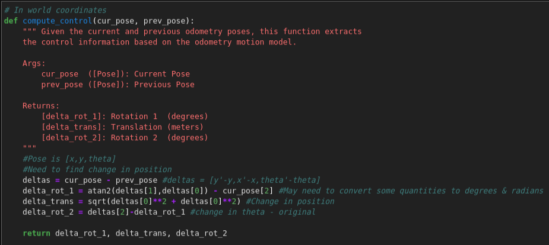
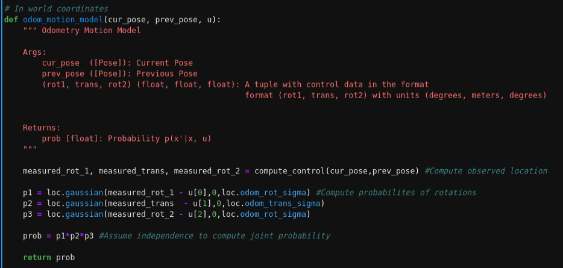

<style>
    ul li { margin-bottom: 10px; }
</style>
<Center> <br>
<h1>About Me</h1></Center>
Hi! My name is Jade and I'm super excited to take this class! Here are some (hopefully) fun facts about me:
<li> I'm currently a junior studying ECE and minoring in robotics </li>
 
<li> I think robots and autonomous systems are super cool - in high school I did a lot with FIRST robotics and I'm a member of CUAir and the Organic Robotics Lab here at Cornell</li>
 
<li> When I'm not being a stereotypical engineer in the lab, I enjoy playing the keyboard (not the typing kind!), running, hiking, and any sort of adventure I might stumble into</li>
 
<li> I'm trying to learn how to cook and don't consider myself so bad at it, but my smoke detector begs to differ </li>

<Center> <h1> Lab 1: The Artemis Board </h1> </Center>

<p style="color: green;font-size:18px"> <b> Setup </b> </p>
To be able to program the Artemis board, I first had to configure my Arduino IDE to install the required libraries. After installing everything, I checked that the programmer was functional by uploading the provided 'Blink It Up' program - as shown in the video below, the board exhibited the expected behavior (built in blue LED toggles every second).
<iframe width="560" height="315" src="https://www.youtube.com/embed/OfnUbPsn1BE" frameborder="0" allow="accelerometer; autoplay; encrypted-media; gyroscope; picture-in-picture" allowfullscreen></iframe><br>
<p style="color: green;font-size:18px"> <b> Example Programs </b> </p>
<b> Serial Output: </b> To test if serial communication worked between my laptop and the Artemis board, I uploaded the provided 'Example2_Serial' program. As seen in the video below, the board was able to receive keyboard input from the laptop, process it, and print statements on my screen via the serial interface. The provided example program actually didn't work perfectly because it neglected to take into account the default newline character when sending serial commands, so I had to alter the code slightly to make it run more smoothly.<br>
<iframe width="560" height="315" src="https://www.youtube.com/embed/wWjGUYQRyek" frameborder="0" allow="accelerometer; autoplay; encrypted-media; gyroscope; picture-in-picture" allowfullscreen></iframe><br>
<b> Analog Tests: </b> To determine if the board is able to measure analog values, I ran the 'Example4_analogRead' program that reads an onboard temperature sensor and prints the output on the Arduino IDE via serial. In the video below, we can see the temperature of the board increase as I hold it close to my overheating laptop. <br>
<iframe width="560" height="315" src="https://www.youtube.com/embed/1t-gQvpS2A4" frameborder="0" allow="accelerometer; autoplay; encrypted-media; gyroscope; picture-in-picture" allowfullscreen></iframe><br>
<b> Microphone Test: </b> To see if the onboard microphone is functional, I uploaded the 'Example1_MicrophoneOuput' program that identifies the loudest frequency heard by the microphone. As seen in the video below, the loudest frequency changes with the pitch of the whistled tone.<br>
<iframe width="560" height="315" src="https://www.youtube.com/embed/7lypdgFtBKc" frameborder="0" allow="accelerometer; autoplay; encrypted-media; gyroscope; picture-in-picture" allowfullscreen></iframe><br>

<p style="color: green;font-size:18px"> <b> Battery Tests </b> </p>
Another cool feature of the Artemis board is its onboard battery charger. When the LiPo battery is connected to the board while plugged into a laptop via USB-C, the board is able to charge the battery (indicated by the yellow light in the image below). When the board is disconnected from the computer, it is able to source power from the battery; this can be seen in the video below, in which the board turns on the blue built in LED when it detects a tone being whistled. The board determines that a tone is being whistled by identifying the loudest frequency using the microphone, just as was done above; if the pitch was above a certain threshold frequency value, then the light would turn on (this frequency value was determined via trial and error - speaking is at much lower tones than whistling)<br>
<b>Code:</b><br>
```C
if(ui32LoudestFrequency >= 500){digitalWrite(LED_BUILTIN,HIGH);}
  else{digitalWrite(LED_BUILTIN,LOW);}
```
<i>The battery being charged while the board is connected to my laptop</i>
<br>
<iframe width="560" height="315" src="https://www.youtube.com/embed/MvvlOql-GQY" frameborder="0" allow="accelerometer; autoplay; encrypted-media; gyroscope; picture-in-picture" allowfullscreen></iframe>

<br> <br>

<Center> <h1> Lab 2: Bluetooth Communication </Center></h1>

<p style="color: green;font-size:18px"> <b> Setup </b> </p>
I had a little trouble setting up the bluetooth on the provided ECE4960 Ubuntu VM, so I just opted to use my windows machine for the entirety of this lab. To enable bluetooth communication with the Artemis board, I installed the necessary python library (bleak) using pip. I also downloaded the provided distribution code (python scripts and Arduino IDE code) as a starting point for this lab.<br>
Once the necessary libraries were installed, I ran the example code to see if my laptop was able to connect to the Artemis board via bluetooth. Luckily, I was able to connect the two after a few tries and added the board's MAC address to the settings cache.

<p style="color: green;font-size:18px"> <b> Pinging the Robot </b> </p>
Each ping packet is 99 bytes - one length, one command, 96 data bytes, and one extra.To measure the round trip response times and flucutuations in latency, I modified the PONG case as below:
```Python
timeDiff = time.time() - theRobot.now
instantDat.append(round(timeDiff,5))
if(Settings["pingLoop"]):
    loop.create_task(theRobot.ping())
```
The program records the time difference between pongs and records it in a python list. When the python script is killed by the user, these python lists are converted to NumPy arrays before the program quits out (this was done because appending to lists is computationally faster than appending to NumPy arrays and I wanted to skew the measurement as little as possible). While a slightly more accurate average may be acquired by only measuring the time every few pings, capturing the round trip time of every ping only adds a few extra commands; since python per-line execution times are on the order of microseconds, this shouldn't skew the data a whole lot - collecting more data points may also give a better idea of the variation in latency. The data I collected was then used to make the following histogram of round trip times: <br>
<br>
The average round-trip ping time was 0.1185 seconds with a standard deviation of 0.0095 seconds with a total of 500 datapoints collected. Interestingly, the data seems to be bimodal in a sense - the majority of times are centered around ~.1125 seconds, but there's a second significant cluster at around 0.13 seconds. 
This test was performed with the artemis board right next to my laptop. To see how the round-trip time varies with distance, I left the board on my porch and pinged it with my laptop from across the street - results can be seen below: <br>
<br> 
The average RT ping time in this case was 0.145 seconds with a standard deviation of 0.034 seconds, also with 500 datapoints collected. As with the last trial, the data also seems to be bimodal in a sense (although it's shifted right and a bit less apparent), but the distribution is a fair bit smoother than in the previous. I was suprised to see that the difference in average RT time did not differ by such a large margin (only about ~0.03 sec slower on average from a distance). <br>
While these rates are not particularly slow, they are significantly slower than a wired serial connection. The standard baud rate (roughly the number of bits/sec) that we've been using for the Artemis board is 115200 - this translates to about 11520 Bytes/sec when accounting for start/stop bits in transmission. Since each byte would have to travel back and forth, this implies that 11520/2=5760 bytes could be transmitted back and forth per second. Since our average RT time over bluetooth was just over 0.1 seconds for 99 bytes, this means that the (somewhat idealized) wired connection is approximately 5-6 times faster than Bluetooth.

<p style="color: green;font-size:18px"> <b> Requesting a float </b></p>
While pinging the robot is pretty cool and serves as a quick check to see if the bluetooth link is functional, sending and receiving meaningful data to/from the Artemis board is much more useful. As a first attempt to transmit values between the two nodes, I tried requesting a float from the board via a command sent by my laptop. Upon reception of this REQ_FLOAT command, the board sends back a packet that contains a 4-byte float value; this return command struct also contains a length field and a command value that the computer uses upon reception of this retun packet. <br>
In order to write a float value into the data bytearray, I ended up casting the data pointer into a float pointer, then storing the desired value in there: <br>
```C
res_cmd->length = sizeof(float);
res_cmd->command_type = GIVE_FLOAT;
*((float*)res_cmd->data) = putVal;
amdtpsSendData((uint8_t *)res_cmd, 6);
```
When testing the program, I first tried transmitting pi over Bluetooth by casting the math library's M_PI constant to a float and sending that, but the received value wasn't exactly pi. To determine if that error was due to an imprecise M_PI constant or floating point isses, I just decided to send the number 3.14 as a float instead; rather than receiving exactly 3.14, the Python code unpacked that value as 3.140000104904175, indicating that there are some issues with floating point comparison/conversion. These issues in C are fairly well known, but one must still be really careful when comparing two float values (especially with subtraction).

<p style="color: green;font-size:18px"> <b> Testing the Data Rate </b> </p>
The procedure for sending two numbers was very similar to sending a float - the only difference was the number of bytes and that they had to be inserted into different points int the array. 
```C
//ct declared as a global uint32_t, lastTime declared as global uint64_t 
lastTime = (uint64_t)micros();
memcpy((uint32_t*)&res_cmd->data[0],&ct,4);
memcpy((uint64_t*)&res_cmd->data[4],&lastTime,8);
amdtpsSendData((uint8_t *)res_cmd, 14);
```
With 5000 received packets, a total of 881 were lost (1 packet dropped for every 5.7 sent, on average). The datastream rate was also much faster, with an average time of 0.0128 seconds between packets received. Below is a histogram of the packet RT times: <br>
<br>

I also tried the same thing but with sending 4x the amount of data in a packet (4-32 bit ints, 4-int_64's). With 5000 received packets, a total of 890 were lost and the average time between packets was also 0.0128 secs - it seems like the amount of data transferred in a single packet has no significant effect on the bytestream performance; this makes sense since all 99 bytes are transmitted each time anyway. The histograms look shockingly similar to each other: <br>
<br>

<p style="color: green;font-size:18px"> <b> Command Framework Modifications </b> </p>
To expand on the command framework, I added a command that transmits 9 floats as provided by the IMU (should be convenient later). I also added some commands to transfer larger PNG files (described below). To do this I had to modify both constants.py and commands.h


<p style="color: green;font-size:18px"> <b> 2+ KB File Transfer </b> </p>
Unfortunately, I did not have enough time to fully complete this optional part of the lab (somehow prelims are starting already!). However, my original idea was to bounce a PNG image bytearray between the two devices and see how the final image looked. To do this, I expanded the framework to include PNG_START_TRANSMIT and PNG_IMG commands that indicated when a file transfer starts and was in progress. Because the full file would have to be distributed across multiple packets, the cmd->length would be the packet number, and the file size would be indicated by the START_TRANSMIT command.
```C
case PNG_IMG_START:{
  pngSize = cmd->length;
  Serial.print("PNG Size is ");
  Serial.println(pngSize);
}
case PNG_IMG:{
  int countt = cmd->length;
  *((uint8_t*)&img[countt*96]) = *cmd->data;
}
```
<br> <br>

<h1> <Center> Lab 3: Characterizing the Robot </Center> </h1> <br>

<p style = "color: green; font-size: 18px;"> <b> 3a: Characterizing the Physical Robot </b> </p> </Center><br>
<i> For this portion of the lab, I worked together with Katie Bradford and Emily Wang </i> <br>

To characterize the physical robot, we first started by measuring the mass and physical dimensions of the robot. Using a scale, we measured the robot to be 45.9g without the battery and 54.0g with the battery. Using a tape measure, we approximated the dimensions to be 15.5 x 13.5 x 12.5 cm (lengthwise, width (across headlights), vertical height). None of us were able to sit in front of the charger for several hours to time how long it takes for the battery to recharge (we prefer watching paint dry tbh, it's much more exciting), but according to the robot manual, it takes approximately 5 hours for a full charge once the battery has been used a few times. This was done so we could eventually accurately describe the robot in simulation and get an estimate of all the relevant forces. We also estimated the battery lifetime to be about 10-15 minutes of continuous driving. <br>

To characterize the motion of robot, we attempted to measure its speed by racing it along a 10m drag strip of tile in Phillips Hall. From 5 trials with our separate robots, we found that the average speed was 2.47 m/s with a maximum trial average speed of 2.61 m/s and a minimum of 2.25 m/s (all in fast mode). By running the robot until its battery was drained, we saw that there was a significant decrease in speed as the battery charge dropped; this was not really a linear phenomenon - while the speed decreased throughout our testing of the robot, once the battery approached its minimum charge, the speed dropped off very sharply until the robot could not drive any further. This data was very useful as an estimate of the average velocity that we could use in simulation and provided somwhat of an upper bound on the speed of the robot. The nonlinearity of the maximum speed as a function of battery life is also something that will probably not be taken into account in simulation but is a very important consideration in real life. <br>

In addition to speed, we attempted to estimate the acceleration of the robot - unfortunately, this proved to be quite difficult using the our eyes and the camera alone; we thought of attaching the IMU to the robot but we would have a hard time securing it to the robot without taking off the top. To estimate the acceleration, we noticed that the robot reached its full speed after about 2m of acceleration. Since our velocity tests were over a full 10m, we can approximate the time needed to accelerate to full velocity as 1/5 of the total time needed to travel the 10m (in reality its's probably a bit longer) - this is about 0.75 sec. From zero to an average velocity of 2.25 m/s in 0.75s, we can estimate the acceleration of the robot to be around 3.0 m/s^2. This also provides somewhat of an upper bound on the acceleration that we can use in the simulation. Also useful for computing forces and checking the accuracy of our IMU when we mount it on the robot. Check out a video of the robot accelerating below! <br>
<iframe width="560" height="315" src="https://www.youtube.com/embed/ypQzi79MOVw" frameborder="0" allow="accelerometer; autoplay; clipboard-write; encrypted-media; gyroscope; picture-in-picture" allowfullscreen></iframe> <br>

We also tried to measure braking distance by driving the robot at full speed and then throwing the motors into reverse when it crossed a line on the floor. In the robot's slow mode, we found the robot's average braking distance to be 13.2cm with a minimum of 10cm and a maximum of 15cm. When we tried to measure the braking distance in the robot's fast mode, we found that the robot simply flips over when we tried to actively brake, so were unable to estimate a reasonable distance at these speeds. This information will hopefully be useful in simulation and may limit how fast we can allow our robot to travel in a given room. In addition, the braking distance could also be used to characterize the robot wheels and how much slippage they experience. Our setup can be seen in the video below. <br>
<iframe width="560" height="315" src="https://www.youtube.com/embed/iga5Dm6c1dE" frameborder="0" allow="accelerometer; autoplay; clipboard-write; encrypted-media; gyroscope; picture-in-picture" allowfullscreen></iframe> <br>

To determine how well the robot could rotate, we drove one set of motors while keeping the other side off. We also tried spinning the robot about its own axis by driving the two sets of motors in opposite directions. When only one set of motors were turning, the robot's motion was very stable about its front wheel (seen in the video below). When both motors are driven in opposite directions in fast mode, the wheels seem to slip a bit and the robot drifts as well - this indicates that the robot is not able to perfectly rotate about its own axis, which provides another useful distinction between ideal simulation parameters and hard reality. <br>
<iframe width="640" height="360" src="https://www.youtube.com/embed/ZS2JQHhOlLI?t=9" frameborder="0" allow="accelerometer; autoplay; clipboard-write; encrypted-media; gyroscope; picture-in-picture" allowfullscreen></iframe> <br>
<iframe width="560" height="315" src="https://www.youtube.com/embed/rCvJbK5JcZs" frameborder="0" allow="accelerometer; autoplay; clipboard-write; encrypted-media; gyroscope; picture-in-picture" allowfullscreen></iframe> <br>

For fun, we also drove the robot across several different surfaces to see how it performed. On all the surfaces we tested (tile, concrete, grass, carpet), the robot was able to drive quite well (useful for future field tests). We also played around with stunts and were able to make the robot flip over (by driving fast and throwing the motors into reverse), spin around / drift (by going fast and turning), and even balance on two wheels (but not the ones you'd expect). Reliably reproducing some of the tricks was a little difficult, but we were able to perform some of the stunts (namely flipping and spinning) fairly reliably - control details described above. We also tried braking before crashing into a wall, but that also proved to be a little difficult since the robot would simply flip over if we went too fast and tried to stop. To achive this in some manner, we had to let the robot coast a bit before braking completely and were able to stop the robot by decelerating about 30cm from the wall. In addition, we also tried to drive the robot as quickly as possible within a 1m square, but it was much more difficult than we expected! This was done to see if we could eventually make an algorithm that performs better than a human driver (although admittedly we're not exactly the gold standard for drivers). Check out the videos of surface tests and stunts below! <br> <br>

<i> Surface Tests </i>
<iframe width="360" height="270" src="https://www.youtube.com/embed/qeUlRmqmca8" frameborder="0" allow="accelerometer; autoplay; clipboard-write; encrypted-media; gyroscope; picture-in-picture" allowfullscreen></iframe> <br>
<i> Stunts </i>
<iframe width="360" height="270" src="https://www.youtube.com/embed/m3y1oS1I_Io" frameborder="0" allow="accelerometer; autoplay; clipboard-write; encrypted-media; gyroscope; picture-in-picture" allowfullscreen></iframe> <br>
<i> Driving on a Square </i>
<iframe width="640" height="360" src="https://www.youtube.com/embed/vc01po-Nxws" frameborder="0" allow="accelerometer; autoplay; clipboard-write; encrypted-media; gyroscope; picture-in-picture" allowfullscreen></iframe> <br>


<p style = "color: green; font-size: 18px;"> <b> 3b: Characterizing the Virtual Robot </b> </p> <br>
After installing all of the necessary dependencies and lab framework (and of course after having to reinstall the VM), I started playing around with the parameters in the robot simulator to try and get a sense of how the virtual robot operates as well as the limitations of the simulation environment. To start, I attempted to move the robot around using the specified keys and adjusted both the linear and angular speeds. While the speeds can grow very large (>10^20), the actual speed is capped at some point by the simulation and the robot does not travel any faster; the same goes for the minimum speed - while, according to the simulation parameters, it will not really ever reach zero (unless due to underflow error), the effective minimum speed is zero. <br>
Interesting things also happen when the robot is steered (purposefully or not) into one of the walls; rather than just stopping or bouncing off, it is replaced by a yellow triangle with an exclamation point in it. To start driving again, the robot must back out or turn out of that position; personally, I would rather have it reset to a starting position or still show the robot instead of replacing it with an uninformative box. <br>
By clicking on the robot, the simulation shows the robot's cooridinates (x,y,z,theta). The user can also drag the robot around the field using the left mouse button and can manually adjust the robot's angle/orientation by clicking and dragging using the right mouse button. The former is especially useful if the robot collides with a wall! <br>
When playing around with the simulator, I found out that clicking on the simulation window and pressing some keys did some interesting things. For example, pressing 'o' showed previous places that the robot visited; these markers would disappear over time. Right clicking and dragging would turn the map into a 3d world and showed that the 'robot' was simply an extruded hexagon. Pressing 'd' put a line of sight cone in front of the robot. 'f' centers the image on the robot and 'g' gets rid of the checkered squares in the background. My favorite change happened while pressing 'r', which put the camera in the frame of the robot, letting the user explore the maze from the robot's perspective. 'p' also pauses the simulation, and 'c' clears away the details in the bottom of the screen. Below is a video of the virtual robot navigating the obstacle course! <br>

<iframe width="766" height="394" src="https://www.youtube.com/embed/X6ZZOyAG-jA" frameborder="0" allow="accelerometer; autoplay; clipboard-write; encrypted-media; gyroscope; picture-in-picture" allowfullscreen></iframe>
<br><br>

<h1> <Center> Lab 4: Open Loop Control </Center></h1>
<p style = "color: green; font-size: 18px;"> Part (a): Physical Robot Control </p>
After assembling the robot, I played around with the code parameters to try and achieve open loop control over the robot. To start, I first modified the example MotorTest code to drive the correct motors and I had to flip some wires around to make each set of wheels turn in the same direction when the motor power was set as positive. To test the 'turn-on power' of the motors, I wrote a short program that incremented the motor speed and printed it to serial; the motors were turned off via serial commands as well as to not waste battery life. The speed that the motors started rotating was recorded and this was performed 10 times (in each trial, both motor speeds were incremented and their turn on power was noted). This was performed in two ways: in one set of trials, I kept the wheels of the robot off the ground and recorded the turn on power for each motor. In another set, the robot was placed on the ground and the power at which it started moving forwards; a speed for each motor could not be determined because one set of wheels rolling forward caused the wheels on the other side to start moving and the motors no longer had to overcome the higher force of static friction. Check out the code and data below! <br>
```C
  int i=50;
  while(i<256){
    Serial.println(i);
    myMotorDriver.setDrive( 0, 0, i);
    myMotorDriver.setDrive( 1, 0, i);
    int startTime = millis();
    while(millis() - startTime < 500){
      if(Serial.available()){i=500; Serial.println("MOTORS OFF"); break;}
    }
    i++;
  }
```
Data:
<table> 
    <tr>
        <th> Left Wheel </th>
        <th> Right Wheel </th>
        <th> Both Wheels </th>
    </tr>
    <tr>
        <td> 62 </td>
        <td> 55 </td>
        <td> 62 </td>
    </tr>
    <tr>
        <td> 59 </td>
        <td> 61 </td>
        <td> 64 </td>
    </tr>
    <tr>
        <td> 62 </td>
        <td> 67 </td>
        <td> 59 </td>
    </tr>
    <tr>
        <td> 59 </td>
        <td> 63 </td>
        <td> 59 </td>
    </tr>
    <tr>
        <td> 61 </td>
        <td> 68 </td>
        <td> 57 </td>
    </tr>
    <tr>
        <td> 60 </td>
        <td> 59 </td>
        <td> 60 </td>
    </tr>
    <tr>
        <td> 60 </td>
        <td> 59 </td>
        <td> 59 </td>
    </tr>
    <tr>
        <td> 56 </td>
        <td> 56 </td>
        <td> 58 </td>
    </tr>
    <tr>
        <td> 67 </td>
        <td> 69 </td>
        <td> 61 </td>
    </tr>
    <tr>
        <td> 58 </td>
        <td> 58 </td>
        <td> 63 </td>
    </tr>
</table>
Right Wheel: Mean = 61.5, SD = 4.78  (distribution is kinda skewed right)<br>
Left Wheel: Mean = 60.4, SD = 2.80 <br>
Both Wheels: Mean = 60.2, SD = 2.14 <br>
<br>
Surprisingly, the average turn on power for both wheels on the ground was less than both the wheels in the air; this might be because the turn on power for the robot on the ground is essentially the minimum of the two motor powers for that trial (since one wheel turning gives the other the 'kick' it needs to overcome friction). It also has a much tighter spread than either wheel.
<br>
Luckily, my motors spun at the same rate so I didn't have to include a calibration factor for the robot to drive in a reasonably straight line - check out the video below!
<br>
<iframe width="560" height="315" src="https://www.youtube.com/embed/PC5nmNpBbzM" frameborder="0" allow="accelerometer; autoplay; clipboard-write; encrypted-media; gyroscope; picture-in-picture" allowfullscreen></iframe>
<br>

To achieve open-loop control, I first tried to make the robot just drive in a square (wanted to see how it compares to part B). This was done by simply driving the robot forwards for 0.7 seconds and then turning the robot by reversing the direction of the wheels for 0.3 seconds. See the code snippet and video below! stopMotor() is a function that just turns off both motors for 0.1 seconds - it seemed to help the robot turn slightly more precisely. <br>
```C
myMotorDriver.setDrive(0,0,sp);
myMotorDriver.setDrive(1,0,sp);
delay(700);
stopMotor();
myMotorDriver.setDrive(1,0,sp*2);
myMotorDriver.setDrive(0,1,sp*2);
delay(300);
stopMotor();
```
<iframe width="560" height="315" src="https://www.youtube.com/embed/LTTo0j7Uthc" frameborder="0" allow="accelerometer; autoplay; clipboard-write; encrypted-media; gyroscope; picture-in-picture" allowfullscreen></iframe> <br>
For fun, I also tried to make the robot travel in a straight line where the speed was dependent on the highest frequency sound that it recorded; this proved to be a bit more difficult than I thought, since the ambient frequency that it detected was somehow higher than the pitches I can whistle. I tried doing some basic filtering, but the robot speed ended up being quite erratic. To obtain the sound frequency, I just modified the printLoudest() function in the microphone example code to return a value rather than just print it to serial. Check out the code below! <br>

```C
  if (myPDM.available())
  {
    myPDM.getData(pdmDataBuffer, pdmDataBufferSize);
    freq = printLoudest();
  }
  if (freq < 2000 && freq != 0){
    sp = 255.0*((float)freq/2000.0);
    myMotorDriver.setDrive(0,0,sp);
    myMotorDriver.setDrive(1,0,sp);
  }
``` 
<br> <br>

<p style = "color: green; font-size: 18px;"> Part (b): Virtual Robot Control </p>
For this lab, I kept the virtual open loop controller very simple. To make the robot drive in a rectangular path, I programmed it to just drive straight and turn for certain amounts of time at a given speed (so that it goes approximately 90 deg on each turn and the straight segments are of equal length). This is open loop control because the control actions given to the system have no dependence on the system's output (i.e. the robot's location or orientation); as a result, while this form of control may be more computationally efficient than closed loop control, it is much more inaccurate if there are sources of error in the system (which there are in this lab - there is some error associated with the speed of the virtual robot). I chose to use a time-dependent control system to avoid any dependence on the output; it also allowed me to see how much the errors accumulate over time - something that may be nice to know for future labs. Since the robot velocity could be set very easily using the provided set_vel function, it also made the most sense with the given implementation. Check out the code and video below to see my implementation of simple open loop control! <br>

```Python
import math
linSpeed = 0.2
angSpeed = math.pi/4
lin = True

while True:
    curTime = time.time()
    robot.set_vel(linSpeed*lin,angSpeed*(not lin))
    while time.time() - curTime < 2:
        pass
    lin = not lin
``` 
<br>
<iframe width="560" height="315" src="https://www.youtube.com/embed/3cZTaRoUcsA" frameborder="0" allow="accelerometer; autoplay; clipboard-write; encrypted-media; gyroscope; picture-in-picture" allowfullscreen></iframe>
<br><br>

<Center><h1> Lab 5: Obstacle Avoidance </h1></Center>
<p style = "color: green; font-size: 18px;"> Prelab </p>
There are quite a few types of infrared distance sensors available for use in low cost robots these days, but there are two main types of infrared sensors: proximity sensors and time-of flight sensors (which are coincidentally the ones we use in this lab - who would've thought!)<br>
1: Proximity Sensors - work by emitting an infrared beam that gets reflected off of nearby objects. When the reflected light arrives at the detector, the sensor uses the characteristics of the reflected light to reconstruct the position of the object. Proximity sensors are quite good at determining if an object is present within a given range, but does not give very accurate estimates of an object's position. Measurements are also more strongly affected by the environment (ambient light, color, etc.). <br>
2: Active TOF sensors - work by measuring the time that it takes for an emitted wave to reflect off a target and be detected by the sensor. These readings are much more accurate than the proximity sensors and have a significantly larger range, but are a bit more costly. Ambient light may also have an effect on sensor readings.<br>
Because the TOF sensor is more accurate, it may be more useful to put it in the front of the robot while driving. It may be advantageous to put the proximity sensor in the back of the robot for short uses and to see if there are any obstacles behind the robot when reversing. The robot may miss obstacles while turning quickly or if objects jut out and clip them on the side / on the wheels; somewhat of a side-to-side motion while driving may help detect objects within the robot's path.
<br>
<Center><p style = "color: green; font-size: 18px;"> Part (a): Physical Obstacle Avoidance </p></Center>
<Center> <b> Proximity Sensor </b> </Center><br>
When I ran the example code that scans all of the I2C addresses, I found that the proximity sensor was at address 0x60. This was expected, as it is the same I2C address listed on the provided datasheet. To test the proximity sensor, I taped it to a box and recorded measurments of several targets at numerous distances away to see how the proximity values differed for different colors (red,black) and lighting conditions ('dim'/normal lighting and 'bright', where I shone my phone flashlight on the experimental setup). The results are summarized in the graph below!

<br>
Experimental Setup (Artemis board usually disconnected from robot): <br>
<br>

As can be seen on the graph, ambient lighting conditions didn't seem to have such a large effect on the proximity reading at distances > 2-3 cm; however, as the proximity sensor got really close to the object, the external light had a more significant effect - this may be due to more reflection of the ambient light source that gets picked up by the sensor. Color had a much larger effect on the sensor reading - the black box had much lower measured proximity values than the red box; this may be due to the fact that black objects absorb light more than colored objects do. During testing, I also noticed that the proximity reading was quite sensitive to the angle of the sensor at closer distances; this may be because this increases the effective distance to the object (use triangle hypotenuse) and the sensor is very sensitive at such low distances. Using the inbuilt micros() function, I measured the time between readings to be about 630 microseconds. From looking at the serial output, it also seems that the reading is updated every ~7ms (although this may be longer than the actual value, just empirically looked at the time between changes in data)<br>

<Center><b> TOF Sensor </b> </Center><br>
When scanning the I2C lines, the TOF sensor was detected at I2C Address 0x29. This was not expected, since the sensor datasheet claims that the address is 0x52 (or 0x53), but after some investigation, I found out that 0x29 is just 0x52 shifted right! This discrepancy most likely arises because I2C addresses are only 7 bits long - while the Arduino IDE just records these 7 bits, the datasheeet includes all 8, so we must shift it right since the LSB is not part of the address.
<br>
Before calibration, the sensor readings were slightly off and overshot the true value (mean of ~145mm for a true distance of 140mm). When I tried running the provided sensor calibration code, the sensor refused to provide any readings; after comparing it to some of the other functional examples, I added the distanceSensor.startRanging() command to fix the code. After successful calibration, the sensor seemed to be a fair bit more accurate (mean of about 140 for a true distance of 140 - see results below with the calibrated sensor). <br>

Experimental setup (Artemis board usually not connected to robot): <br>
<br>

To test the effects of the inter-measurement period and the timing budget, I kept one constant while manipulating the other. To start, I used an inter-measurement period of 500 and varied the timing budget between 20 (minimum) and 500 (since the inter-measurement period has to be >= timing budget). <br>

For 25 measurements with an inter-measurement period of 500:<br>
	TB = 20: mean = 121.4, SD = 7.34 <br>
	TB = 50: mean = 142.04, SD = 2.06 <br>
	TB = 100: mean = 144.8, SD = 1.23 <br>
	TB = 200: mean = 145.5, SD = 0.75 <br>
	TB = 500: mean = 146.6, SD = 0.48 <br>

While the sensor becomes more accurate as the timing budget increases, there is a trade-off between accuracy and measurement frequency. Since the sensor was calibrated with a timing budget of 50 ms, different timing budgets have slightly different mean values, as seen above; interestingly, the mean measurement seems to increase with the timing budget. From lab 3, we saw that the robot travels at approximately 2-3 m/s; to have enough information about the state of the world, it would be nice to have the robot update its position every ~10 cm. For the position to update every 10cm at full speed with no latency in measurement time, the timing budget would have to be about 50 ms. This is a nice value to choose because the refresh rate is fairly quick and the precision of the measurements is not too bad (standard deviation of around 2 cm); the sensor being calibrated with this timing budget is also an added bonus!<br>

I also attempted to determine the effect of the inter-measurement period on the TOF readings. To do this, I kept the timing budget at a constant 50ms while increasing the inter-measurement period starting at 50ms (since the period has to be greater/equal the budget). <br>

For 25 measurements with an timing budget of 50 ms: <br>
	IMP = 50: mean = 141.8, sd = 1.90 <br>
	IMP = 100: mean = 141.2, sd = 1.75 <br>
	IMP = 200: mean = 140.7, sd = 1.69 <br>
	IMP = 500: mean = 141.52, sd = 1.42 <br>

As seen above, there doesn’t seem to be a very significant difference between the different sets of measurements; while the standard deviation tends to decrease as we increase the inter-measurement period, this also slows down the times between sensor readings. Because the robot is moving fairly quickly, it seems as if the benefits gained by more frequent readings outweigh the drawbacks associated with the slightly larger variation in sensor measurements. <br>

Since the goal of this lab is to have the robot avoid obstacles in my room, it seems as if the medium distance mode would be best suited for this effort, since my room isn’t even 4m across. The short distance mode limits the range of the sensor to 1.5m, which is a bit too short given the dimensions of my room. According to the datasheet, the main benefit of choosing a shorter distance mode is that the sensor is less sensitive to ambient light - because the lights in my room are not so bright and the light scattered about the room is fairly uniform, there may not be much of an advantage to choosing the short distance mode anyway. <br>

To determine the accuracy and range of the sensor, I compared the measured distance to the actual distance at several points in front of a wall and found that the sensor was suprisingly accurate for at least 2.5 meters (ran out of room at this distance!). These readings seemed fairly consistent over time and I didn't notice any fluctuations as the day progressed. Error bars representing the standard deviation are supposed to be shown on the graph below but it seems like they were too small; each datapoint represents the average of 50 measurements. Using the micros() function, I determined the time to read the sensor using the getDistance() function to be 0.725 ms. In the same vein, the time it takes to execute startRanging();getDistance();stopRanging() was about 1.63 ms; however, the reading time is still limited by the timing budget and inter-measurement period. I also tested the TOF sensor on a few colored pieces of paper and the target color did not appear to have a significant effect on the measurement. Check out the range test graph and picture of my experimental setup below! <br>

<br>
<br>
	
According to the datasheet, sigma is the estimated standard deviation of the measurement, and signal is the amplitude of the signal detected by the TOF sensor (that is reflected from the target). When I quickly place a target in front of the object, I get a ‘wrapped target fail’ error which, according to the datasheet, indicates that the phase (presumably of the emitted signal) does not match the received one. Occasionally when I quickly move the target out of the way, I get a ‘signal fail’ error, which indicates that the detected signal amplitude is below some preset threshold - this may mean that the sensor never receives the reflected beacon. These errors may be important to take into account during future labs because they represent a discontinuity in sensor measurement; for the mapping lab, if there is a very steep gradient in the room’s distance profile, the sensor may not be able to detect the boundary of an object with high precision. However, the proximity sensor we have is fairly good at detecting the presence of an object, so we can use it to detect the rapid presence of objects if the TOF sensor misses it.

<br><br>

<Center><b> Working with the Robot </b></Center><br>
To attach all the sensors onto the robot, I used an interesting combination of cardboard and masking tape in order to secure all of the electronic components onto the robot frame. I also daisy chained all of the sensors together (including the motor drivers) and connected it to the Artemis board via QWIIC connectors. Once I made sure that I could control the motors and read the TOF data without any issues, I tried implementing a few steering algorithms to see which ones would be most effective in avoiding obstacles. <br>
To start, I decided to be ambitious and implement a steering algorithm that gave the robot a base speed and applied a correction factor to each of the motor speeds that depended on the distance between the robot and the object in front of it. This would cause the robot to turn more quickly when it is closer to an object, and go more straight when objects in front of it are relatively distant. Unfortunately, it proved to be fairly difficult to tune the correction factor so that the robot actually behaved as expected - check out a video of the robot failing below! <br>
<iframe width="560" height="315" src="https://www.youtube.com/embed/jbE9EMnXJCk" frameborder="0" allow="accelerometer; autoplay; clipboard-write; encrypted-media; gyroscope; picture-in-picture" allowfullscreen></iframe> <br>
Correction Factor Code: <br>
```C
baseSpeed = 120; //max(50,min(120,distance/15.0)); - wanted to make it slow down as it approached the wall...
int correction = min(100,10000.0/distance);
rightSpeed = baseSpeed - correction;
leftSpeed = baseSpeed + correction;
```
I also wanted to try coding a steering algorithm that incorporated the angle of the robot using the IMU and working with averages of sensor measurements to try and avoid erroneous motion due to measurement errors, but unfortunately did not have time to implement something that complex (maybe next week!). After trying to implement the correction factor steering, I switched to a very simple, yet effective method in which the robot would simply go straight until it detected an object within a certain threshold distance, then turn until things were no longer within that threshold. While this method may be a bit crude, it was still quite effective in allowing the robot to avoid obstacles. Check out the code and videos below! <br> <br>
Take 1:
<iframe width="560" height="315" src="https://www.youtube.com/embed/E3w1qgjr5JU" frameborder="0" allow="accelerometer; autoplay; clipboard-write; encrypted-media; gyroscope; picture-in-picture" allowfullscreen></iframe> <br>
Take 2 (slight improvements):
<iframe width="560" height="315" src="https://www.youtube.com/embed/Z4BC3OgD_lY" frameborder="0" allow="accelerometer; autoplay; clipboard-write; encrypted-media; gyroscope; picture-in-picture" allowfullscreen></iframe> <br>

```C
baseSpeed = 120;
if (distance < 200){
	motorDriver.setDrive(0,1,150);
	motorDriver.setDrive(1,0,150);
}
else{
	motorDriver.setDrive(0,1,baseSpeed);
	motorDriver.setDrive(1,1,baseSpeed);
}
```

For future labs that have a similar goal, I would like to try and implement the more complicated steering algorithms that I described above. It would also be interesting to work with average sensor measurements to try and reduce the impact of errors on the motion of the robot, and see how the increased time between averages would impact the robot's performance. It would also be interesting to integrate the other sensors on the robot (especially the proximity sensor! haven't really figured out what purpose it might serve, especially since it's on the same end of the robot as the TOF sensor, although possible reasons were discussed above). Unfortunately, I was unable to record a video of my robot going as fast as possible into a wall because the battery wires became disconnected from the header pins and I didn't have access to a soldering iron on Sunday - will try and fix Monday :/. In the code, the robot sped along at a 150 power and successfully avoided the wall; from Lab 3, we determined the maximum speed to be about 2.5 m/s - assuming the speed scales linearly with the motor power, this suggests that the robot was able to avoid the wall at a speed of 1.5 m/s.


<Center><p style = "color: green; font-size: 18px;"> Part (b): Virtual Obstacle Avoidance </p></Center>
For this part of the lab, I used the provided Jupyter notebook file and simulation software to control the virtual robot in an attempt to avoid obstacles. To start, I decided to go with a fairly simple algorithm and then improve upon it along the way. Looking at the problem, I thought that a fairly simple obstacle avoidance algorithm would just increase the angular speed as the robot gets closer and closer to the wall; by turning at a speed inversely proportional to the distance to the wall, the robot should be able to turn in a different direction before it actually collides with the wall itself. To do this, I set the robot's velocity as follows: 
```Python
dist = robot.get_laser_data()
robot.set_vel(linSpeed,1/dist)
```
While this was an interesting idea, I ran into problems almost immediately. First, I noticed that the robot's speed was very erratic and didn't behave as expected. After some investigation, I found out that the refresh rate of the sensors is a lot slower than the velocity commands (which I measured to take 0.25ms using the time.time() function) and extraneous code I was using to control the robot (I discovered this when trying to take several measurements in a row and finding out that they were all the same). To fix this issue, I added a wait command inside of my while(True) loop so the steering algorithm would consistently get new data that reflects the robots change in position a bit better. <br>
In addition to this sensor refresh issue, the simple steering algorithm was unable to steer away fast enough - it kept on crashing into the walls of the map; this problem only became worse as the linear speed was increased. To fix this issue, I also made the linear velocity dependent on the distance to the object; by subtracting 1/distance from a base speed, the robot would even start going backwards if it got too close to the wall. After some trial and error, I made the angular velocity dependent on 1/distance^2, which improved the robot's obstacle avoidance to some extent. Check out the videos of the functional virtual robot below! <br>

<iframe width="560" height="315" src="https://www.youtube.com/embed/galxFycMBew" frameborder="0" allow="accelerometer; autoplay; clipboard-write; encrypted-media; gyroscope; picture-in-picture" allowfullscreen></iframe> <br>
<iframe width="670" height="345" src="https://www.youtube.com/embed/0gVxaJiNw9o" frameborder="0" allow="accelerometer; autoplay; clipboard-write; encrypted-media; gyroscope; picture-in-picture" allowfullscreen></iframe> <br>

As seen in the videos, the robot can get pretty close to the walls without crashing into them (especially on the sides!). The linear velocity is also quite high (baseline velocity in the code was set to 1000). As for collisions, they happened pretty rare, but here's an image of the robot having crashed ;( <br>

<br>

Code: <br>
```Python
def perform_obstacle_avoidance(robot):
	linvel = 1000
	robot.set_vel(linvel,0)
	while True:
		dist = robot.get_laser_data()
		robot.set_vel(linvel-linvel/(dist*2),1/dist**2)
		time.sleep(0.1)
```


<Center> <h1> Lab 6: IMU, PID, and Odometry </h1> </Center>
<Center><p style = "color: green; font-size: 18px;"> Lab 6a: IMU, PID, and Odometry with the Physical Robot </p> </Center>
NOTE: For some reason, certain images do not appear on the website version of this lab report - check out the index.md file for the images if they are missing; they should all be in the Github repo. <br>
<Center> <b> Setting up the IMU </b> </Center>
To start experimenting with the IMU, I first had to install all the necessary libraries on the Arduino IDE and connected the module to the Artemis board via a QUIIC connector. After everything was hooked up properly, I scanned the I2C addresses on the Artemis board and found that the IMU was located at address 0x69 - this was expected, as the datasheet claims that the I2C address is either 0x69 (1101001) or 0x68 (1101000) depending on the voltage on the address select pin AD0. To read the accelerometer, magnetometer, and gyroscope data, I ran the provided Example1 code and observed the values output to serial.  <br>

The first thing I noticed was that the X and Y acceleration readings had a fair amount of error associated with them and were not necessarily centered at zero when the IMU was stationary - see the picture below that shows the X (red) and Y (purple) accelerometer readings over time while stationary. I also saw that the Z acceleration was hovering around 1000, even though the IMU was not moving; this acceleration is due to the force of gravity, and it seems that the accelerometer readings are scaled such that 1 g of acceleration = 1000 units of read acceleration. In light of this, the offset in X and Y acceleration readings may be due to gravity affecting these directions because of a slight tilt of the board (I doubt my desk or even my whole house is perfectly level); however, it could still be due to measurement error to begin with. <br>
Once I started moving the board around, I noticed that the gyroscope readings were not the absolute angle of the board with respect to its starting position, but were rather measurements of the change in angle; this may cause problems down the line if there are errors in gyro readings that would accumulate over time. I also noticed that the gyro and accelerometer directionalites corresponded to the little arrows that are drawn on the board itself. To get a better sense of the measurement errors of the IMU, I recorded the accelerometer, gyro, and magnetometer readings and calculated the mean and standard deviation of 50 consecutive measurements below. <br>
accel_x => mean = -8.66, sd = 5.67 <br>
accel_y => mean = -24.27, sd = 5.94 <br>
accel_z => mean = 1021.0, sd = 6.79 <br>
gyr_x => mean = 0.777, sd = 1.386 <br>
gyr_y => mean = 0.310, sd = 1.594 <br>
gyr_z => mean = 0.064, sd = 1.330 <br>
mag_x => mean = -31.19 sd = 0.779 <br>
mag_y => mean = -16.04, sd = 0.691 <br>
mag_z => mean = 18.43, sd = 0.733 <br>
<br>
The errors in the gyroscope measurements may be significant since the mean reading is fairly distant from 0 and the standard deviation is quite high. The magnetometer data is not centered about zero because it measures the direction of the board with respect to the Earth’s magnetic field, not the change in direction like the gyroscope. <br>
Image of X,Y acceleration readings over time (stationary IMU): <br>
 <br>
<br> 
<Center> <b> Accelerometer </b> </Center> <br>
To obtain the board’s pitch and roll from the accelerometer values, I used the equations from class to estimate the relevant angles (this uses the direction of gravity wrt the board to calculate the pitch and roll of the IMU). <br>
```C
float calc_tilt = atan2(myICM.accX(),myICM.accZ())*180.0/M_PI; //Convert to Degrees
float calc_roll = atan2(myICM.accY(),myICM.accZ())*180.0/M_PI; //Convert to Degrees
```
<br> 
To get a sense of the error on these measurements, I recorded the mean and standard deviation for 50 measurements for both the pitch and roll in {-90,0,90}. To make sure the true angle was actually +/- 90 or 0 degrees, I held the board flush against the front and sides of my desk (which is fairly level). Results are shown below: <br>
Calculated Roll (truth=90): mean = 89.34, sd = 0.352 <br>
Calculated Roll (truth=0): mean = -1.64, sd = 0.436 <br>
Calculated Roll (truth=-90): mean = -88.55, sd = 0.378 <br>
Calculated Pitch (truth=90): mean = 88.62, sd = 0.381 <br>
Calculated Pitch (truth=0): mean = -0.471, sd = 0.377 <br>
Calculated Pitch (truth=-90): mean = -88.13, sd = 0.377 <br>
<br>
As seen in the measurements above, the accelerometer is fairly accurate; at the maximum pitch and roll values, the mean measurement is only about 1-1.5 degrees below the true value. The standard deviations are also fairly small (all < 0.4 except Roll when the IMU is flat). We can calculate some sort of calibration factor by mapping the range of measurements to {-90,90}. This map would be calculated by (measured - min_calc) * (90-(-90))/(max_calc-min_calc)-90. For roll, this map would be (measured+88.55) * (180/(89.34+88.55))-90 => scale factor = 1.012. For pitch, this map would be calculated by (measured+88.13)*(180/(88.13+88.62))-90 => scale factor = 1.018.
<br>
To try and eliminate the noise in acceleration measurements, I tried to perform a Fourier transform on the accelerometer data to identify the frequency of the noise. Using the provided guide and scipy packages, I wrote the code below to analyze the frequencies in the accelerometer measurements: <br>
```Python
sfreq = 1000
N = 2*sfreq
frequency = np.linspace(0.0,sfreq/2,int(N/2))
Freq_data = fft(acc)
y = 2/N * abs(freq_data[0:np.int(N/2)])
plt.plot(frequency,y)
```
The sampling rate sfreq was set to 1000 because I had a 1ms delay between measurements in my Arduino code, thus making the sampling rate 1000 Hz. The resulting Fourier spectrum is shown below: <br>
 <br>

The peak towards the lower frequencies may be because I was tapping the robot in somewhat of an oscillatory motion. For higher frequencies (noise), it is hard to find a definitive peak, but there seems to be somewhat of a local maximum at f = 160 Hz - we can use this as the cutoff for our low pass filter (oscillations above that frequency may be due to motion). From lecture, we know that we can implement this low pass filter fairly easily in the arduino code using the equation <br>
theta_LPF[n]  = alpha* theta + (1-alpha)* theta_LPF[n-1] <br>
theta_LPF[n-1] = theta_LPF[n] <br>
Where alpha = T/(T+RC) and f_cutoff = 1/(2* pi* RC). As the cutoff frequency increases, higher frequencies become more important - our data is more ‘complete,’ but high frequency noise in the signal readings increases significantly. If we decrease the cutoff frequency, this noise gets reduced, but we might lose some important information about our data <br>

<Center> <b> Gyroscope </b> </Center>
To see how reliable angle calculations from the gyroscope would be, I used the equations from class to obtain the calculated angle from the gyro readings and plotted it using the serial plotter. To see how the gyro errors accumulate over time, I recorded the gyro measurements over time <i> while the IMU was stationary </i>and plotted them with the serial plotter. Here’s the code I used to do this:
```C
float dt = (millis()-lastTime)/1000.0;
gx += dt*myICM.gyrX();
gy += dt*myICM.gyrY();
gz += dt*myICM.gyrZ();
/*Serial Commands*/
lastTime = millis();
```
<br>
As seen in the graph below, these angles are not too reliable - while the accumulated errors in pitch were not too bad, the calculated yaw had a negative skew, and the calculated roll clearly has a positive error in measurement, which accumulates over time to produce the upwards-trending red line below. <br>
 <br>
<br>
These results weren’t so great, so I wondered how they would compare to the angles calculated by the accelerometer readings. To see how they performed against each other, I plotted all three gyro readings and the two acceleration-based angles on the same graph (angle units are all radians) while the IMU was stationary: <br>
 <br>
NOTE: calculated pitch and roll are flipped - gave them the wrong labels (oops) <br>
As seen in the graph above, the gyro-calculated angles are much, much more inaccurate than the accelerometer derived values because the errors in measurement accumulate over time. While the gyro readings fluctuate quite a bit, the accel-angles are nearly a constant zero when the IMU is held flat against the table. It’s hard to see in the graph above, since the gyro values have drifted so much, but the gyro angles appear to have less noise than the accelerometer angles (accel angles vary quite a bit in short periods of time, but have little drift in comparison to the gyro angles) The filter on the accelerometer values further improves the results with relation to the gyro readings by reducing noise in the acceleration-based angles. The gyro noise doesn’t seem to be significantly affected by the sampling frequency, but the drift in measurement seems to increase with sampling frequency. <br>

In an attempt to fix this issue, I added a complementary filter to the pitch and roll gyro calculations. The code snippet below shows the calculations as described in lecture
```C
float calc_pitch = atan2(myICM.accX(),myICM.accZ());
float calc_roll = atan2(myICM.accY(),myICM.accZ());
float alpha = 0.8;
pitch  = (pitch+myICM.gyrX()*dt)*(1-alpha)+calc_roll*alpha;
roll = (roll + myICM.gyrY()*dt)*(1-alpha)+calc_pitch*alpha;
yaw += myICM.gyrZ()*dt;
```
Because the gyro sensor is quite inaccurate, the reliability of the pitch and roll measurements decreases significantly as alpha decreases. In the image below (with alpha = 0.5), I tilted the robot to try and get smooth increases/decreases in pitch and roll, but fluctuations in the gyro readings made these readings quite different from the true observed angle. However, I did start tapping the robot and moving it around in later bits of this plot, and the vibrations/accelerations did not affect the calculated pitch and roll as much. <br>
 <br>
When I increased alpha, the calculated angles relied more on the accelerometer readings. This significantly improved accuracy of measurement, but made the calculated pitch and roll much more susceptible to vibrations. In the image below, alpha = 0.9 and the pitch/roll do not fluctuate as rapidly / as much, but are affected more heavily by the vibrations/tapping applied at the end of the plot. In this plot, I first smoothly rotated the robot (in pitch and roll), and then tapped it towards the end. <br>
 <br>

<br> <br>
<Center> <b> Magnetometer </b> </Center>
To start experimenting with the magnetometer in the IMU, I first tried to find magnetic North by reading out the X and Y readings of the magnetometer. After rotating it around a bit, I noticed that the readings were at maximum or minimum when the one of the board’s edges pointed in a certain direction (which, using my phone compass, turned out to be North (maximum) or South (minimum)). Looking at the axes drawn on the IMU module, I saw that the X readings were at maximum (~-0.5) when the X axis was pointing North, and the Y readings were at a similar value when the Y axis was pointing North. When each axis was pointing South, the magnetometer readings for that axis were at minimum (~-40 - -45); each axis had a slightly different maximum and minimum reading - this may have to be calibrated later. <br>

Once I had a better intuition as to how the magnetometer values varied, I tried calculating the yaw angle by 1) solely using the X and Y magnetometer readings, and 2) fusing the magnetometer data with the accelerometer and gyroscope readings. Below is the code I used to do this: <br>
```C
float xm = myICM.magX()*cos(roll) - myICM.magY()*sin(roll)*sin(pitch) + myICM.magZ()*cos(roll)*sin(pitch);
float ym = myICM.magY()*cos(roll) + myICM.magZ()*sin(roll);
float mag_yaw = atan2(xm, ym);
float mag_yaw_flat = atan2(myICM.magY(),myICM.magX());
```
Using solely the magnetometer values only works for yaw calculations where the pitch and roll are both zero. To test these calculations, I first plotted the computed yaw values while rotating the IMU on a flat surface (pitch and roll are both zero): <br>
 <br>
Looking at this image, we can see that the two measurements are very, very similar. This makes sense, because if we set pitch=roll=0 in the equations above, mag_yaw should equal mag_yaw_flat. In the plot, we can also see that there are occasional spikes in the data; this can be due to a large random fluctuation in the magnetometer reading that influences the calculated yaw angle. When playing around with it, I also noticed that when the IMU was pointing North, one of the magnetometer readings was hovering just below zero - if there was a small fluctuation in the reading that bumps it above zero, this caused a sign change in the atan2 argument, which ended up switching the angle from ~-pi to ~+pi; these discontinuities in the atan2 function may also prove to be important to consider in the future. I also noticed that the calculated yaw only varied between [-pi,-pi/2] - this may be because the magnetometer readings do not really exceed 0 for any given direction (maybe shifting the values so their range is centered at 0 may help) and may also be related to the symmetry of the readings as the IMU rotates through 360 degrees. Interestingly, when I was finishing up the lab on Sunday night, these values changed dramatically, with the magnetometer X and Y values now ranging from ~800 to ~1000; this might be due to calibration errors (or maybe I was just sitting on top of a massive magnet!) <br>
After playing around with the readings when the IMU was flat, I tried to calculate the yaw when pitch and roll were involved. For this, I had to fuse the magnetometer data with the calculated roll and pitch angles from the accelerometer and gyroscope (see equations above). This calculated angle was somewhat robust to small, gradual changes in pitch, but still generally tracked the measured pitch if it changed quickly or increased significantly. In the plot below, the green line is the magnetometer-calculated yaw, purple is the pitch, and red is the roll. As seen in the plot, the calculated yaw varies with pitch to some extent, but changes less dramatically than the actual pitch.


<Center> <b> PID Control </b> </Center> 
To start working towards successful PID control of the robot, I first recorded the yaw reading of the gyroscope as the robot rotated about its own axis.  To do this, I recorded the gyroscope’s Z axis reading (measured in rad/s) as I increased the power to each of the motors (as they rotated in the opposite direction). Gyro readings and motor power increases were performed every 30 ms (this was done because a) these timesteps were used in previous parts of the lab and b) stepping up/down the motor power every 30 mins gave a reasonable duration for the experiment). Code below: <br>
```C
int startTime = millis();
for (int i=50; i<256; i++){
    myICM.getAGMT(); 
    yaw = myICM.gyrZ();
    time = startTime - millis();
    /*Commands to record time and angular speed omitted*/
    delay(30);
    motors.setDrive(0,0,i); //Set motors in opposite directions
    motors.setDrive(1,1,i);
  }
  //Spin motors in opposite directions
  for (int q=255; q>=50;q--){
       myICM.getAGMT(); 
       yaw = myICM.gyrZ();
       time = startTime - millis();
       /*Commands to record time and angular speed omitted*/
       delay(30)
       motors.setDrive(0,0,q);
       motors.setDrive(1,1,q);
  }
```
<br>
And here’s the results/data plotted in Matplotlib (gyro readings were actually negative since the robot was rotating opposite the direction marked on the IMU, so the values on the graph were made positive, for display purposes): <br>
 <br>
As seen in the graph, the angular yaw speed generally increases as the motor power increases - as expected. From the data, the maximum angular speed was 891.28 rad/s - on the graph, this roughly corresponds to the maximum power delivered to the motors. There also exists a deadband in rotation that’s different for each motors - the motors only start rotating after a certain power level is exceeded. I noticed that this power level is slightly different for each motor; in my trials, the left motor starts spinning before the right one (may vary with direction of rotation). There also appears to be some sort of hysteresis going on - the motor power deadband is much larger on the left side of the plot than on the right; this makes sense because the motor has to overcome the force of static friction as it ramps up from a stationary position, while it is only fighting kinetic friction as it slows down. As seen in the graph above, it also appears that the error in gyro reading is proportional to the angular speed of the robot. During trials, I also noticed that some slippage was occurring at higher speeds, which may introduce more error into the open-loop measurements.
<br>
After playing around with different motor speeds, I tried to find the lowest possible power at which the robot could spin about its own axis without any feedback control. Looking at the graph above, I wanted to try a power of 150 first (this was about the speed at which both motors began to turn). Unfortunately, when I set both motors to this speed, the robot did not rotate since the power was too low (this may be due to the charge on the batteries, since speed at low power seems to drop dramatically as the battery level decreases). After playing around with it a bit more (even trying to push it to give it a bit of a head start), I set the motor power to 200 instead and saw that the robot could then rotate about its own axis. As a comparison, I also recorded the angular speed with a motor power of 250 and graphed them both below: <br>
 <br>
When experimenting with this, I also tried with a motor power of 180, but that was too slow given the battery capacity at the time of experiment (this was quite a problem during the labs, since the battery life of the robot is atrociously short). In the graph, the angular speed for a power of 200 seems to go up and then down; when observing the robot, I noticed that the speed slowed down by a fair amount after a few seconds - this might have been due to the presumably low battery level at the time of experiment, even though I only ran the robot for a few minutes since the last charge. The variation in angular speed seen in this graph may also be due to the fact that open-loop control is extremely imprecise. While the angular speeds at lower power seem to have more variation, the rotational speed measurements for the higher motor power seem to be marginally more consistent than for the lower one given the deviations in gyro readings. <br>
Looking at the graph, we can see that the minimum open loop rotational speed is about 200 rad/s - according to the lab instructions, the units of the gyro readings are supposed to be in rad/s, but 200 rad/s seems like far too large of a number; it is most likely in <b> degrees/s </b>. For future experiments, it would also be interesting to try initially ramping up the power to a high level, then decreasing it to go slower, since static friction would then be overcome! (This is probably what PID control is going to do in the end!)
<br> <br>
 
<b> TOF Analysis </b> <br>
According to the TOF sensor datasheet, the sensor can perform ranging measurements at a maximum frequency of 50 Hz (new measurement every 0.02 seconds). With a minimum rotational speed of 200 degrees/s, this is most likely too slow to accurately map out a room. <br>
For a robot that is 0.5m from a wall and a sensor refresh rate of 50 Hz, the robot will take a new measurement 0.02 seconds later. At 200 degrees/s, this is 4 degrees of motion (at 200 rad/s, this is 4 rad of motion, which would be insane). The distance covered would be 0.5 * tan(4 deg), or 3.5 cm of missed space  - this is most likely too much for any decent map. If the robot were to start off at 45 degrees, this would increase to 0.5(tan(49 deg)-tan(45 deg)) = 7.5 cm, which is most certainly too much missed distance to generate any sort of decent map. <br>
Because the TOF sensor uses the “signal” and “sigma” parameters to filter the output if the measurements are too different, this rotational speed of 200 degrees/s may cause the TOF sensor to ignore the output, especially if the robot is already at a high angle from the wall (distances would be even more different between measurements). In addition, since the open loop speed is not consistent, getting a reliable rotational scan to map out a room would be even more difficult, if not downright impossible.
<br>
<br>
<b> PID CONTROL </b> <br>
Finally, we get to the good stuff. To start implementing PID control, I first used some online resources (this one was helpful: https://www.teachmemicro.com/arduino-pid-control-tutorial/) to set up a tunable PID algorithm in the Arduino IDE. After some trial and error, I came up with the algorithm below: 
```C
double getPID(double curYaw) {
  curTime = millis();
  dt = (double)(curTime - prevTime);
  error = setPoint - curYaw;
  intError += error * dt;
  dError = (error - prevError) / dt;
  prevError = error;
  prevTime = curTime;
  double intTerm = ki * intError;
  return kp * error + intTerm + kd * dError;
}
```
Motor control code: <br>
```C
myICM.getAGMT();
double pidVal = getPID(myICM.gyrZ());
motors.setDrive(0, 0, min(pidVal+50,255)); //add 50 to put motors into operating range
motors.setDrive(1,1, min(pidVal+50,255));
```
This algorithm allows me to easily set the PID parameters (kp,ki,kd) at the top of the program and experiment with different values for each. At first, the value of this getPID function was just set as the motor power, but I eventually added a base speed to this value so negative values returned by the getPID function were still taken into consideration. To start tuning the parameters to make the robot spin at the correct speed, I used a heuristic method we discussed in class; this method first increases kP until oscillation, then decreases it and increases kI until stability loss, then varies kD to increase versatility with respect to disturbances. After seeing if the code returned reasonable values from the PID function without the motors moving, I set all parameters to zero and started increasing kP. To start, I made the set point a modest 100 (roughly half of the open loop rotational speed) and set kP = 1, with kI = kD = 0. The video and graph below show the robot’s motion with these parameters. <br>
<iframe width="560" height="315" src="https://www.youtube.com/embed/zqpe6kpQpRI" frameborder="0" allow="accelerometer; autoplay; clipboard-write; encrypted-media; gyroscope; picture-in-picture" allowfullscreen></iframe> <br>
 <br>
In the video, the robot appears to move fairly smoothly (minus the little bump over the scissors that I forgot to move out the way) - however, soon after it starts up, one wheel stops turning and the second one controls the motion; this may be due to the deadband observed earlier and friction from the table. Increasing the setpoint to 150 did not change this, so I decided to proceed and see if anything changed. Additionally, the graph shows that the gyro reading hovered around 60 as the robot rotated around - this may have been because the motors were not receiving enough power to run fast enough, so I increased the base power delivered to the motors; I also thought increasing kP may resolve this issue, so that’s exactly what I did next. In the next step, I increased kP to 5: <br>
<iframe width="560" height="315" src="https://www.youtube.com/embed/Qw_HR6EgBnA" frameborder="0" allow="accelerometer; autoplay; clipboard-write; encrypted-media; gyroscope; picture-in-picture" allowfullscreen></iframe> <br>
 <br>
With these parameters, we can clearly see the robot motors oscillate as the PID controller continuously overcorrects the robot’s motion. In the graph, we can also see that the PID values are very large, but the gyro measurements are now at least somewhat centered around the set point of 100 (as it should be). As prescribed by the heuristic described above, I then reduced the value of kP by a factor of 2 (kP = 2.5 now) and then increased kI to 1 (value selected somewhat arbitrarily). <br>
<iframe width="560" height="315" src="https://www.youtube.com/embed/BXQPqzb6HpY" frameborder="0" allow="accelerometer; autoplay; clipboard-write; encrypted-media; gyroscope; picture-in-picture" allowfullscreen></iframe> <br> 
<br>
This worked fairly well, but the controller still undershoots the set point a little bit, so I increased kI to 4 instead. <br>
<iframe width="560" height="315" src="https://www.youtube.com/embed/HZUjX5tpRW0" frameborder="0" allow="accelerometer; autoplay; clipboard-write; encrypted-media; gyroscope; picture-in-picture" allowfullscreen></iframe> <br>
<br>
This worked very well - still undershoots the target point sometimes, but generally works very well! To see if I could improve the performance of the controller by adjusting the integral parameter, I increased kI to 10:
<iframe width="560" height="315" src="https://www.youtube.com/embed/6e8F2VgtziA" frameborder="0" allow="accelerometer; autoplay; clipboard-write; encrypted-media; gyroscope; picture-in-picture" allowfullscreen></iframe> <br>
<br>
In this video, the integral error builds up and the robot occasionally stops - this may also be due to the clamp I put on the integral error in the code. This effect was also reproducible with larger values of kI, so I reduced it back down to 4 and tried increasing kD to 1: <br>
 <br>
In this graph, we can see that the addition of the derivative term does not really improve the performance of the PID controller (if anything, it seems to even degrade it a bit!). This may be because the sensor readings are fairly imprecise and have quite high variations (so the derivative term will be quite high and somewhat irrelevant). So, for my final PID controller, I stuck with kP = 2.5, kI = 4, kD = 0 for a set point of 100 (this was essentially the slowest speed I could get my robot to turn). While a speed of 100 is a pretty nice improvement over my open loop speed of 200, this is still not enough to produce a rotational scan that is reliable enough to map out a room (just halve the errors found in the TOF section above). <br>
<br>
To really get a good rotational scan, we would have to move the motors much more slowly; one way to achieve this is by applying PID control to a single motor instead of both of them. This allows us to make the motor slower since we are only moving one instead of two in opposite directions (and hence less speed); we also have to deal with less friction and can work with the motor that has a lower deadband. If we move one motor only, it might also have more torque moving about the axis (not a mechE so I’m not 100% sure). By applying the same PID algorithm with parameters described above, I was able to achieve a rotational speed of 20 degrees/sec! <br>
<iframe width="560" height="315" src="https://www.youtube.com/embed/ODOI3VM74P8" frameborder="0" allow="accelerometer; autoplay; clipboard-write; encrypted-media; gyroscope; picture-in-picture" allowfullscreen></iframe> <br>
<br>

With a speed of 20 degrees/s (1/10 of the open-loop speed!) and a TOF sampling rate of 50 Hz, this would generate a measurement every 0.4 degrees! While it is a little noisy (this is almost certainly because of noise in the gyro sensor), the angular speed measurements are certainly centered around 20 degrees/s!  For a 4x4 meter box with the robot 1 m away, this gives an angle of 63 deg at the end of the box; at this angle, the robot would perform the next measurement at 63.4 deg (corresponding to a linear missed distance of ~3cm). As an upper bound on the measurement, this is not a terribly inaccurate map. Multiple rotational scans could also be performed to further boost the accuracy of the map in the end.<br>

Unfortunately, I did not have enough time to try and generate a plot of TOF readings as the robot rotated, since so many things went haywire during this lab - having the qwiic connector on the Artemis board break was a decently large setback, so I had to be very careful with the precarious connections that I soldered back together. This lab also took a very, very long time (20+ hours minimum) to complete even without these setbacks.<br> <br>

<Center><p style = "color:green;font-size:18px;"> Lab 6b: Odometry with the Virtual Robot </p></Center>
After playing around with the provided get_pose() and get_gt_pose() member functions, learning how to use the plotter and displaying the robot’s odometry and ground truth location was fairly easy. Below is the simple code I wrote to send the odometry and ground truth to the plotter: <br>
```Python
def update_plot(robot):
	while True:
		odom = robot.get_pose()
		gt = robot.get_gt_pose()
		robot.send_to_plot(odom[0],odom[1],ODOM)
		robot.send_to_plot(gt[0],gt[1],GT)
		time.sleep(0.2) #can be changed
```
To start, I was curious to see how much the odometer varied over time, so I plotted the robot’s measured position and its ground truth location for several periods of time <i> while the robot was stationary </i>. As seen in the graphs below, the robot’s odometry fluctuates by a significant amount in relation to the ground truth and the map - this may cause issues in future labs if the robot is tasked with autonomously navigating a given map without any corrections to the odometry data or further sensor inputs. <br>
Here’s the odometry data plotted for 1 minute (at 5 samples per second). Odometry is plotted in red, ground truth is the single point in green: <br>
 
<br>
Here’s the same plot 4 minutes later. As you can see, the robot’s measured position has changed by an incredible amount over this fairly long period of time: <br>

<br>
After playing around with the virtual robot and observing its odometry while it was stationary, I wanted to see how much the measured position deviated from the ground truth while the robot was moving. Immediately after trying it out, I noticed that the odometry was a 90 degree rotation away from where it should have been (after trying this again, this was most likely a result of a bad initialization on my end): <br>
 
<br>
After fixing it by switching the odometry coordinates to (-y,x), I then saw that the odometry matched the ground truth trajectory fairly well. Although the trajectories were quite similar, there were some notable differences between the two - the measured trajectory lines were more skew/curved, points weren’t spaced as evenly, and the points are quite spread out when the robot is stationary / turning about its own axis when compared to the ground truth. Here’s the trajectory (odom and gt are very similar, but trajectories are translated for some reason): <br>
 
<br>
After restarting the VM and trying again, I found out that the 90 degree rotation and translation of the trajectory was because I had initialized the robot after playing around with the telop a bit. Once I initialized the position correctly, I could remove the (-y,x) correction that I had applied earlier and played around with the trajectory some more - I was curious how the measured location and the ground truth trajectory would differ if the robot was turning in a circle. Here’s what I saw (drove around a bit first and then turned in a circle): <br> 
 
<br>
As seen in the plot above, the measured trajectory in the circular loop is much more spread out than the ground truth values; it does not measure as tight or as circular of a loop as the GT. In addition, when the robot exits the loop, the odometry is way off from the ground truth - the robot thinks that it’s going in a completely different direction than it actually is! This may be because it was driving in circles for a fairly long period of time and the odometer may have drifted, or the odometry was influenced by the motion of the robot itself. This phenomenon is certainly something that must be taken into account in future labs. <br>
I was also curious to see how the odometry varied with speed. To do this, I drove the same trajectory at a low speed (0.28) and a high speed (7.5) and saw how it compared. <br>
<i> High Speed: </i> <br>
  <br>
<i> Low Speed: </i> <br>
  <br>

Unfortunately, the low speed one was a bit skew with relation to the ground truth to start, but the differences between the high and low speeds are still clear. In the high-speed trajectory, the points are spaced much further apart and the angle at turning is much, much more off from the ground truth than for the low speed (low speed odometry looks like it turned 90 degrees, while the high speed appears to have turned >135). In addition to the turns, the straight lines in the trajectory are a bit more curvy/skew for the high-speed run - this suggests that odometry gets worse as speed increases, which is definitely in accordance with what I’ve seen in the real world. <br>
It would be interesting to see how odometry may be improved by averaging over measurements and/or taking measurements much more quickly.
<br><br>

<Center><h1> Lab 7: Mapping </h1></Center>
<Center><p style = "color:green;font-size:18px;"> Part (a): Grid Localization with the Bayes Filter </p></Center>
To start with this portion of the lab, I first performed the usual steps of downloading the base code and running the setup script on the VM. Upon opening up the Jupyter notebook, I ran the provided code with the plotter tool open and got to work on the pseudocode for the localization functions using the odometry model. <br>
The first step in the odometry model was to extract the control information from the current and past postitions of the robot. Getting the change in translation and rotations was fairly easy and was based off of the lecture slides from class <br>
 <br>
Next, I wrote pseudocode to execute the rest of the odometry motion model and generate the probability of being in the current position given the robot's previous location and the control action: <br>
 <br>
I then wrote pseudocode to perform the prediction step of the Bayes filter algorithm that updates the prior belief using the belief from the previous step and the probability generated by the odometry motion model. I also added an extra input (state) that could easily be set by the Bayes algorithm when looping through all x_t. <br>
 <br>
For the last step in the Bayes Filter, we need to compute the probability of the observed sensor measurement given the robot's position. To do this, I wrote some pseudocode to compute this using the sensor noise distribution: <br>
<br>
The last thing to do was to perform the update step of the Bayes filter and update the belief. In the pseudocode, the normalization constant is one that makes the sum of belief values equal to one (because it's a probability - can probably be done by dividing by the sum of all of the belief values). <br>
 <br>
Because the Bayes filter involves a nested for loop over all possible current and previous states, this will take quite a long time, as the grid size is quite large (40 * 40 * 18 * 40 * 40 * 18 = 829 million loops!). Should try and use matrix operations / NumPy if possible when implementing the real thing! <br>

<Center><p style = "color:green;font-size:18px;"> Part (b): Mapping </p></Center>
I never expected that a class lab would force me to clean up my room, but a Cornell education never ceases to surprise! After picking up all of the clothes and other clutter scattered about my floor, I prepared my room for mapping by clearing out as much space as possible and placing interesting obstacles for the robot to navigate around. To make sure the robot couldn't wander off, I made a pseudo-arena using two walls, a bunch of boxes I had lying about, a whiteboard, and a saxophone case. To spice up the map a little bit, I placed a box in the center of the room (tried putting a chair first, but found out that the TOF sensor had a hard time detecting the pegs reliably and that they were too small for our eventual 0.2m x 0.2m grid boxes), and some circular objects (soccer ball, lysol wipes, trash can) around as well. I also made a little wall using my keyboard to see if the robot could eventually explore different "sections" of the room on its own. I then painstakingly used a tape measure to make a map in python to use as a comparison to the TOF measurements from the robot. <br>
<br>
<br>
<br>
To start mapping out my room, I first made sure my PI(D) controller was still working from the last lab. To obtain enough points to produce a decent map, I used the solution proposed in the last lab in which the robot would only rotate a single wheel to achieve much lower rotational speeds. While this may introduce some additional error beacuse the robot is no longer rotating about a single point (or smaller radius), I thought that the information gained by the increased number of measurements would outweigh the slightly harder computations. To get a higher resolution, I set the robot's speed to 30 degrees/sec and saw that it performed quite well and was quite stable on the floor of my room (where I programmed the last lab as well, see the previous report for a video of the robot going at a similar speed). <br>
Once I verified that my PID controller was still operational, I put my robot in the corner of my room (where the soccer ball is in the picture above) and performed a single rotation while recording the distances measured by the TOF sensor: <br>
<br>
Code:<br>
```C
if (distanceSensor.checkForDataReady()){
    distance = distanceSensor.getDistance();
    distanceSensor.stopRanging();
    distanceSensor.clearInterrupt();
    distanceSensor.startRanging();
    // {commands to record distance and send it to laptop here}
  }
  myICM.getAGMT();
  yaw = -1 * (double)myICM.gyrZ(); //keep rate positive
  totalYaw += yaw*(millis()-prevTime)/1000.0; //prevTime is updated in PID loop
  double pidVal = getPID(yaw);
  
  motors.setDrive(0, 0, min(pidVal+100,255));
  motors.setDrive(1, 1, 50);
  if(totalYaw > 360 || cumYaw < -360){ //stop robot if one rotation is completed
    motors.setDrive(0,0,0);
    motors.setDrive(1,0,0);
    delay(30000);
  }
  ```
In this image, we can clearly see the corner of the wall and there are two objects detected by the TOF sensor: one is the leg of my dresser and the other is an object under my dresser that I only noticed after the fact. I also tried recording the TOF measurements as the robot rotated twice instead of once: <br>
<br>
Here, we can clearly see that the measurements are quite similar but do not line up. After observing the calculated gyro readings, I noticed that there was a slight drift in the gyro readings over time, which would explain the alignment issues we see above; for future labs, it may be useful to try and fuse the gyro readings with the magnetometer to get a more stable heading - raising the IMU off of the robot a little bit may also help so that there is less interference from magnetic fields generated by the electromotors. In terms of range measurements, everything was generally as expected - the measurements were most accurate when the robot was directly facing a wall or other large flat surface; as the robot started to rotate, the measurments became slightly more inaccurate, and the TOF sensor did not perform very well on small circular objects (i.e. the leg of my dresser). As a result, I removed rhe smaller circular objects that I placed as obstacles for the robot to navigate around since they could not be detected very accurately; this may be due to increased scattering of the TOF beam on these rounded surfaces, leading to more inaccuracy. <br>
<br>
To calculate the transformation matrices, I used the same ideas from lecture in class. For simplicity, I said that the IMU and world frames had the same coordinate axes except for an (X,Y) position offset and rotation due to the robot (if the axes were flipped (i.e. Z is up in the real world but down for the IMU, the first column of the transformation matrix would simply be inverted). Once I had figured out the transformation matrix from the world frame to the IMU frame, I 
<br>
After testing the TOF sensor and obtaining the polar plots, I then went about mapping about my room using the robot. To do this, I placed my robot in several known postitions (x,y) around my room that I thought would allow it to produce a pretty decent map of what the room looks like. At each of these positions, the robot started facing the wall with the door and performed a full clockwise rotation (not sure what a "line scan" is, felt this was an interesting way to gauge the characteristics of the room). After taking these measurements in 6 locations around my room, I then had to stitch the polar plots together into a single rectangular image that would hopefully produce a good view of my room. To do this, I first found the position of the end of the TOF beam relative to the sensor (just the sensor reading directly in front of the robot) and then translated this into the frame of the robot's axis by measuring how far the TOF sensor was mounted away from the axis of the robot (NOTE: because the robot only turned one wheel at a time, I set the axis to be the center of the two wheels that do not spin). I then applied the robot's rotation using the standard rotation matrix for yaw and applied the location offset to finally obtain the TOF reading in the world coordinates. Here's the code I used to do all this: <br>
```Python
def getWorldPoints(yaw,tof,xr,yr):
    realX = np.zeros(len(yaw))
    realY = np.zeros(len(yaw))
    R = np.array([xr,yr])
    v = np.array([-7,4.5]) #-7 in x direction, 4.5 in y
    for i in range(len(yaw)):
        sin = math.sin
        cos = math.cos
        theta = -yaw[i]*math.pi/180
        tMat = np.array([[cos(theta),-sin(theta)],[sin(theta),cos(theta)]])
        s = np.array([-tof[i],0])*0.1
        point = np.dot(tMat,s+v)+R
        realX[i] = point[0]
        realY[i] = point[1]
    return realX,realY
```
After doing all this, I got the following image (TOF measurements are scatter points superimposed on the ground truth map from above, stars are the locations at which the robot performed a scan):<br>
<br>
This wasn't so great, so I tried downsampling the points and re-measuring the distances a bit to obtain the following map:<br>
<br>

Looking at the maps above, we can see that the TOF sensor on the robot can detect the walls with fairly high accuracy (accounting for measurement error, of course); large flat surfaces were ideal for accurate TOF readings. However, the robot's mapping performance degraded significantly when measuring the location of obstacles scattered about the room, particularly the lysol wipes bottle due to its small round shape. In the map above, there are two phenomena that are especially notable; the robot did a surprisingly poor performance in mapping out the space under my dresser (denoted by the blue dashed line in the map) and underperformed on the top right wall in the map. Although the robot was easily able to fit under my dresser and there was a fair bit of clearance between the top of the robot and the dresser edge, the scans performed in this region yielded very inaccurate results. This may be due to the fact that the TOF sensor was mounted on the top of the robot and the ceiling of the dresser "tunnel" could have interfered with the sensor readings; I observed that the floor interfered with distance measurements when the TOF sensor was mounted too low on the robot. These effects may also have something to do with the lower light levels under the dresser, but this didn't seem to have much of an effect on TOF readings in lab 5. In addition, the readings were especially inaccurate in the top right corner of the map as well. In this location, I used a whiteboard to block the space under my bed and serve as a wall; its high reflectivity/shininess and white color may have influenced the TOF measurements to become more inaccurate - I will try and replace this surface in future attempts and see if it improves. Furthermore, some of the objects in the map were not detected as well if they were measured at a strange angle (i.e. not head-on) - to resolve this, we could try and mount more TOF sensors on the robot or try and place the robot in positions where the path to the object is more direct; it would be interesting to see how much map accuracy improves with more measurements in future labs as well. <br>
<br>
After playing around with the real robot, I then coded the same map in the VM simulator for use in future labs: <br>
<br>
Because the simulator expects measurements in 20 degree intervals, we can't just feed the data into the plotter/simulator as I did with the map and the real robot. Looking at the data I collected with my robot, I noticed that each rotation generated 300+ datapoints, or just under 1 measurement for every degree of motion. To pare down the measurements, I could take the average of a few locations clustered about the angle that I want to measure at, and I could weight them by their angular distance to the desired heading (i.e. the closest value would get the highest weight in the average, could also use an exponentially decreasing weight). Because angles might change rapidly, we can also instate a cutoff distance value at which no other angles would be considered (if the measurement closest to the desired heading differs drastically from a measurment that is a few degrees off, we can ignore the second measurement in the calculation in case there is a steep gradient). Averaging generally helps decrease noise/error in sensor measurements, so it seems like it would be an advantageous tactic to use in this case where the map is quite sensitive to sensor errors.
