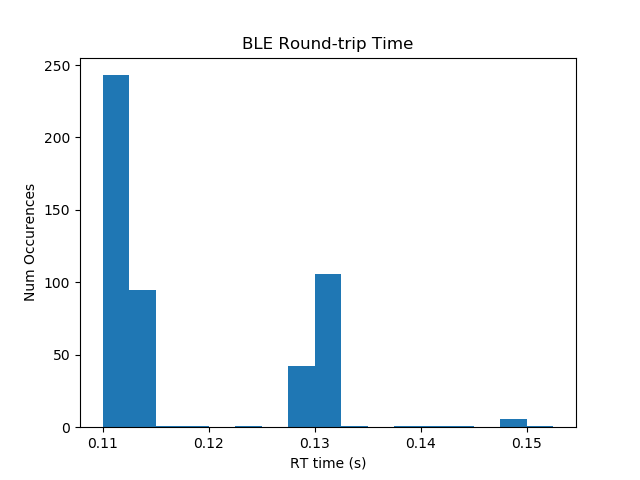
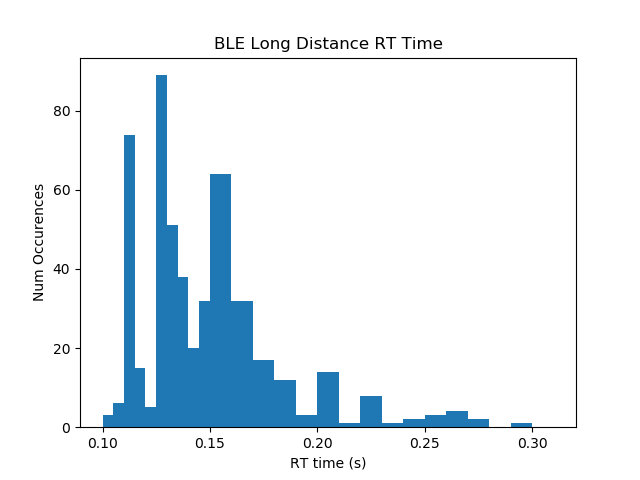
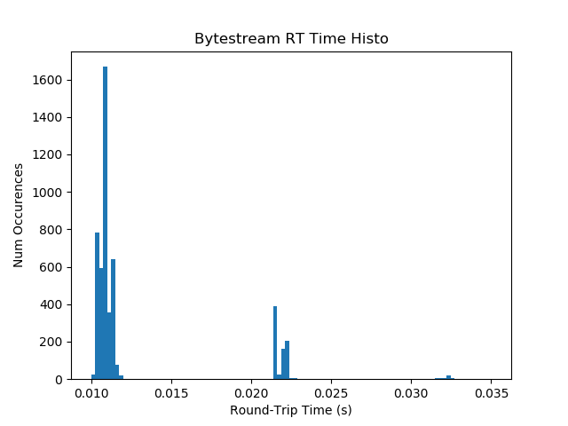
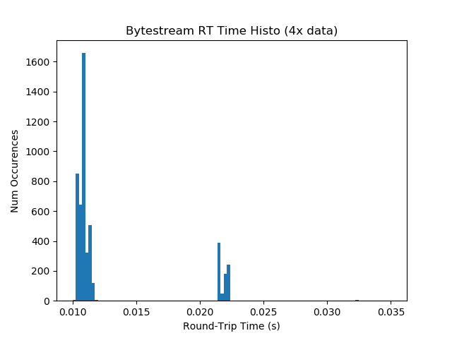
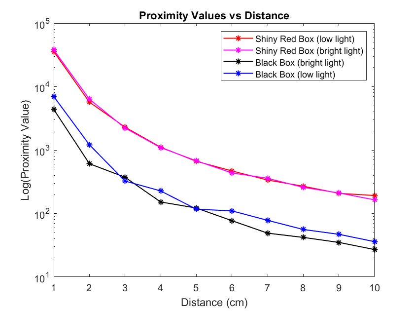
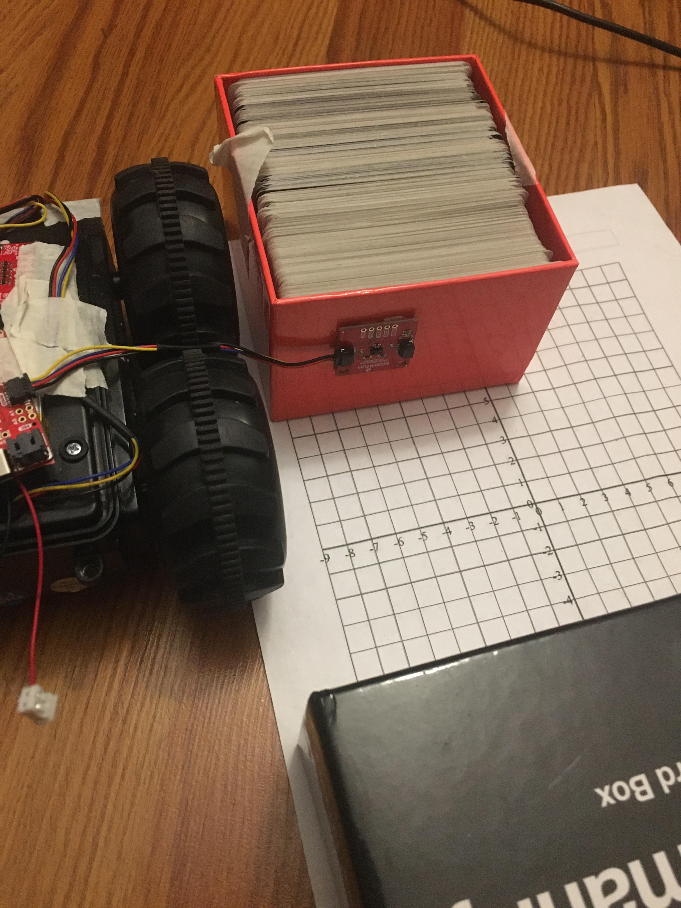
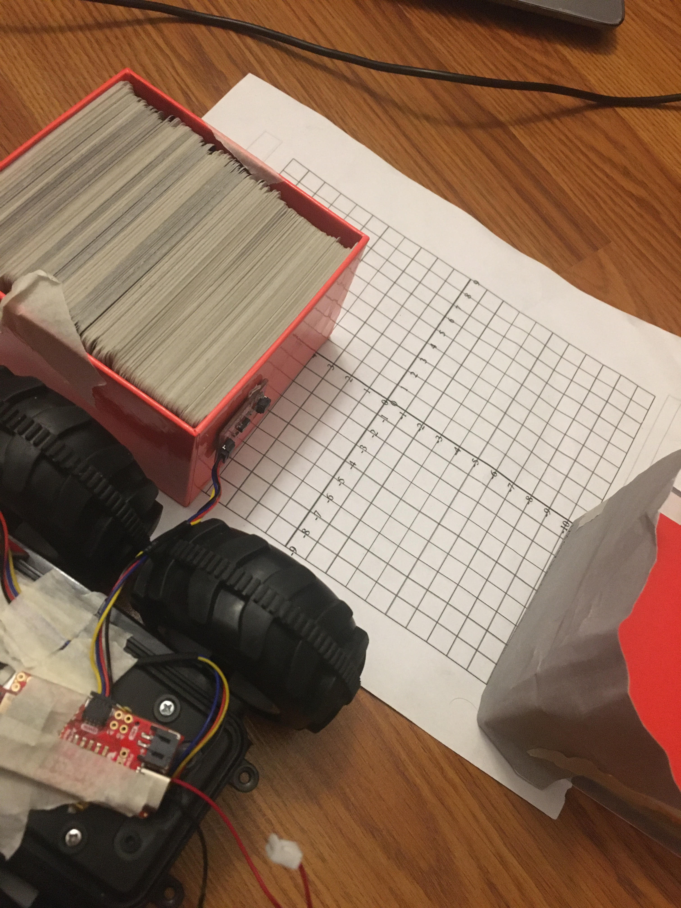
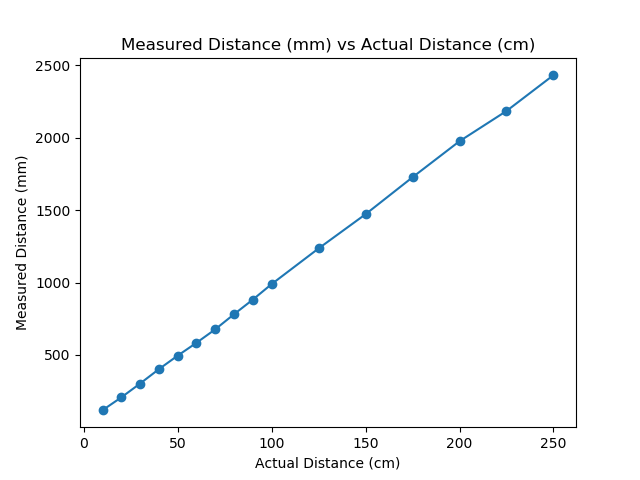
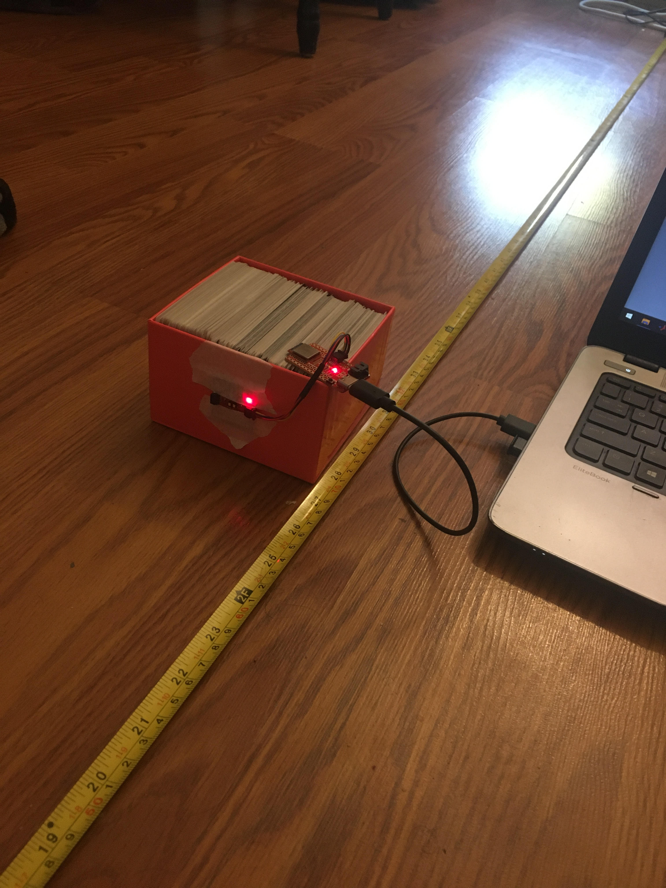

<style>
    ul li { margin-bottom: 10px; }
</style>
<Center> <br>
<h1>About Me</h1></Center>
Hi! My name is Jade and I'm super excited to take this class! Here are some (hopefully) fun facts about me:
<li> I'm currently a junior studying ECE and minoring in robotics </li>
 
<li> I think robots and autonomous systems are super cool - in high school I did a lot with FIRST robotics and I'm a member of CUAir and the Organic Robotics Lab here at Cornell</li>
 
<li> When I'm not being a stereotypical engineer in the lab, I enjoy playing the keyboard (not the typing kind!), running, hiking, and any sort of adventure I might stumble into</li>
 
<li> I'm trying to learn how to cook and don't consider myself so bad at it, but my smoke detector begs to differ </li>

<Center> <h1> Lab 1: The Artemis Board </h1> </Center>

<p style="color: green;font-size:18px"> <b> Setup </b> </p>
To be able to program the Artemis board, I first had to configure my Arduino IDE to install the required libraries. After installing everything, I checked that the programmer was functional by uploading the provided 'Blink It Up' program - as shown in the video below, the board exhibited the expected behavior (built in blue LED toggles every second).
<iframe width="560" height="315" src="https://www.youtube.com/embed/OfnUbPsn1BE" frameborder="0" allow="accelerometer; autoplay; encrypted-media; gyroscope; picture-in-picture" allowfullscreen></iframe><br>
<p style="color: green;font-size:18px"> <b> Example Programs </b> </p>
<b> Serial Output: </b> To test if serial communication worked between my laptop and the Artemis board, I uploaded the provided 'Example2_Serial' program. As seen in the video below, the board was able to receive keyboard input from the laptop, process it, and print statements on my screen via the serial interface. The provided example program actually didn't work perfectly because it neglected to take into account the default newline character when sending serial commands, so I had to alter the code slightly to make it run more smoothly.<br>
<iframe width="560" height="315" src="https://www.youtube.com/embed/wWjGUYQRyek" frameborder="0" allow="accelerometer; autoplay; encrypted-media; gyroscope; picture-in-picture" allowfullscreen></iframe><br>
<b> Analog Tests: </b> To determine if the board is able to measure analog values, I ran the 'Example4_analogRead' program that reads an onboard temperature sensor and prints the output on the Arduino IDE via serial. In the video below, we can see the temperature of the board increase as I hold it close to my overheating laptop. <br>
<iframe width="560" height="315" src="https://www.youtube.com/embed/1t-gQvpS2A4" frameborder="0" allow="accelerometer; autoplay; encrypted-media; gyroscope; picture-in-picture" allowfullscreen></iframe><br>
<b> Microphone Test: </b> To see if the onboard microphone is functional, I uploaded the 'Example1_MicrophoneOuput' program that identifies the loudest frequency heard by the microphone. As seen in the video below, the loudest frequency changes with the pitch of the whistled tone.<br>
<iframe width="560" height="315" src="https://www.youtube.com/embed/7lypdgFtBKc" frameborder="0" allow="accelerometer; autoplay; encrypted-media; gyroscope; picture-in-picture" allowfullscreen></iframe><br>

<p style="color: green;font-size:18px"> <b> Battery Tests </b> </p>
Another cool feature of the Artemis board is its onboard battery charger. When the LiPo battery is connected to the board while plugged into a laptop via USB-C, the board is able to charge the battery (indicated by the yellow light in the image below). When the board is disconnected from the computer, it is able to source power from the battery; this can be seen in the video below, in which the board turns on the blue built in LED when it detects a tone being whistled. The board determines that a tone is being whistled by identifying the loudest frequency using the microphone, just as was done above; if the pitch was above a certain threshold frequency value, then the light would turn on (this frequency value was determined via trial and error - speaking is at much lower tones than whistling)<br>
<b>Code:</b><br>
```C
if(ui32LoudestFrequency >= 500){digitalWrite(LED_BUILTIN,HIGH);}
  else{digitalWrite(LED_BUILTIN,LOW);}
```
<i>The battery being charged while the board is connected to my laptop</i>
<br>
<iframe width="560" height="315" src="https://www.youtube.com/embed/MvvlOql-GQY" frameborder="0" allow="accelerometer; autoplay; encrypted-media; gyroscope; picture-in-picture" allowfullscreen></iframe>

<br> <br>

<Center> <h1> Lab 2: Bluetooth Communication </Center></h1>

<p style="color: green;font-size:18px"> <b> Setup </b> </p>
I had a little trouble setting up the bluetooth on the provided ECE4960 Ubuntu VM, so I just opted to use my windows machine for the entirety of this lab. To enable bluetooth communication with the Artemis board, I installed the necessary python library (bleak) using pip. I also downloaded the provided distribution code (python scripts and Arduino IDE code) as a starting point for this lab.<br>
Once the necessary libraries were installed, I ran the example code to see if my laptop was able to connect to the Artemis board via bluetooth. Luckily, I was able to connect the two after a few tries and added the board's MAC address to the settings cache.

<p style="color: green;font-size:18px"> <b> Pinging the Robot </b> </p>
Each ping packet is 99 bytes - one length, one command, 96 data bytes, and one extra.To measure the round trip response times and flucutuations in latency, I modified the PONG case as below:
```Python
timeDiff = time.time() - theRobot.now
instantDat.append(round(timeDiff,5))
if(Settings["pingLoop"]):
    loop.create_task(theRobot.ping())
```
The program records the time difference between pongs and records it in a python list. When the python script is killed by the user, these python lists are converted to NumPy arrays before the program quits out (this was done because appending to lists is computationally faster than appending to NumPy arrays and I wanted to skew the measurement as little as possible). While a slightly more accurate average may be acquired by only measuring the time every few pings, capturing the round trip time of every ping only adds a few extra commands; since python per-line execution times are on the order of microseconds, this shouldn't skew the data a whole lot - collecting more data points may also give a better idea of the variation in latency. The data I collected was then used to make the following histogram of round trip times: <br>
<br>
The average round-trip ping time was 0.1185 seconds with a standard deviation of 0.0095 seconds with a total of 500 datapoints collected. Interestingly, the data seems to be bimodal in a sense - the majority of times are centered around ~.1125 seconds, but there's a second significant cluster at around 0.13 seconds. 
This test was performed with the artemis board right next to my laptop. To see how the round-trip time varies with distance, I left the board on my porch and pinged it with my laptop from across the street - results can be seen below: <br>
<br> 
The average RT ping time in this case was 0.145 seconds with a standard deviation of 0.034 seconds, also with 500 datapoints collected. As with the last trial, the data also seems to be bimodal in a sense (although it's shifted right and a bit less apparent), but the distribution is a fair bit smoother than in the previous. I was suprised to see that the difference in average RT time did not differ by such a large margin (only about ~0.03 sec slower on average from a distance). <br>
While these rates are not particularly slow, they are significantly slower than a wired serial connection. The standard baud rate (roughly the number of bits/sec) that we've been using for the Artemis board is 115200 - this translates to about 11520 Bytes/sec when accounting for start/stop bits in transmission. Since each byte would have to travel back and forth, this implies that 11520/2=5760 bytes could be transmitted back and forth per second. Since our average RT time over bluetooth was just over 0.1 seconds for 99 bytes, this means that the (somewhat idealized) wired connection is approximately 5-6 times faster than Bluetooth.

<p style="color: green;font-size:18px"> <b> Requesting a float </b></p>
While pinging the robot is pretty cool and serves as a quick check to see if the bluetooth link is functional, sending and receiving meaningful data to/from the Artemis board is much more useful. As a first attempt to transmit values between the two nodes, I tried requesting a float from the board via a command sent by my laptop. Upon reception of this REQ_FLOAT command, the board sends back a packet that contains a 4-byte float value; this return command struct also contains a length field and a command value that the computer uses upon reception of this retun packet. <br>
In order to write a float value into the data bytearray, I ended up casting the data pointer into a float pointer, then storing the desired value in there: <br>
```C
res_cmd->length = sizeof(float);
res_cmd->command_type = GIVE_FLOAT;
*((float*)res_cmd->data) = putVal;
amdtpsSendData((uint8_t *)res_cmd, 6);
```
When testing the program, I first tried transmitting pi over Bluetooth by casting the math library's M_PI constant to a float and sending that, but the received value wasn't exactly pi. To determine if that error was due to an imprecise M_PI constant or floating point isses, I just decided to send the number 3.14 as a float instead; rather than receiving exactly 3.14, the Python code unpacked that value as 3.140000104904175, indicating that there are some issues with floating point comparison/conversion. These issues in C are fairly well known, but one must still be really careful when comparing two float values (especially with subtraction).

<p style="color: green;font-size:18px"> <b> Testing the Data Rate </b> </p>
The procedure for sending two numbers was very similar to sending a float - the only difference was the number of bytes and that they had to be inserted into different points int the array. 
```C
//ct declared as a global uint32_t, lastTime declared as global uint64_t 
lastTime = (uint64_t)micros();
memcpy((uint32_t*)&res_cmd->data[0],&ct,4);
memcpy((uint64_t*)&res_cmd->data[4],&lastTime,8);
amdtpsSendData((uint8_t *)res_cmd, 14);
```
With 5000 received packets, a total of 881 were lost (1 packet dropped for every 5.7 sent, on average). The datastream rate was also much faster, with an average time of 0.0128 seconds between packets received. Below is a histogram of the packet RT times: <br>
<br>

I also tried the same thing but with sending 4x the amount of data in a packet (4-32 bit ints, 4-int_64's). With 5000 received packets, a total of 890 were lost and the average time between packets was also 0.0128 secs - it seems like the amount of data transferred in a single packet has no significant effect on the bytestream performance; this makes sense since all 99 bytes are transmitted each time anyway. The histograms look shockingly similar to each other: <br>
<br>

<p style="color: green;font-size:18px"> <b> Command Framework Modifications </b> </p>
To expand on the command framework, I added a command that transmits 9 floats as provided by the IMU (should be convenient later). I also added some commands to transfer larger PNG files (described below). To do this I had to modify both constants.py and commands.h


<p style="color: green;font-size:18px"> <b> 2+ KB File Transfer </b> </p>
Unfortunately, I did not have enough time to fully complete this optional part of the lab (somehow prelims are starting already!). However, my original idea was to bounce a PNG image bytearray between the two devices and see how the final image looked. To do this, I expanded the framework to include PNG_START_TRANSMIT and PNG_IMG commands that indicated when a file transfer starts and was in progress. Because the full file would have to be distributed across multiple packets, the cmd->length would be the packet number, and the file size would be indicated by the START_TRANSMIT command.
```C
case PNG_IMG_START:{
  pngSize = cmd->length;
  Serial.print("PNG Size is ");
  Serial.println(pngSize);
}
case PNG_IMG:{
  int countt = cmd->length;
  *((uint8_t*)&img[countt*96]) = *cmd->data;
}
```
<br> <br>

<h1> <Center> Lab 3: Characterizing the Robot </Center> </h1> <br>

<p style = "color: green; font-size: 18px;"> <b> 3a: Characterizing the Physical Robot </b> </p> </Center><br>
<i> For this portion of the lab, I worked together with Katie Bradford and Emily Wang </i> <br>

To characterize the physical robot, we first started by measuring the mass and physical dimensions of the robot. Using a scale, we measured the robot to be 45.9g without the battery and 54.0g with the battery. Using a tape measure, we approximated the dimensions to be 15.5 x 13.5 x 12.5 cm (lengthwise, width (across headlights), vertical height). None of us were able to sit in front of the charger for several hours to time how long it takes for the battery to recharge (we prefer watching paint dry tbh, it's much more exciting), but according to the robot manual, it takes approximately 5 hours for a full charge once the battery has been used a few times. This was done so we could eventually accurately describe the robot in simulation and get an estimate of all the relevant forces. We also estimated the battery lifetime to be about 10-15 minutes of continuous driving. <br>

To characterize the motion of robot, we attempted to measure its speed by racing it along a 10m drag strip of tile in Phillips Hall. From 5 trials with our separate robots, we found that the average speed was 2.47 m/s with a maximum trial average speed of 2.61 m/s and a minimum of 2.25 m/s (all in fast mode). By running the robot until its battery was drained, we saw that there was a significant decrease in speed as the battery charge dropped; this was not really a linear phenomenon - while the speed decreased throughout our testing of the robot, once the battery approached its minimum charge, the speed dropped off very sharply until the robot could not drive any further. This data was very useful as an estimate of the average velocity that we could use in simulation and provided somwhat of an upper bound on the speed of the robot. The nonlinearity of the maximum speed as a function of battery life is also something that will probably not be taken into account in simulation but is a very important consideration in real life. <br>

In addition to speed, we attempted to estimate the acceleration of the robot - unfortunately, this proved to be quite difficult using the our eyes and the camera alone; we thought of attaching the IMU to the robot but we would have a hard time securing it to the robot without taking off the top. To estimate the acceleration, we noticed that the robot reached its full speed after about 2m of acceleration. Since our velocity tests were over a full 10m, we can approximate the time needed to accelerate to full velocity as 1/5 of the total time needed to travel the 10m (in reality its's probably a bit longer) - this is about 0.75 sec. From zero to an average velocity of 2.25 m/s in 0.75s, we can estimate the acceleration of the robot to be around 3.0 m/s^2. This also provides somewhat of an upper bound on the acceleration that we can use in the simulation. Also useful for computing forces and checking the accuracy of our IMU when we mount it on the robot. Check out a video of the robot accelerating below! <br>
<iframe width="560" height="315" src="https://www.youtube.com/embed/ypQzi79MOVw" frameborder="0" allow="accelerometer; autoplay; clipboard-write; encrypted-media; gyroscope; picture-in-picture" allowfullscreen></iframe> <br>

We also tried to measure braking distance by driving the robot at full speed and then throwing the motors into reverse when it crossed a line on the floor. In the robot's slow mode, we found the robot's average braking distance to be 13.2cm with a minimum of 10cm and a maximum of 15cm. When we tried to measure the braking distance in the robot's fast mode, we found that the robot simply flips over when we tried to actively brake, so were unable to estimate a reasonable distance at these speeds. This information will hopefully be useful in simulation and may limit how fast we can allow our robot to travel in a given room. In addition, the braking distance could also be used to characterize the robot wheels and how much slippage they experience. Our setup can be seen in the video below. <br>
<iframe width="560" height="315" src="https://www.youtube.com/embed/iga5Dm6c1dE" frameborder="0" allow="accelerometer; autoplay; clipboard-write; encrypted-media; gyroscope; picture-in-picture" allowfullscreen></iframe> <br>

To determine how well the robot could rotate, we drove one set of motors while keeping the other side off. We also tried spinning the robot about its own axis by driving the two sets of motors in opposite directions. When only one set of motors were turning, the robot's motion was very stable about its front wheel (seen in the video below). When both motors are driven in opposite directions in fast mode, the wheels seem to slip a bit and the robot drifts as well - this indicates that the robot is not able to perfectly rotate about its own axis, which provides another useful distinction between ideal simulation parameters and hard reality. <br>
<iframe width="640" height="360" src="https://www.youtube.com/embed/ZS2JQHhOlLI?t=9" frameborder="0" allow="accelerometer; autoplay; clipboard-write; encrypted-media; gyroscope; picture-in-picture" allowfullscreen></iframe> <br>
<iframe width="560" height="315" src="https://www.youtube.com/embed/rCvJbK5JcZs" frameborder="0" allow="accelerometer; autoplay; clipboard-write; encrypted-media; gyroscope; picture-in-picture" allowfullscreen></iframe> <br>

For fun, we also drove the robot across several different surfaces to see how it performed. On all the surfaces we tested (tile, concrete, grass, carpet), the robot was able to drive quite well (useful for future field tests). We also played around with stunts and were able to make the robot flip over (by driving fast and throwing the motors into reverse), spin around / drift (by going fast and turning), and even balance on two wheels (but not the ones you'd expect). Reliably reproducing some of the tricks was a little difficult, but we were able to perform some of the stunts (namely flipping and spinning) fairly reliably - control details described above. We also tried braking before crashing into a wall, but that also proved to be a little difficult since the robot would simply flip over if we went too fast and tried to stop. To achive this in some manner, we had to let the robot coast a bit before braking completely and were able to stop the robot by decelerating about 30cm from the wall. In addition, we also tried to drive the robot as quickly as possible within a 1m square, but it was much more difficult than we expected! This was done to see if we could eventually make an algorithm that performs better than a human driver (although admittedly we're not exactly the gold standard for drivers). Check out the videos of surface tests and stunts below! <br> <br>

<i> Surface Tests </i>
<iframe width="360" height="270" src="https://www.youtube.com/embed/qeUlRmqmca8" frameborder="0" allow="accelerometer; autoplay; clipboard-write; encrypted-media; gyroscope; picture-in-picture" allowfullscreen></iframe> <br>
<i> Stunts </i>
<iframe width="360" height="270" src="https://www.youtube.com/embed/m3y1oS1I_Io" frameborder="0" allow="accelerometer; autoplay; clipboard-write; encrypted-media; gyroscope; picture-in-picture" allowfullscreen></iframe> <br>
<i> Driving on a Square </i>
<iframe width="640" height="360" src="https://www.youtube.com/embed/vc01po-Nxws" frameborder="0" allow="accelerometer; autoplay; clipboard-write; encrypted-media; gyroscope; picture-in-picture" allowfullscreen></iframe> <br>


<p style = "color: green; font-size: 18px;"> <b> 3b: Characterizing the Virtual Robot </b> </p> <br>
After installing all of the necessary dependencies and lab framework (and of course after having to reinstall the VM), I started playing around with the parameters in the robot simulator to try and get a sense of how the virtual robot operates as well as the limitations of the simulation environment. To start, I attempted to move the robot around using the specified keys and adjusted both the linear and angular speeds. While the speeds can grow very large (>10^20), the actual speed is capped at some point by the simulation and the robot does not travel any faster; the same goes for the minimum speed - while, according to the simulation parameters, it will not really ever reach zero (unless due to underflow error), the effective minimum speed is zero. <br>
Interesting things also happen when the robot is steered (purposefully or not) into one of the walls; rather than just stopping or bouncing off, it is replaced by a yellow triangle with an exclamation point in it. To start driving again, the robot must back out or turn out of that position; personally, I would rather have it reset to a starting position or still show the robot instead of replacing it with an uninformative box. <br>
By clicking on the robot, the simulation shows the robot's cooridinates (x,y,z,theta). The user can also drag the robot around the field using the left mouse button and can manually adjust the robot's angle/orientation by clicking and dragging using the right mouse button. The former is especially useful if the robot collides with a wall! <br>
When playing around with the simulator, I found out that clicking on the simulation window and pressing some keys did some interesting things. For example, pressing 'o' showed previous places that the robot visited; these markers would disappear over time. Right clicking and dragging would turn the map into a 3d world and showed that the 'robot' was simply an extruded hexagon. Pressing 'd' put a line of sight cone in front of the robot. 'f' centers the image on the robot and 'g' gets rid of the checkered squares in the background. My favorite change happened while pressing 'r', which put the camera in the frame of the robot, letting the user explore the maze from the robot's perspective. 'p' also pauses the simulation, and 'c' clears away the details in the bottom of the screen. Below is a video of the virtual robot navigating the obstacle course! <br>

<iframe width="766" height="394" src="https://www.youtube.com/embed/X6ZZOyAG-jA" frameborder="0" allow="accelerometer; autoplay; clipboard-write; encrypted-media; gyroscope; picture-in-picture" allowfullscreen></iframe>
<br><br>

<h1> <Center> Lab 4: Open Loop Control </Center></h1>
<p style = "color: green; font-size: 18px;"> Part (a): Physical Robot Control </p>
After assembling the robot, I played around with the code parameters to try and achieve open loop control over the robot. To start, I first modified the example MotorTest code to drive the correct motors and I had to flip some wires around to make each set of wheels turn in the same direction when the motor power was set as positive. To test the 'turn-on power' of the motors, I wrote a short program that incremented the motor speed and printed it to serial; the motors were turned off via serial commands as well as to not waste battery life. The speed that the motors started rotating was recorded and this was performed 10 times (in each trial, both motor speeds were incremented and their turn on power was noted). This was performed in two ways: in one set of trials, I kept the wheels of the robot off the ground and recorded the turn on power for each motor. In another set, the robot was placed on the ground and the power at which it started moving forwards; a speed for each motor could not be determined because one set of wheels rolling forward caused the wheels on the other side to start moving and the motors no longer had to overcome the higher force of static friction. Check out the code and data below! <br>
```C
  int i=50;
  while(i<256){
    Serial.println(i);
    myMotorDriver.setDrive( 0, 0, i);
    myMotorDriver.setDrive( 1, 0, i);
    int startTime = millis();
    while(millis() - startTime < 500){
      if(Serial.available()){i=500; Serial.println("MOTORS OFF"); break;}
    }
    i++;
  }
```
Data:
<table> 
    <tr>
        <th> Left Wheel </th>
        <th> Right Wheel </th>
        <th> Both Wheels </th>
    </tr>
    <tr>
        <td> 62 </td>
        <td> 55 </td>
        <td> 62 </td>
    </tr>
    <tr>
        <td> 59 </td>
        <td> 61 </td>
        <td> 64 </td>
    </tr>
    <tr>
        <td> 62 </td>
        <td> 67 </td>
        <td> 59 </td>
    </tr>
    <tr>
        <td> 59 </td>
        <td> 63 </td>
        <td> 59 </td>
    </tr>
    <tr>
        <td> 61 </td>
        <td> 68 </td>
        <td> 57 </td>
    </tr>
    <tr>
        <td> 60 </td>
        <td> 59 </td>
        <td> 60 </td>
    </tr>
    <tr>
        <td> 60 </td>
        <td> 59 </td>
        <td> 59 </td>
    </tr>
    <tr>
        <td> 56 </td>
        <td> 56 </td>
        <td> 58 </td>
    </tr>
    <tr>
        <td> 67 </td>
        <td> 69 </td>
        <td> 61 </td>
    </tr>
    <tr>
        <td> 58 </td>
        <td> 58 </td>
        <td> 63 </td>
    </tr>
</table>
Right Wheel: Mean = 61.5, SD = 4.78  (distribution is kinda skewed right)<br>
Left Wheel: Mean = 60.4, SD = 2.80 <br>
Both Wheels: Mean = 60.2, SD = 2.14 <br>
<br>
Surprisingly, the average turn on power for both wheels on the ground was less than both the wheels in the air; this might be because the turn on power for the robot on the ground is essentially the minimum of the two motor powers for that trial (since one wheel turning gives the other the 'kick' it needs to overcome friction). It also has a much tighter spread than either wheel.
<br>
Luckily, my motors spun at the same rate so I didn't have to include a calibration factor for the robot to drive in a reasonably straight line - check out the video below!
<br>
<iframe width="560" height="315" src="https://www.youtube.com/embed/PC5nmNpBbzM" frameborder="0" allow="accelerometer; autoplay; clipboard-write; encrypted-media; gyroscope; picture-in-picture" allowfullscreen></iframe>
<br>

To achieve open-loop control, I first tried to make the robot just drive in a square (wanted to see how it compares to part B). This was done by simply driving the robot forwards for 0.7 seconds and then turning the robot by reversing the direction of the wheels for 0.3 seconds. See the code snippet and video below! stopMotor() is a function that just turns off both motors for 0.1 seconds - it seemed to help the robot turn slightly more precisely. <br>
```C
myMotorDriver.setDrive(0,0,sp);
myMotorDriver.setDrive(1,0,sp);
delay(700);
stopMotor();
myMotorDriver.setDrive(1,0,sp*2);
myMotorDriver.setDrive(0,1,sp*2);
delay(300);
stopMotor();
```
<iframe width="560" height="315" src="https://www.youtube.com/embed/LTTo0j7Uthc" frameborder="0" allow="accelerometer; autoplay; clipboard-write; encrypted-media; gyroscope; picture-in-picture" allowfullscreen></iframe> <br>
For fun, I also tried to make the robot travel in a straight line where the speed was dependent on the highest frequency sound that it recorded; this proved to be a bit more difficult than I thought, since the ambient frequency that it detected was somehow higher than the pitches I can whistle. I tried doing some basic filtering, but the robot speed ended up being quite erratic. To obtain the sound frequency, I just modified the printLoudest() function in the microphone example code to return a value rather than just print it to serial. Check out the code below! <br>

```C
  if (myPDM.available())
  {
    myPDM.getData(pdmDataBuffer, pdmDataBufferSize);
    freq = printLoudest();
  }
  if (freq < 2000 && freq != 0){
    sp = 255.0*((float)freq/2000.0);
    myMotorDriver.setDrive(0,0,sp);
    myMotorDriver.setDrive(1,0,sp);
  }
``` 
<br> <br>

<p style = "color: green; font-size: 18px;"> Part (b): Virtual Robot Control </p>
For this lab, I kept the virtual open loop controller very simple. To make the robot drive in a rectangular path, I programmed it to just drive straight and turn for certain amounts of time at a given speed (so that it goes approximately 90 deg on each turn and the straight segments are of equal length). This is open loop control because the control actions given to the system have no dependence on the system's output (i.e. the robot's location or orientation); as a result, while this form of control may be more computationally efficient than closed loop control, it is much more inaccurate if there are sources of error in the system (which there are in this lab - there is some error associated with the speed of the virtual robot). I chose to use a time-dependent control system to avoid any dependence on the output; it also allowed me to see how much the errors accumulate over time - something that may be nice to know for future labs. Since the robot velocity could be set very easily using the provided set_vel function, it also made the most sense with the given implementation. Check out the code and video below to see my implementation of simple open loop control! <br>

```Python
import math
linSpeed = 0.2
angSpeed = math.pi/4
lin = True

while True:
    curTime = time.time()
    robot.set_vel(linSpeed*lin,angSpeed*(not lin))
    while time.time() - curTime < 2:
        pass
    lin = not lin
``` 
<br>
<iframe width="560" height="315" src="https://www.youtube.com/embed/3cZTaRoUcsA" frameborder="0" allow="accelerometer; autoplay; clipboard-write; encrypted-media; gyroscope; picture-in-picture" allowfullscreen></iframe>
<br><br>

<Center><h1> Lab 5: Obstacle Avoidance </h1></Center>
<p style = "color: green; font-size: 18px;"> Prelab </p>
1: Proximity Sensors (passive?) <br>
2: Active TOF sensors - use measured time between photon detection and emission to calculate distance to object <br>
<br>
<p style = "color: green; font-size: 18px;"> Part (a): Physical Obstacle Avoidance </p>
<b> Proximity Sensor </b>
When I ran the example code that scans all of the I2C addresses, I found that the proximity sensor was at address 0x60. This was expected, as it is the same I2C address listed on the provided datasheet. To test the proximity sensor, I taped it to a box and recorded measurments of several targets at numerous distances away to see how the proximity values differed for different colors (red,black) and lighting conditions ('dim'/normal lighting and 'bright', where I shone my phone flashlight on the experimental setup). The results are summarized in the graph below!

<br>
Experimental Setup: <br>
<br>

As can be seen on the graph, ambient lighting conditions didn't seem to have such a large effect on the proximity reading at distances > 2-3 cm; however, as the proximity sensor got really close to the object, the external light had a more significant effect - this may be due to more reflection of the ambient light source that gets picked up by the sensor. Color had a much larger effect on the sensor reading - the black box had much lower measured proximity values than the red box; this may be due to the fact that black objects absorb light more than colored objects do. During testing, I also noticed that the proximity reading was quite sensitive to the angle of the sensor at closer distances; this may be because this increases the effective distance to the object (use triangle hypotenuse) and the sensor is very sensitive at such low distances. Using the inbuilt micros() function, I measured the time between readings to be about 630 microseconds. From looking at the serial output, it also seems that the reading is updated every ~7ms (although this may be longer than the actual value, just empirically looked at the time between changes in data)<br>

<b> TOF Sensor </b>
When scanning the I2C lines, the TOF sensor was detected at I2C Address 0x29. This was not expected, since the sensor datasheet claims that the address is 0x52 (or 0x53), but after some investigation, I found out that 0x29 is just 0x52 shifted right! This discrepancy most likely arises because I2C addresses are only 7 bits long - while the Arduino IDE just records these 7 bits, the datasheeet includes all 8, so we must shift it right since the LSB is not part of the address.
<br>
Before calibration, the sensor readings were slightly off and overshot the true value (mean of ~145mm for a true distance of 140mm). When I tried running the provided sensor calibration code, the sensor refused to provide any readings; after comparing it to some of the other functional examples, I added the distanceSensor.startRanging() command to fix the code. After successful calibration, the sensor seemed to be a fair bit more accurate (mean of about 140 for a true distance of 140 - see results below with the calibrated sensor). <br>

<br>

To test the effects of the inter-measurement period and the timing budget, I kept one constant while manipulating the other. To start, I used an inter-measurement period of 500 and varied the timing budget between 20 (minimum) and 500 (since the inter-measurement period has to be >= timing budget). <br>

For 25 measurements with an inter-measurement period of 500:<br>
	TB = 20: mean = 121.4, SD = 7.34 <br>
	TB = 50: mean = 142.04, SD = 2.06 <br>
	TB = 100: mean = 144.8, SD = 1.23 <br>
	TB = 200: mean = 145.5, SD = 0.75 <br>
	TB = 500: mean = 146.6, SD = 0.48 <br>

While the sensor becomes more accurate as the timing budget increases, there is a trade-off between accuracy and measurement frequency. Since the sensor was calibrated with a timing budget of 50 ms, different timing budgets have slightly different mean values, as seen above; interestingly, the mean measurement seems to increase with the timing budget. From lab 3, we saw that the robot travels at approximately 2-3 m/s; to have enough information about the state of the world, it would be nice to have the robot update its position every ~10 cm. For the position to update every 10cm at full speed with no latency in measurement time, the timing budget would have to be about 50 ms. This is a nice value to choose because the refresh rate is fairly quick and the precision of the measurements is not too bad (standard deviation of around 2 cm); the sensor being calibrated with this timing budget is also an added bonus!<br>

I also attempted to determine the effect of the inter-measurement period on the TOF readings. To do this, I kept the timing budget at a constant 50ms while increasing the inter-measurement period starting at 50ms (since the period has to be greater/equal the budget). <br>

For 25 measurements with an timing budget of 50 ms: <br>
	IMP = 50: mean = 141.8, sd = 1.90 <br>
	IMP = 100: mean = 141.2, sd = 1.75 <br>
	IMP = 200: mean = 140.7, sd = 1.69 <br>
	IMP = 500: mean = 141.52, sd = 1.42 <br>

As seen above, there doesn’t seem to be a very significant difference between the different sets of measurements; while the standard deviation tends to decrease as we increase the inter-measurement period, this also slows down the times between sensor readings. Because the robot is moving fairly quickly, it seems as if the benefits gained by more frequent readings outweigh the drawbacks associated with the slightly larger variation in sensor measurements. <br>

Since the goal of this lab is to have the robot avoid obstacles in my room, it seems as if the medium distance mode would be best suited for this effort, since my room isn’t even 4m across. The short distance mode limits the range of the sensor to 1.5m, which is a bit too short given the dimensions of my room. According to the datasheet, the main benefit of choosing a shorter distance mode is that the sensor is less sensitive to ambient light - because the lights in my room are not so bright and the light scattered about the room is fairly uniform, there may not be much of an advantage to choosing the short distance mode anyway. <br>

To determine the accuracy and range of the sensor, I compared the measured distance to the actual distance at several points in front of a wall and found that the sensor was suprisingly accurate for at least 2.5 meters (ran out of room at this distance!). These readings seemed fairly consistent over time and I didn't notice any fluctuations as the day progressed. Error bars representing the standard deviation are supposed to be shown on the graph below but it seems like they were too small; each datapoint represents the average of 50 measurements. Using the micros() function, I determined the time to read the sensor using the getDistance() function to be 0.725 ms. In the same vein, the time it takes to execute startRanging();getDistance();stopRanging() was about 1.63 ms; however, the reading time is still limited by the timing budget and inter-measurement period. Check out the graph and picture of my experimental setup below! <br>

<br>
<br>
	
According to the datasheet, sigma is the estimated standard deviation of the measurement, and signal is the amplitude of the signal detected by the TOF sensor (that is reflected from the target). When I quickly place a target in front of the object, I get a ‘wrapped target fail’ error which, according to the datasheet, indicates that the phase (presumably of the emitted signal) does not match the received one. Occasionally when I quickly move the target out of the way, I get a ‘signal fail’ error, which indicates that the detected signal amplitude is below some preset threshold - this may mean that the sensor never receives the reflected beacon. These errors may be important to take into account during future labs because they represent a discontinuity in sensor measurement; for the mapping lab, if there is a very steep gradient in the room’s distance profile, the sensor may not be able to detect the boundary of an object with high precision. However, the proximity sensor we have is fairly good at detecting the presence of an object, so we can use it to detect the rapid presence of objects if the TOF sensor misses it.

<br><br>

<b> Working with the Robot </b>
To attach all the sensors onto the robot, I used an interesting combination of cardboard and masking tape in order to secure all of the electronic components onto the robot frame. I also daisy chained all of the sensors together (including the motor drivers) and connected it to the Artemis board via QWIIC connectors. Once I made sure that I could control the motors and read the TOF data without any issues, I tried implementing a few steering algorithms to see which ones would be most effective in avoiding obstacles. <br>
To start, I decided to be ambitious and implement a steering algorithm that gave the robot a base speed and applied a correction factor to each of the motor speeds that depended on the distance between the robot and the object in front of it. This would cause the robot to turn more quickly when it is closer to an object, and go more straight when objects in front of it are relatively distant. Unfortunately, it proved to be fairly difficult to tune the correction factor so that the robot actually behaved as expected - check out a video of the robot failing below! <br>
<iframe width="560" height="315" src="https://www.youtube.com/embed/jbE9EMnXJCk" frameborder="0" allow="accelerometer; autoplay; clipboard-write; encrypted-media; gyroscope; picture-in-picture" allowfullscreen></iframe> <br>
Correction Factor Code: <br>
```C
baseSpeed = 120; //max(50,min(120,distance/15.0)); - wanted to make it slow down as it approached the wall...
int correction = min(100,10000.0/distance);
rightSpeed = baseSpeed - correction;
leftSpeed = baseSpeed + correction;
```
I also wanted to try coding a steering algorithm that incorporated the angle of the robot using the IMU and working with averages of sensor measurements to try and avoid erroneous motion due to measurement errors, but unfortunately did not have time to implement something that complex (maybe next week!). After trying to implement the correction factor steering, I switched to a very simple, yet effective method in which the robot would simply go straight until it detected an object within a certain threshold distance, then turn until things were no longer within that threshold. While this method may be a bit crude, it was still quite effective in allowing the robot to avoid obstacles. Check out the code and videos below! <br> <br>
Take 1:
<iframe width="560" height="315" src="https://www.youtube.com/embed/E3w1qgjr5JU" frameborder="0" allow="accelerometer; autoplay; clipboard-write; encrypted-media; gyroscope; picture-in-picture" allowfullscreen></iframe> <br>
Take 2 (slight improvements):
<iframe width="560" height="315" src="https://www.youtube.com/embed/Z4BC3OgD_lY" frameborder="0" allow="accelerometer; autoplay; clipboard-write; encrypted-media; gyroscope; picture-in-picture" allowfullscreen></iframe> <br>

```C
baseSpeed = 120;
if (distance < 200){
	motorDriver.setDrive(0,1,150);
	motorDriver.setDrive(1,0,150);
}
else{
	motorDriver.setDrive(0,1,baseSpeed);
	motorDriver.setDrive(1,1,baseSpeed);
}
```

For future labs that have a similar goal, I would like to try and implement the more complicated steering algorithms that I described above. It would also be interesting to work with average sensor measurements to try and reduce the impact of errors on the motion of the robot, and see how the increased time between averages would impact the robot's performance. It would also be interesting to integrate the other sensors on the robot (especially the proximity sensor! haven't really figured out what purpose it might serve, especially since it's on the same end of the robot as the TOF sensor, although possible reasons were discussed above). Unfortunately, I was unable to record a video of my robot going as fast as possible into a wall because the battery wires became disconnected from the header pins and I didn't have access to a soldering iron on Sunday - will try and fix Monday :/. In the code, the robot sped along at a 150 power and successfully avoided the wall; from Lab 3, we determined the maximum speed to be about 2.5 m/s - assuming the speed scales linearly with the motor power, this suggests that the robot was able to avoid the wall at a speed of 1.5 m/s.


<p style = "color: green; font-size: 18px;"> Part (b): Virtual Obstacle Avoidance </p>
For this part of the lab, I used the provided Jupyter notebook file and simulation software to control the virtual robot in an attempt to avoid obstacles. To start, I decided to go with a fairly simple algorithm and then improve upon it along the way. Looking at the problem, I thought that a fairly simple obstacle avoidance algorithm would just increase the angular speed as the robot gets closer and closer to the wall; by turning at a speed inversely proportional to the distance to the wall, the robot should be able to turn in a different direction before it actually collides with the wall itself. To do this, I set the robot's velocity as follows: 
```Python
dist = robot.get_laser_data()
robot.set_vel(linSpeed,1/dist)
```
While this was an interesting idea, I ran into problems almost immediately. First, I noticed that the robot's speed was very erratic and didn't behave as expected. After some investigation, I found out that the refresh rate of the sensors is a lot slower than the velocity commands (which I measured to take 0.25ms using the time.time() function) and extraneous code I was using to control the robot (I discovered this when trying to take several measurements in a row and finding out that they were all the same). To fix this issue, I added a wait command inside of my while(True) loop so the steering algorithm would consistently get new data that reflects the robots change in position a bit better. <br>
In addition to this sensor refresh issue, the simple steering algorithm was unable to steer away fast enough - it kept on crashing into the walls of the map; this problem only became worse as the linear speed was increased. To fix this issue, I also made the linear velocity dependent on the distance to the object; by subtracting 1/distance from a base speed, the robot would even start going backwards if it got too close to the wall. After some trial and error, I made the angular velocity dependent on 1/distance^2, which improved the robot's obstacle avoidance to some extent. Check out the videos of the functional virtual robot below! <br>

<iframe width="560" height="315" src="https://www.youtube.com/embed/galxFycMBew" frameborder="0" allow="accelerometer; autoplay; clipboard-write; encrypted-media; gyroscope; picture-in-picture" allowfullscreen></iframe> <br>
<iframe width="670" height="345" src="https://www.youtube.com/embed/0gVxaJiNw9o" frameborder="0" allow="accelerometer; autoplay; clipboard-write; encrypted-media; gyroscope; picture-in-picture" allowfullscreen></iframe> <br>

As seen in the videos, the robot can get pretty close to the walls without crashing into them (especially on the sides!). The linear velocity is also quite high (baseline velocity in the code was set to 1000). As for collisions, they happened pretty rare, but here's an image of the robot having crashed ;( <br>

<br>

Code: <br>
```Python
def perform_obstacle_avoidance(robot):
	linvel = 1000
	robot.set_vel(linvel,0)
	while True:
		dist = robot.get_laser_data()
		robot.set_vel(linvel-linvel/(dist*2),1/dist**2)
		time.sleep(0.1)
```
