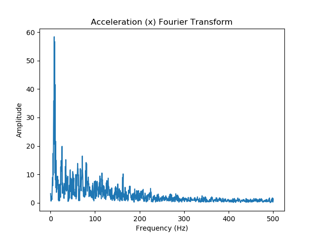
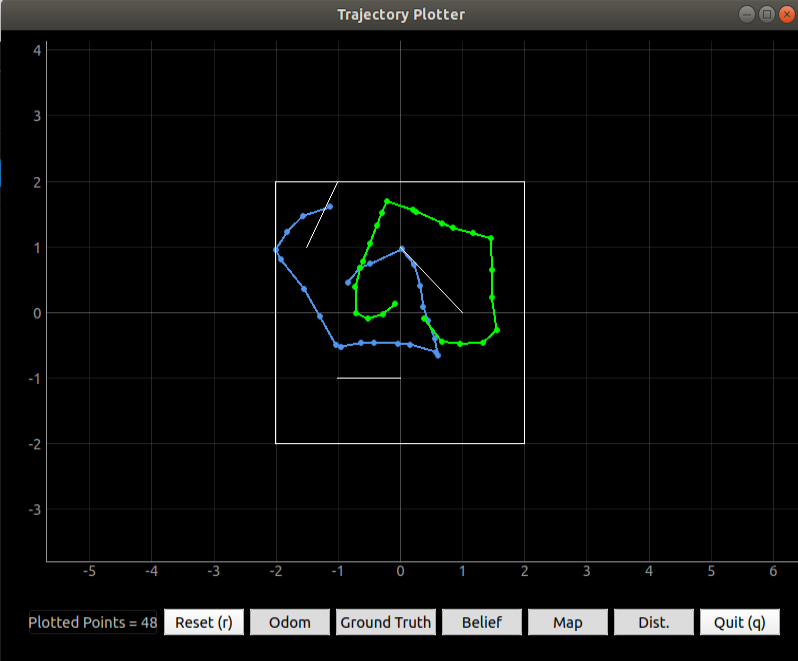
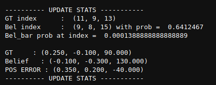
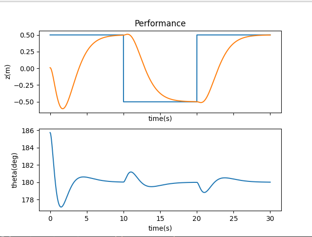
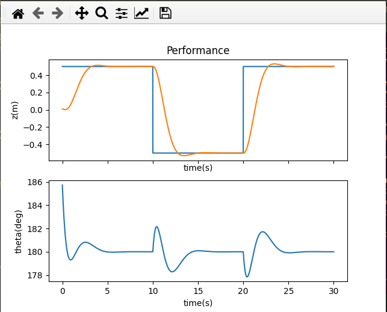

<style>
    ul li { margin-bottom: 10px; }
</style>
<Center> <br>
<p style="font-size:30px"> <b> About Me </b> </p></Center>
Hi! My name is Jade and I'm super excited to take this class! Here are some (hopefully) fun facts about me:
<li> I'm currently a junior studying ECE and minoring in robotics </li>
 
<li> I think robots and autonomous systems are super cool - in high school I did a lot with FIRST robotics and I'm a member of CUAir and the Organic Robotics Lab here at Cornell</li>
 
<li> When I'm not being a stereotypical engineer in the lab, I enjoy playing the keyboard (not the typing kind!), running, hiking, and any sort of adventure I might stumble into</li>
 
<li> I'm trying to learn how to cook and don't consider myself so bad at it, but my smoke detector begs to differ </li>

<Center> <h1> Lab 1: The Artemis Board </h1> </Center>

<p style="color: green;font-size:18px"> <b> Setup </b> </p>
To be able to program the Artemis board, I first had to configure my Arduino IDE to install the required libraries. After installing everything, I checked that the programmer was functional by uploading the provided 'Blink It Up' program - as shown in the video below, the board exhibited the expected behavior (built in blue LED toggles every second).
<iframe width="560" height="315" src="https://www.youtube.com/embed/OfnUbPsn1BE" frameborder="0" allow="accelerometer; autoplay; encrypted-media; gyroscope; picture-in-picture" allowfullscreen></iframe><br>
<p style="color: green;font-size:18px"> <b> Example Programs </b> </p>
<b> Serial Output: </b> To test if serial communication worked between my laptop and the Artemis board, I uploaded the provided 'Example2_Serial' program. As seen in the video below, the board was able to receive keyboard input from the laptop, process it, and print statements on my screen via the serial interface. The provided example program actually didn't work perfectly because it neglected to take into account the default newline character when sending serial commands, so I had to alter the code slightly to make it run more smoothly.<br>
<iframe width="560" height="315" src="https://www.youtube.com/embed/wWjGUYQRyek" frameborder="0" allow="accelerometer; autoplay; encrypted-media; gyroscope; picture-in-picture" allowfullscreen></iframe><br>
<b> Analog Tests: </b> To determine if the board is able to measure analog values, I ran the 'Example4_analogRead' program that reads an onboard temperature sensor and prints the output on the Arduino IDE via serial. In the video below, we can see the temperature of the board increase as I hold it close to my overheating laptop. <br>
<iframe width="560" height="315" src="https://www.youtube.com/embed/1t-gQvpS2A4" frameborder="0" allow="accelerometer; autoplay; encrypted-media; gyroscope; picture-in-picture" allowfullscreen></iframe><br>
<b> Microphone Test: </b> To see if the onboard microphone is functional, I uploaded the 'Example1_MicrophoneOuput' program that identifies the loudest frequency heard by the microphone. As seen in the video below, the loudest frequency changes with the pitch of the whistled tone.<br>
<iframe width="560" height="315" src="https://www.youtube.com/embed/7lypdgFtBKc" frameborder="0" allow="accelerometer; autoplay; encrypted-media; gyroscope; picture-in-picture" allowfullscreen></iframe><br>

<p style="color: green;font-size:18px"> <b> Battery Tests </b> </p>
Another cool feature of the Artemis board is its onboard battery charger. When the LiPo battery is connected to the board while plugged into a laptop via USB-C, the board is able to charge the battery (indicated by the yellow light in the image below). When the board is disconnected from the computer, it is able to source power from the battery; this can be seen in the video below, in which the board turns on the blue built in LED when it detects a tone being whistled. The board determines that a tone is being whistled by identifying the loudest frequency using the microphone, just as was done above; if the pitch was above a certain threshold frequency value, then the light would turn on (this frequency value was determined via trial and error - speaking is at much lower tones than whistling)<br>
<b>Code:</b><br>
```C
if(ui32LoudestFrequency >= 500){digitalWrite(LED_BUILTIN,HIGH);}
  else{digitalWrite(LED_BUILTIN,LOW);}
```
<i>The battery being charged while the board is connected to my laptop</i>
<br>
<iframe width="560" height="315" src="https://www.youtube.com/embed/MvvlOql-GQY" frameborder="0" allow="accelerometer; autoplay; encrypted-media; gyroscope; picture-in-picture" allowfullscreen></iframe>

<br> <br>

<Center> <h1> Lab 2: Bluetooth Communication </Center></h1>

<p style="color: green;font-size:18px"> <b> Setup </b> </p>
I had a little trouble setting up the bluetooth on the provided ECE4960 Ubuntu VM, so I just opted to use my windows machine for the entirety of this lab. To enable bluetooth communication with the Artemis board, I installed the necessary python library (bleak) using pip. I also downloaded the provided distribution code (python scripts and Arduino IDE code) as a starting point for this lab.<br>
Once the necessary libraries were installed, I ran the example code to see if my laptop was able to connect to the Artemis board via bluetooth. Luckily, I was able to connect the two after a few tries and added the board's MAC address to the settings cache.

<p style="color: green;font-size:18px"> <b> Pinging the Robot </b> </p>
Each ping packet is 99 bytes - one length, one command, 96 data bytes, and one extra.To measure the round trip response times and flucutuations in latency, I modified the PONG case as below:
```Python
timeDiff = time.time() - theRobot.now
instantDat.append(round(timeDiff,5))
if(Settings["pingLoop"]):
    loop.create_task(theRobot.ping())
```
The program records the time difference between pongs and records it in a python list. When the python script is killed by the user, these python lists are converted to NumPy arrays before the program quits out (this was done because appending to lists is computationally faster than appending to NumPy arrays and I wanted to skew the measurement as little as possible). While a slightly more accurate average may be acquired by only measuring the time every few pings, capturing the round trip time of every ping only adds a few extra commands; since python per-line execution times are on the order of microseconds, this shouldn't skew the data a whole lot - collecting more data points may also give a better idea of the variation in latency. The data I collected was then used to make the following histogram of round trip times: <br>
<br>
The average round-trip ping time was 0.1185 seconds with a standard deviation of 0.0095 seconds with a total of 500 datapoints collected. Interestingly, the data seems to be bimodal in a sense - the majority of times are centered around ~.1125 seconds, but there's a second significant cluster at around 0.13 seconds. 
This test was performed with the artemis board right next to my laptop. To see how the round-trip time varies with distance, I left the board on my porch and pinged it with my laptop from across the street - results can be seen below: <br>
<br> 
The average RT ping time in this case was 0.145 seconds with a standard deviation of 0.034 seconds, also with 500 datapoints collected. As with the last trial, the data also seems to be bimodal in a sense (although it's shifted right and a bit less apparent), but the distribution is a fair bit smoother than in the previous. I was suprised to see that the difference in average RT time did not differ by such a large margin (only about ~0.03 sec slower on average from a distance). <br>
While these rates are not particularly slow, they are significantly slower than a wired serial connection. The standard baud rate (roughly the number of bits/sec) that we've been using for the Artemis board is 115200 - this translates to about 11520 Bytes/sec when accounting for start/stop bits in transmission. Since each byte would have to travel back and forth, this implies that 11520/2=5760 bytes could be transmitted back and forth per second. Since our average RT time over bluetooth was just over 0.1 seconds for 99 bytes, this means that the (somewhat idealized) wired connection is approximately 5-6 times faster than Bluetooth.

<p style="color: green;font-size:18px"> <b> Requesting a float </b></p>
While pinging the robot is pretty cool and serves as a quick check to see if the bluetooth link is functional, sending and receiving meaningful data to/from the Artemis board is much more useful. As a first attempt to transmit values between the two nodes, I tried requesting a float from the board via a command sent by my laptop. Upon reception of this REQ_FLOAT command, the board sends back a packet that contains a 4-byte float value; this return command struct also contains a length field and a command value that the computer uses upon reception of this retun packet. <br>
In order to write a float value into the data bytearray, I ended up casting the data pointer into a float pointer, then storing the desired value in there: <br>
```C
res_cmd->length = sizeof(float);
res_cmd->command_type = GIVE_FLOAT;
*((float*)res_cmd->data) = putVal;
amdtpsSendData((uint8_t *)res_cmd, 6);
```
When testing the program, I first tried transmitting pi over Bluetooth by casting the math library's M_PI constant to a float and sending that, but the received value wasn't exactly pi. To determine if that error was due to an imprecise M_PI constant or floating point isses, I just decided to send the number 3.14 as a float instead; rather than receiving exactly 3.14, the Python code unpacked that value as 3.140000104904175, indicating that there are some issues with floating point comparison/conversion. These issues in C are fairly well known, but one must still be really careful when comparing two float values (especially with subtraction).

<p style="color: green;font-size:18px"> <b> Testing the Data Rate </b> </p>
The procedure for sending two numbers was very similar to sending a float - the only difference was the number of bytes and that they had to be inserted into different points int the array. 
```C
//ct declared as a global uint32_t, lastTime declared as global uint64_t 
lastTime = (uint64_t)micros();
memcpy((uint32_t*)&res_cmd->data[0],&ct,4);
memcpy((uint64_t*)&res_cmd->data[4],&lastTime,8);
amdtpsSendData((uint8_t *)res_cmd, 14);
```
With 5000 received packets, a total of 881 were lost (1 packet dropped for every 5.7 sent, on average). The datastream rate was also much faster, with an average time of 0.0128 seconds between packets received. Below is a histogram of the packet RT times: <br>
<br>

I also tried the same thing but with sending 4x the amount of data in a packet (4-32 bit ints, 4-int_64's). With 5000 received packets, a total of 890 were lost and the average time between packets was also 0.0128 secs - it seems like the amount of data transferred in a single packet has no significant effect on the bytestream performance; this makes sense since all 99 bytes are transmitted each time anyway. The histograms look shockingly similar to each other: <br>
<br>

<p style="color: green;font-size:18px"> <b> Command Framework Modifications </b> </p>
To expand on the command framework, I added a command that transmits 9 floats as provided by the IMU (should be convenient later). I also added some commands to transfer larger PNG files (described below). To do this I had to modify both constants.py and commands.h


<p style="color: green;font-size:18px"> <b> 2+ KB File Transfer </b> </p>
Unfortunately, I did not have enough time to fully complete this optional part of the lab (somehow prelims are starting already!). However, my original idea was to bounce a PNG image bytearray between the two devices and see how the final image looked. To do this, I expanded the framework to include PNG_START_TRANSMIT and PNG_IMG commands that indicated when a file transfer starts and was in progress. Because the full file would have to be distributed across multiple packets, the cmd->length would be the packet number, and the file size would be indicated by the START_TRANSMIT command.
```C
case PNG_IMG_START:{
  pngSize = cmd->length;
  Serial.print("PNG Size is ");
  Serial.println(pngSize);
}
case PNG_IMG:{
  int countt = cmd->length;
  *((uint8_t*)&img[countt*96]) = *cmd->data;
}
```
<br> <br>

<h1> <Center> Lab 3: Characterizing the Robot </Center> </h1> <br>

<p style = "color: green; font-size: 18px;"> <b> 3a: Characterizing the Physical Robot </b> </p> </Center><br>
<i> For this portion of the lab, I worked together with Katie Bradford and Emily Wang </i> <br>

To characterize the physical robot, we first started by measuring the mass and physical dimensions of the robot. Using a scale, we measured the robot to be 45.9g without the battery and 54.0g with the battery. Using a tape measure, we approximated the dimensions to be 15.5 x 13.5 x 12.5 cm (lengthwise, width (across headlights), vertical height). None of us were able to sit in front of the charger for several hours to time how long it takes for the battery to recharge (we prefer watching paint dry tbh, it's much more exciting), but according to the robot manual, it takes approximately 5 hours for a full charge once the battery has been used a few times. This was done so we could eventually accurately describe the robot in simulation and get an estimate of all the relevant forces. We also estimated the battery lifetime to be about 10-15 minutes of continuous driving. <br>

To characterize the motion of robot, we attempted to measure its speed by racing it along a 10m drag strip of tile in Phillips Hall. From 5 trials with our separate robots, we found that the average speed was 2.47 m/s with a maximum trial average speed of 2.61 m/s and a minimum of 2.25 m/s (all in fast mode). By running the robot until its battery was drained, we saw that there was a significant decrease in speed as the battery charge dropped; this was not really a linear phenomenon - while the speed decreased throughout our testing of the robot, once the battery approached its minimum charge, the speed dropped off very sharply until the robot could not drive any further. This data was very useful as an estimate of the average velocity that we could use in simulation and provided somwhat of an upper bound on the speed of the robot. The nonlinearity of the maximum speed as a function of battery life is also something that will probably not be taken into account in simulation but is a very important consideration in real life. <br>

In addition to speed, we attempted to estimate the acceleration of the robot - unfortunately, this proved to be quite difficult using the our eyes and the camera alone; we thought of attaching the IMU to the robot but we would have a hard time securing it to the robot without taking off the top. To estimate the acceleration, we noticed that the robot reached its full speed after about 2m of acceleration. Since our velocity tests were over a full 10m, we can approximate the time needed to accelerate to full velocity as 1/5 of the total time needed to travel the 10m (in reality its's probably a bit longer) - this is about 0.75 sec. From zero to an average velocity of 2.25 m/s in 0.75s, we can estimate the acceleration of the robot to be around 3.0 m/s^2. This also provides somewhat of an upper bound on the acceleration that we can use in the simulation. Also useful for computing forces and checking the accuracy of our IMU when we mount it on the robot. Check out a video of the robot accelerating below! <br>
<iframe width="560" height="315" src="https://www.youtube.com/embed/ypQzi79MOVw" frameborder="0" allow="accelerometer; autoplay; clipboard-write; encrypted-media; gyroscope; picture-in-picture" allowfullscreen></iframe> <br>

We also tried to measure braking distance by driving the robot at full speed and then throwing the motors into reverse when it crossed a line on the floor. In the robot's slow mode, we found the robot's average braking distance to be 13.2cm with a minimum of 10cm and a maximum of 15cm. When we tried to measure the braking distance in the robot's fast mode, we found that the robot simply flips over when we tried to actively brake, so were unable to estimate a reasonable distance at these speeds. This information will hopefully be useful in simulation and may limit how fast we can allow our robot to travel in a given room. In addition, the braking distance could also be used to characterize the robot wheels and how much slippage they experience. Our setup can be seen in the video below. <br>
<iframe width="560" height="315" src="https://www.youtube.com/embed/iga5Dm6c1dE" frameborder="0" allow="accelerometer; autoplay; clipboard-write; encrypted-media; gyroscope; picture-in-picture" allowfullscreen></iframe> <br>

To determine how well the robot could rotate, we drove one set of motors while keeping the other side off. We also tried spinning the robot about its own axis by driving the two sets of motors in opposite directions. When only one set of motors were turning, the robot's motion was very stable about its front wheel (seen in the video below). When both motors are driven in opposite directions in fast mode, the wheels seem to slip a bit and the robot drifts as well - this indicates that the robot is not able to perfectly rotate about its own axis, which provides another useful distinction between ideal simulation parameters and hard reality. <br>
<iframe width="640" height="360" src="https://www.youtube.com/embed/ZS2JQHhOlLI?t=9" frameborder="0" allow="accelerometer; autoplay; clipboard-write; encrypted-media; gyroscope; picture-in-picture" allowfullscreen></iframe> <br>
<iframe width="560" height="315" src="https://www.youtube.com/embed/rCvJbK5JcZs" frameborder="0" allow="accelerometer; autoplay; clipboard-write; encrypted-media; gyroscope; picture-in-picture" allowfullscreen></iframe> <br>

For fun, we also drove the robot across several different surfaces to see how it performed. On all the surfaces we tested (tile, concrete, grass, carpet), the robot was able to drive quite well (useful for future field tests). We also played around with stunts and were able to make the robot flip over (by driving fast and throwing the motors into reverse), spin around / drift (by going fast and turning), and even balance on two wheels (but not the ones you'd expect). Reliably reproducing some of the tricks was a little difficult, but we were able to perform some of the stunts (namely flipping and spinning) fairly reliably - control details described above. We also tried braking before crashing into a wall, but that also proved to be a little difficult since the robot would simply flip over if we went too fast and tried to stop. To achive this in some manner, we had to let the robot coast a bit before braking completely and were able to stop the robot by decelerating about 30cm from the wall. In addition, we also tried to drive the robot as quickly as possible within a 1m square, but it was much more difficult than we expected! This was done to see if we could eventually make an algorithm that performs better than a human driver (although admittedly we're not exactly the gold standard for drivers). Check out the videos of surface tests and stunts below! <br> <br>

<i> Surface Tests </i>
<iframe width="360" height="270" src="https://www.youtube.com/embed/qeUlRmqmca8" frameborder="0" allow="accelerometer; autoplay; clipboard-write; encrypted-media; gyroscope; picture-in-picture" allowfullscreen></iframe> <br>
<i> Stunts </i>
<iframe width="360" height="270" src="https://www.youtube.com/embed/m3y1oS1I_Io" frameborder="0" allow="accelerometer; autoplay; clipboard-write; encrypted-media; gyroscope; picture-in-picture" allowfullscreen></iframe> <br>
<i> Driving on a Square </i>
<iframe width="640" height="360" src="https://www.youtube.com/embed/vc01po-Nxws" frameborder="0" allow="accelerometer; autoplay; clipboard-write; encrypted-media; gyroscope; picture-in-picture" allowfullscreen></iframe> <br>


<p style = "color: green; font-size: 18px;"> <b> 3b: Characterizing the Virtual Robot </b> </p> <br>
After installing all of the necessary dependencies and lab framework (and of course after having to reinstall the VM), I started playing around with the parameters in the robot simulator to try and get a sense of how the virtual robot operates as well as the limitations of the simulation environment. To start, I attempted to move the robot around using the specified keys and adjusted both the linear and angular speeds. While the speeds can grow very large (>10^20), the actual speed is capped at some point by the simulation and the robot does not travel any faster; the same goes for the minimum speed - while, according to the simulation parameters, it will not really ever reach zero (unless due to underflow error), the effective minimum speed is zero. <br>
Interesting things also happen when the robot is steered (purposefully or not) into one of the walls; rather than just stopping or bouncing off, it is replaced by a yellow triangle with an exclamation point in it. To start driving again, the robot must back out or turn out of that position; personally, I would rather have it reset to a starting position or still show the robot instead of replacing it with an uninformative box. <br>
By clicking on the robot, the simulation shows the robot's cooridinates (x,y,z,theta). The user can also drag the robot around the field using the left mouse button and can manually adjust the robot's angle/orientation by clicking and dragging using the right mouse button. The former is especially useful if the robot collides with a wall! <br>
When playing around with the simulator, I found out that clicking on the simulation window and pressing some keys did some interesting things. For example, pressing 'o' showed previous places that the robot visited; these markers would disappear over time. Right clicking and dragging would turn the map into a 3d world and showed that the 'robot' was simply an extruded hexagon. Pressing 'd' put a line of sight cone in front of the robot. 'f' centers the image on the robot and 'g' gets rid of the checkered squares in the background. My favorite change happened while pressing 'r', which put the camera in the frame of the robot, letting the user explore the maze from the robot's perspective. 'p' also pauses the simulation, and 'c' clears away the details in the bottom of the screen. Below is a video of the virtual robot navigating the obstacle course! <br>

<iframe width="766" height="394" src="https://www.youtube.com/embed/X6ZZOyAG-jA" frameborder="0" allow="accelerometer; autoplay; clipboard-write; encrypted-media; gyroscope; picture-in-picture" allowfullscreen></iframe>
<br><br>

<h1> <Center> Lab 4: Open Loop Control </Center></h1>
<p style = "color: green; font-size: 18px;"> Part (a): Physical Robot Control </p>
After assembling the robot, I played around with the code parameters to try and achieve open loop control over the robot. To start, I first modified the example MotorTest code to drive the correct motors and I had to flip some wires around to make each set of wheels turn in the same direction when the motor power was set as positive. To test the 'turn-on power' of the motors, I wrote a short program that incremented the motor speed and printed it to serial; the motors were turned off via serial commands as well as to not waste battery life. The speed that the motors started rotating was recorded and this was performed 10 times (in each trial, both motor speeds were incremented and their turn on power was noted). This was performed in two ways: in one set of trials, I kept the wheels of the robot off the ground and recorded the turn on power for each motor. In another set, the robot was placed on the ground and the power at which it started moving forwards; a speed for each motor could not be determined because one set of wheels rolling forward caused the wheels on the other side to start moving and the motors no longer had to overcome the higher force of static friction. Check out the code and data below! <br>
```C
  int i=50;
  while(i<256){
    Serial.println(i);
    myMotorDriver.setDrive( 0, 0, i);
    myMotorDriver.setDrive( 1, 0, i);
    int startTime = millis();
    while(millis() - startTime < 500){
      if(Serial.available()){i=500; Serial.println("MOTORS OFF"); break;}
    }
    i++;
  }
```
Data:
<table> 
    <tr>
        <th> Left Wheel </th>
        <th> Right Wheel </th>
        <th> Both Wheels </th>
    </tr>
    <tr>
        <td> 62 </td>
        <td> 55 </td>
        <td> 62 </td>
    </tr>
    <tr>
        <td> 59 </td>
        <td> 61 </td>
        <td> 64 </td>
    </tr>
    <tr>
        <td> 62 </td>
        <td> 67 </td>
        <td> 59 </td>
    </tr>
    <tr>
        <td> 59 </td>
        <td> 63 </td>
        <td> 59 </td>
    </tr>
    <tr>
        <td> 61 </td>
        <td> 68 </td>
        <td> 57 </td>
    </tr>
    <tr>
        <td> 60 </td>
        <td> 59 </td>
        <td> 60 </td>
    </tr>
    <tr>
        <td> 60 </td>
        <td> 59 </td>
        <td> 59 </td>
    </tr>
    <tr>
        <td> 56 </td>
        <td> 56 </td>
        <td> 58 </td>
    </tr>
    <tr>
        <td> 67 </td>
        <td> 69 </td>
        <td> 61 </td>
    </tr>
    <tr>
        <td> 58 </td>
        <td> 58 </td>
        <td> 63 </td>
    </tr>
</table>
Right Wheel: Mean = 61.5, SD = 4.78  (distribution is kinda skewed right)<br>
Left Wheel: Mean = 60.4, SD = 2.80 <br>
Both Wheels: Mean = 60.2, SD = 2.14 <br>
<br>
Surprisingly, the average turn on power for both wheels on the ground was less than both the wheels in the air; this might be because the turn on power for the robot on the ground is essentially the minimum of the two motor powers for that trial (since one wheel turning gives the other the 'kick' it needs to overcome friction). It also has a much tighter spread than either wheel.
<br>
Luckily, my motors spun at the same rate so I didn't have to include a calibration factor for the robot to drive in a reasonably straight line - check out the video below!
<br>
<iframe width="560" height="315" src="https://www.youtube.com/embed/PC5nmNpBbzM" frameborder="0" allow="accelerometer; autoplay; clipboard-write; encrypted-media; gyroscope; picture-in-picture" allowfullscreen></iframe>
<br>

To achieve open-loop control, I first tried to make the robot just drive in a square (wanted to see how it compares to part B). This was done by simply driving the robot forwards for 0.7 seconds and then turning the robot by reversing the direction of the wheels for 0.3 seconds. See the code snippet and video below! stopMotor() is a function that just turns off both motors for 0.1 seconds - it seemed to help the robot turn slightly more precisely. <br>
```C
myMotorDriver.setDrive(0,0,sp);
myMotorDriver.setDrive(1,0,sp);
delay(700);
stopMotor();
myMotorDriver.setDrive(1,0,sp*2);
myMotorDriver.setDrive(0,1,sp*2);
delay(300);
stopMotor();
```
<iframe width="560" height="315" src="https://www.youtube.com/embed/LTTo0j7Uthc" frameborder="0" allow="accelerometer; autoplay; clipboard-write; encrypted-media; gyroscope; picture-in-picture" allowfullscreen></iframe> <br>
For fun, I also tried to make the robot travel in a straight line where the speed was dependent on the highest frequency sound that it recorded; this proved to be a bit more difficult than I thought, since the ambient frequency that it detected was somehow higher than the pitches I can whistle. I tried doing some basic filtering, but the robot speed ended up being quite erratic. To obtain the sound frequency, I just modified the printLoudest() function in the microphone example code to return a value rather than just print it to serial. Check out the code below! <br>

```C
  if (myPDM.available())
  {
    myPDM.getData(pdmDataBuffer, pdmDataBufferSize);
    freq = printLoudest();
  }
  if (freq < 2000 && freq != 0){
    sp = 255.0*((float)freq/2000.0);
    myMotorDriver.setDrive(0,0,sp);
    myMotorDriver.setDrive(1,0,sp);
  }
``` 
<br> <br>

<p style = "color: green; font-size: 18px;"> Part (b): Virtual Robot Control </p>
For this lab, I kept the virtual open loop controller very simple. To make the robot drive in a rectangular path, I programmed it to just drive straight and turn for certain amounts of time at a given speed (so that it goes approximately 90 deg on each turn and the straight segments are of equal length). This is open loop control because the control actions given to the system have no dependence on the system's output (i.e. the robot's location or orientation); as a result, while this form of control may be more computationally efficient than closed loop control, it is much more inaccurate if there are sources of error in the system (which there are in this lab - there is some error associated with the speed of the virtual robot). I chose to use a time-dependent control system to avoid any dependence on the output; it also allowed me to see how much the errors accumulate over time - something that may be nice to know for future labs. Since the robot velocity could be set very easily using the provided set_vel function, it also made the most sense with the given implementation. Check out the code and video below to see my implementation of simple open loop control! <br>

```Python
import math
linSpeed = 0.2
angSpeed = math.pi/4
lin = True

while True:
    curTime = time.time()
    robot.set_vel(linSpeed*lin,angSpeed*(not lin))
    while time.time() - curTime < 2:
        pass
    lin = not lin
``` 
<br>
<iframe width="560" height="315" src="https://www.youtube.com/embed/3cZTaRoUcsA" frameborder="0" allow="accelerometer; autoplay; clipboard-write; encrypted-media; gyroscope; picture-in-picture" allowfullscreen></iframe>
<br><br>

<Center><h1> Lab 5: Obstacle Avoidance </h1></Center>
<p style = "color: green; font-size: 18px;"> Prelab </p>
There are quite a few types of infrared distance sensors available for use in low cost robots these days, but there are two main types of infrared sensors: proximity sensors and time-of flight sensors (which are coincidentally the ones we use in this lab - who would've thought!)<br>
1: Proximity Sensors - work by emitting an infrared beam that gets reflected off of nearby objects. When the reflected light arrives at the detector, the sensor uses the characteristics of the reflected light to reconstruct the position of the object. Proximity sensors are quite good at determining if an object is present within a given range, but does not give very accurate estimates of an object's position. Measurements are also more strongly affected by the environment (ambient light, color, etc.). <br>
2: Active TOF sensors - work by measuring the time that it takes for an emitted wave to reflect off a target and be detected by the sensor. These readings are much more accurate than the proximity sensors and have a significantly larger range, but are a bit more costly. Ambient light may also have an effect on sensor readings.<br>
Because the TOF sensor is more accurate, it may be more useful to put it in the front of the robot while driving. It may be advantageous to put the proximity sensor in the back of the robot for short uses and to see if there are any obstacles behind the robot when reversing. The robot may miss obstacles while turning quickly or if objects jut out and clip them on the side / on the wheels; somewhat of a side-to-side motion while driving may help detect objects within the robot's path.
<br>
<Center><p style = "color: green; font-size: 18px;"> Part (a): Physical Obstacle Avoidance </p></Center>
<Center> <b> Proximity Sensor </b> </Center><br>
When I ran the example code that scans all of the I2C addresses, I found that the proximity sensor was at address 0x60. This was expected, as it is the same I2C address listed on the provided datasheet. To test the proximity sensor, I taped it to a box and recorded measurments of several targets at numerous distances away to see how the proximity values differed for different colors (red,black) and lighting conditions ('dim'/normal lighting and 'bright', where I shone my phone flashlight on the experimental setup). The results are summarized in the graph below!

<br>
Experimental Setup (Artemis board usually disconnected from robot): <br>
<br>

As can be seen on the graph, ambient lighting conditions didn't seem to have such a large effect on the proximity reading at distances > 2-3 cm; however, as the proximity sensor got really close to the object, the external light had a more significant effect - this may be due to more reflection of the ambient light source that gets picked up by the sensor. Color had a much larger effect on the sensor reading - the black box had much lower measured proximity values than the red box; this may be due to the fact that black objects absorb light more than colored objects do. During testing, I also noticed that the proximity reading was quite sensitive to the angle of the sensor at closer distances; this may be because this increases the effective distance to the object (use triangle hypotenuse) and the sensor is very sensitive at such low distances. Using the inbuilt micros() function, I measured the time between readings to be about 630 microseconds. From looking at the serial output, it also seems that the reading is updated every ~7ms (although this may be longer than the actual value, just empirically looked at the time between changes in data)<br>

<Center><b> TOF Sensor </b> </Center><br>
When scanning the I2C lines, the TOF sensor was detected at I2C Address 0x29. This was not expected, since the sensor datasheet claims that the address is 0x52 (or 0x53), but after some investigation, I found out that 0x29 is just 0x52 shifted right! This discrepancy most likely arises because I2C addresses are only 7 bits long - while the Arduino IDE just records these 7 bits, the datasheeet includes all 8, so we must shift it right since the LSB is not part of the address.
<br>
Before calibration, the sensor readings were slightly off and overshot the true value (mean of ~145mm for a true distance of 140mm). When I tried running the provided sensor calibration code, the sensor refused to provide any readings; after comparing it to some of the other functional examples, I added the distanceSensor.startRanging() command to fix the code. After successful calibration, the sensor seemed to be a fair bit more accurate (mean of about 140 for a true distance of 140 - see results below with the calibrated sensor). <br>

Experimental setup (Artemis board usually not connected to robot): <br>
<br>

To test the effects of the inter-measurement period and the timing budget, I kept one constant while manipulating the other. To start, I used an inter-measurement period of 500 and varied the timing budget between 20 (minimum) and 500 (since the inter-measurement period has to be >= timing budget). <br>

For 25 measurements with an inter-measurement period of 500:<br>
	TB = 20: mean = 121.4, SD = 7.34 <br>
	TB = 50: mean = 142.04, SD = 2.06 <br>
	TB = 100: mean = 144.8, SD = 1.23 <br>
	TB = 200: mean = 145.5, SD = 0.75 <br>
	TB = 500: mean = 146.6, SD = 0.48 <br>

While the sensor becomes more accurate as the timing budget increases, there is a trade-off between accuracy and measurement frequency. Since the sensor was calibrated with a timing budget of 50 ms, different timing budgets have slightly different mean values, as seen above; interestingly, the mean measurement seems to increase with the timing budget. From lab 3, we saw that the robot travels at approximately 2-3 m/s; to have enough information about the state of the world, it would be nice to have the robot update its position every ~10 cm. For the position to update every 10cm at full speed with no latency in measurement time, the timing budget would have to be about 50 ms. This is a nice value to choose because the refresh rate is fairly quick and the precision of the measurements is not too bad (standard deviation of around 2 cm); the sensor being calibrated with this timing budget is also an added bonus!<br>

I also attempted to determine the effect of the inter-measurement period on the TOF readings. To do this, I kept the timing budget at a constant 50ms while increasing the inter-measurement period starting at 50ms (since the period has to be greater/equal the budget). <br>

For 25 measurements with an timing budget of 50 ms: <br>
	IMP = 50: mean = 141.8, sd = 1.90 <br>
	IMP = 100: mean = 141.2, sd = 1.75 <br>
	IMP = 200: mean = 140.7, sd = 1.69 <br>
	IMP = 500: mean = 141.52, sd = 1.42 <br>

As seen above, there doesn’t seem to be a very significant difference between the different sets of measurements; while the standard deviation tends to decrease as we increase the inter-measurement period, this also slows down the times between sensor readings. Because the robot is moving fairly quickly, it seems as if the benefits gained by more frequent readings outweigh the drawbacks associated with the slightly larger variation in sensor measurements. <br>

Since the goal of this lab is to have the robot avoid obstacles in my room, it seems as if the medium distance mode would be best suited for this effort, since my room isn’t even 4m across. The short distance mode limits the range of the sensor to 1.5m, which is a bit too short given the dimensions of my room. According to the datasheet, the main benefit of choosing a shorter distance mode is that the sensor is less sensitive to ambient light - because the lights in my room are not so bright and the light scattered about the room is fairly uniform, there may not be much of an advantage to choosing the short distance mode anyway. <br>

To determine the accuracy and range of the sensor, I compared the measured distance to the actual distance at several points in front of a wall and found that the sensor was suprisingly accurate for at least 2.5 meters (ran out of room at this distance!). These readings seemed fairly consistent over time and I didn't notice any fluctuations as the day progressed. Error bars representing the standard deviation are supposed to be shown on the graph below but it seems like they were too small; each datapoint represents the average of 50 measurements. Using the micros() function, I determined the time to read the sensor using the getDistance() function to be 0.725 ms. In the same vein, the time it takes to execute startRanging();getDistance();stopRanging() was about 1.63 ms; however, the reading time is still limited by the timing budget and inter-measurement period. I also tested the TOF sensor on a few colored pieces of paper and the target color did not appear to have a significant effect on the measurement. Check out the range test graph and picture of my experimental setup below! <br>

<br>
<br>
	
According to the datasheet, sigma is the estimated standard deviation of the measurement, and signal is the amplitude of the signal detected by the TOF sensor (that is reflected from the target). When I quickly place a target in front of the object, I get a ‘wrapped target fail’ error which, according to the datasheet, indicates that the phase (presumably of the emitted signal) does not match the received one. Occasionally when I quickly move the target out of the way, I get a ‘signal fail’ error, which indicates that the detected signal amplitude is below some preset threshold - this may mean that the sensor never receives the reflected beacon. These errors may be important to take into account during future labs because they represent a discontinuity in sensor measurement; for the mapping lab, if there is a very steep gradient in the room’s distance profile, the sensor may not be able to detect the boundary of an object with high precision. However, the proximity sensor we have is fairly good at detecting the presence of an object, so we can use it to detect the rapid presence of objects if the TOF sensor misses it.

<br><br>

<Center><b> Working with the Robot </b></Center><br>
To attach all the sensors onto the robot, I used an interesting combination of cardboard and masking tape in order to secure all of the electronic components onto the robot frame. I also daisy chained all of the sensors together (including the motor drivers) and connected it to the Artemis board via QWIIC connectors. Once I made sure that I could control the motors and read the TOF data without any issues, I tried implementing a few steering algorithms to see which ones would be most effective in avoiding obstacles. <br>
To start, I decided to be ambitious and implement a steering algorithm that gave the robot a base speed and applied a correction factor to each of the motor speeds that depended on the distance between the robot and the object in front of it. This would cause the robot to turn more quickly when it is closer to an object, and go more straight when objects in front of it are relatively distant. Unfortunately, it proved to be fairly difficult to tune the correction factor so that the robot actually behaved as expected - check out a video of the robot failing below! <br>
<iframe width="560" height="315" src="https://www.youtube.com/embed/jbE9EMnXJCk" frameborder="0" allow="accelerometer; autoplay; clipboard-write; encrypted-media; gyroscope; picture-in-picture" allowfullscreen></iframe> <br>
Correction Factor Code: <br>
```C
baseSpeed = 120; //max(50,min(120,distance/15.0)); - wanted to make it slow down as it approached the wall...
int correction = min(100,10000.0/distance);
rightSpeed = baseSpeed - correction;
leftSpeed = baseSpeed + correction;
```
I also wanted to try coding a steering algorithm that incorporated the angle of the robot using the IMU and working with averages of sensor measurements to try and avoid erroneous motion due to measurement errors, but unfortunately did not have time to implement something that complex (maybe next week!). After trying to implement the correction factor steering, I switched to a very simple, yet effective method in which the robot would simply go straight until it detected an object within a certain threshold distance, then turn until things were no longer within that threshold. While this method may be a bit crude, it was still quite effective in allowing the robot to avoid obstacles. Check out the code and videos below! <br> <br>
Take 1:
<iframe width="560" height="315" src="https://www.youtube.com/embed/E3w1qgjr5JU" frameborder="0" allow="accelerometer; autoplay; clipboard-write; encrypted-media; gyroscope; picture-in-picture" allowfullscreen></iframe> <br>
Take 2 (slight improvements):
<iframe width="560" height="315" src="https://www.youtube.com/embed/Z4BC3OgD_lY" frameborder="0" allow="accelerometer; autoplay; clipboard-write; encrypted-media; gyroscope; picture-in-picture" allowfullscreen></iframe> <br>

```C
baseSpeed = 120;
if (distance < 200){
	motorDriver.setDrive(0,1,150);
	motorDriver.setDrive(1,0,150);
}
else{
	motorDriver.setDrive(0,1,baseSpeed);
	motorDriver.setDrive(1,1,baseSpeed);
}
```

For future labs that have a similar goal, I would like to try and implement the more complicated steering algorithms that I described above. It would also be interesting to work with average sensor measurements to try and reduce the impact of errors on the motion of the robot, and see how the increased time between averages would impact the robot's performance. It would also be interesting to integrate the other sensors on the robot (especially the proximity sensor! haven't really figured out what purpose it might serve, especially since it's on the same end of the robot as the TOF sensor, although possible reasons were discussed above). Unfortunately, I was unable to record a video of my robot going as fast as possible into a wall because the battery wires became disconnected from the header pins and I didn't have access to a soldering iron on Sunday - will try and fix Monday :/. In the code, the robot sped along at a 150 power and successfully avoided the wall; from Lab 3, we determined the maximum speed to be about 2.5 m/s - assuming the speed scales linearly with the motor power, this suggests that the robot was able to avoid the wall at a speed of 1.5 m/s.


<Center><p style = "color: green; font-size: 18px;"> Part (b): Virtual Obstacle Avoidance </p></Center>
For this part of the lab, I used the provided Jupyter notebook file and simulation software to control the virtual robot in an attempt to avoid obstacles. To start, I decided to go with a fairly simple algorithm and then improve upon it along the way. Looking at the problem, I thought that a fairly simple obstacle avoidance algorithm would just increase the angular speed as the robot gets closer and closer to the wall; by turning at a speed inversely proportional to the distance to the wall, the robot should be able to turn in a different direction before it actually collides with the wall itself. To do this, I set the robot's velocity as follows: 
```Python
dist = robot.get_laser_data()
robot.set_vel(linSpeed,1/dist)
```
While this was an interesting idea, I ran into problems almost immediately. First, I noticed that the robot's speed was very erratic and didn't behave as expected. After some investigation, I found out that the refresh rate of the sensors is a lot slower than the velocity commands (which I measured to take 0.25ms using the time.time() function) and extraneous code I was using to control the robot (I discovered this when trying to take several measurements in a row and finding out that they were all the same). To fix this issue, I added a wait command inside of my while(True) loop so the steering algorithm would consistently get new data that reflects the robots change in position a bit better. <br>
In addition to this sensor refresh issue, the simple steering algorithm was unable to steer away fast enough - it kept on crashing into the walls of the map; this problem only became worse as the linear speed was increased. To fix this issue, I also made the linear velocity dependent on the distance to the object; by subtracting 1/distance from a base speed, the robot would even start going backwards if it got too close to the wall. After some trial and error, I made the angular velocity dependent on 1/distance^2, which improved the robot's obstacle avoidance to some extent. Check out the videos of the functional virtual robot below! <br>

<iframe width="560" height="315" src="https://www.youtube.com/embed/galxFycMBew" frameborder="0" allow="accelerometer; autoplay; clipboard-write; encrypted-media; gyroscope; picture-in-picture" allowfullscreen></iframe> <br>
<iframe width="670" height="345" src="https://www.youtube.com/embed/0gVxaJiNw9o" frameborder="0" allow="accelerometer; autoplay; clipboard-write; encrypted-media; gyroscope; picture-in-picture" allowfullscreen></iframe> <br>

As seen in the videos, the robot can get pretty close to the walls without crashing into them (especially on the sides!). The linear velocity is also quite high (baseline velocity in the code was set to 1000). As for collisions, they happened pretty rare, but here's an image of the robot having crashed ;( <br>

<br>

Code: <br>
```Python
def perform_obstacle_avoidance(robot):
	linvel = 1000
	robot.set_vel(linvel,0)
	while True:
		dist = robot.get_laser_data()
		robot.set_vel(linvel-linvel/(dist*2),1/dist**2)
		time.sleep(0.1)
```


<Center> <h1> Lab 6: IMU, PID, and Odometry </h1> </Center>
<Center><p style = "color: green; font-size: 18px;"> Lab 6a: IMU, PID, and Odometry with the Physical Robot </p> </Center>
NOTE: For some reason, certain images do not appear on the website version of this lab report - check out the index.md file for the images if they are missing; they should all be in the Github repo. <br>
<Center> <b> Setting up the IMU </b> </Center>
To start experimenting with the IMU, I first had to install all the necessary libraries on the Arduino IDE and connected the module to the Artemis board via a QUIIC connector. After everything was hooked up properly, I scanned the I2C addresses on the Artemis board and found that the IMU was located at address 0x69 - this was expected, as the datasheet claims that the I2C address is either 0x69 (1101001) or 0x68 (1101000) depending on the voltage on the address select pin AD0. To read the accelerometer, magnetometer, and gyroscope data, I ran the provided Example1 code and observed the values output to serial.  <br>

The first thing I noticed was that the X and Y acceleration readings had a fair amount of error associated with them and were not necessarily centered at zero when the IMU was stationary - see the picture below that shows the X (red) and Y (purple) accelerometer readings over time while stationary. I also saw that the Z acceleration was hovering around 1000, even though the IMU was not moving; this acceleration is due to the force of gravity, and it seems that the accelerometer readings are scaled such that 1 g of acceleration = 1000 units of read acceleration. In light of this, the offset in X and Y acceleration readings may be due to gravity affecting these directions because of a slight tilt of the board (I doubt my desk or even my whole house is perfectly level); however, it could still be due to measurement error to begin with. <br>
Once I started moving the board around, I noticed that the gyroscope readings were not the absolute angle of the board with respect to its starting position, but were rather measurements of the change in angle; this may cause problems down the line if there are errors in gyro readings that would accumulate over time. I also noticed that the gyro and accelerometer directionalites corresponded to the little arrows that are drawn on the board itself. To get a better sense of the measurement errors of the IMU, I recorded the accelerometer, gyro, and magnetometer readings and calculated the mean and standard deviation of 50 consecutive measurements below. <br>
accel_x => mean = -8.66, sd = 5.67 <br>
accel_y => mean = -24.27, sd = 5.94 <br>
accel_z => mean = 1021.0, sd = 6.79 <br>
gyr_x => mean = 0.777, sd = 1.386 <br>
gyr_y => mean = 0.310, sd = 1.594 <br>
gyr_z => mean = 0.064, sd = 1.330 <br>
mag_x => mean = -31.19 sd = 0.779 <br>
mag_y => mean = -16.04, sd = 0.691 <br>
mag_z => mean = 18.43, sd = 0.733 <br>
<br>
The errors in the gyroscope measurements may be significant since the mean reading is fairly distant from 0 and the standard deviation is quite high. The magnetometer data is not centered about zero because it measures the direction of the board with respect to the Earth’s magnetic field, not the change in direction like the gyroscope. <br>
Image of X,Y acceleration readings over time (stationary IMU): <br>
 <br>
<br> 
<Center> <b> Accelerometer </b> </Center> <br>
To obtain the board’s pitch and roll from the accelerometer values, I used the equations from class to estimate the relevant angles (this uses the direction of gravity wrt the board to calculate the pitch and roll of the IMU). <br>
```C
float calc_tilt = atan2(myICM.accX(),myICM.accZ())*180.0/M_PI; //Convert to Degrees
float calc_roll = atan2(myICM.accY(),myICM.accZ())*180.0/M_PI; //Convert to Degrees
```
<br> 
To get a sense of the error on these measurements, I recorded the mean and standard deviation for 50 measurements for both the pitch and roll in {-90,0,90}. To make sure the true angle was actually +/- 90 or 0 degrees, I held the board flush against the front and sides of my desk (which is fairly level). Results are shown below: <br>
Calculated Roll (truth=90): mean = 89.34, sd = 0.352 <br>
Calculated Roll (truth=0): mean = -1.64, sd = 0.436 <br>
Calculated Roll (truth=-90): mean = -88.55, sd = 0.378 <br>
Calculated Pitch (truth=90): mean = 88.62, sd = 0.381 <br>
Calculated Pitch (truth=0): mean = -0.471, sd = 0.377 <br>
Calculated Pitch (truth=-90): mean = -88.13, sd = 0.377 <br>
<br>
As seen in the measurements above, the accelerometer is fairly accurate; at the maximum pitch and roll values, the mean measurement is only about 1-1.5 degrees below the true value. The standard deviations are also fairly small (all < 0.4 except Roll when the IMU is flat). We can calculate some sort of calibration factor by mapping the range of measurements to {-90,90}. This map would be calculated by (measured - min_calc) * (90-(-90))/(max_calc-min_calc)-90. For roll, this map would be (measured+88.55) * (180/(89.34+88.55))-90 => scale factor = 1.012. For pitch, this map would be calculated by (measured+88.13)*(180/(88.13+88.62))-90 => scale factor = 1.018.
<br>
To try and eliminate the noise in acceleration measurements, I tried to perform a Fourier transform on the accelerometer data to identify the frequency of the noise. Using the provided guide and scipy packages, I wrote the code below to analyze the frequencies in the accelerometer measurements: <br>
```Python
sfreq = 1000
N = 2*sfreq
frequency = np.linspace(0.0,sfreq/2,int(N/2))
Freq_data = fft(acc)
y = 2/N * abs(freq_data[0:np.int(N/2)])
plt.plot(frequency,y)
```
The sampling rate sfreq was set to 1000 because I had a 1ms delay between measurements in my Arduino code, thus making the sampling rate 1000 Hz. The resulting Fourier spectrum is shown below: <br>
 <br>

The peak towards the lower frequencies may be because I was tapping the robot in somewhat of an oscillatory motion. For higher frequencies (noise), it is hard to find a definitive peak, but there seems to be somewhat of a local maximum at f = 160 Hz - we can use this as the cutoff for our low pass filter (oscillations above that frequency may be due to motion). From lecture, we know that we can implement this low pass filter fairly easily in the arduino code using the equation <br>
theta_LPF[n]  = alpha* theta + (1-alpha)* theta_LPF[n-1] <br>
theta_LPF[n-1] = theta_LPF[n] <br>
Where alpha = T/(T+RC) and f_cutoff = 1/(2* pi* RC). As the cutoff frequency increases, higher frequencies become more important - our data is more ‘complete,’ but high frequency noise in the signal readings increases significantly. If we decrease the cutoff frequency, this noise gets reduced, but we might lose some important information about our data <br>

<Center> <b> Gyroscope </b> </Center>
To see how reliable angle calculations from the gyroscope would be, I used the equations from class to obtain the calculated angle from the gyro readings and plotted it using the serial plotter. To see how the gyro errors accumulate over time, I recorded the gyro measurements over time <i> while the IMU was stationary </i>and plotted them with the serial plotter. Here’s the code I used to do this:
```C
float dt = (millis()-lastTime)/1000.0;
gx += dt*myICM.gyrX();
gy += dt*myICM.gyrY();
gz += dt*myICM.gyrZ();
/*Serial Commands*/
lastTime = millis();
```
<br>
As seen in the graph below, these angles are not too reliable - while the accumulated errors in pitch were not too bad, the calculated yaw had a negative skew, and the calculated roll clearly has a positive error in measurement, which accumulates over time to produce the upwards-trending red line below. <br>
 <br>
<br>
These results weren’t so great, so I wondered how they would compare to the angles calculated by the accelerometer readings. To see how they performed against each other, I plotted all three gyro readings and the two acceleration-based angles on the same graph (angle units are all radians) while the IMU was stationary: <br>
 <br>
NOTE: calculated pitch and roll are flipped - gave them the wrong labels (oops) <br>
As seen in the graph above, the gyro-calculated angles are much, much more inaccurate than the accelerometer derived values because the errors in measurement accumulate over time. While the gyro readings fluctuate quite a bit, the accel-angles are nearly a constant zero when the IMU is held flat against the table. It’s hard to see in the graph above, since the gyro values have drifted so much, but the gyro angles appear to have less noise than the accelerometer angles (accel angles vary quite a bit in short periods of time, but have little drift in comparison to the gyro angles) The filter on the accelerometer values further improves the results with relation to the gyro readings by reducing noise in the acceleration-based angles. The gyro noise doesn’t seem to be significantly affected by the sampling frequency, but the drift in measurement seems to increase with sampling frequency. <br>

In an attempt to fix this issue, I added a complementary filter to the pitch and roll gyro calculations. The code snippet below shows the calculations as described in lecture
```C
float calc_pitch = atan2(myICM.accX(),myICM.accZ());
float calc_roll = atan2(myICM.accY(),myICM.accZ());
float alpha = 0.8;
pitch  = (pitch+myICM.gyrX()*dt)*(1-alpha)+calc_roll*alpha;
roll = (roll + myICM.gyrY()*dt)*(1-alpha)+calc_pitch*alpha;
yaw += myICM.gyrZ()*dt;
```
Because the gyro sensor is quite inaccurate, the reliability of the pitch and roll measurements decreases significantly as alpha decreases. In the image below (with alpha = 0.5), I tilted the robot to try and get smooth increases/decreases in pitch and roll, but fluctuations in the gyro readings made these readings quite different from the true observed angle. However, I did start tapping the robot and moving it around in later bits of this plot, and the vibrations/accelerations did not affect the calculated pitch and roll as much. <br>
 <br>
When I increased alpha, the calculated angles relied more on the accelerometer readings. This significantly improved accuracy of measurement, but made the calculated pitch and roll much more susceptible to vibrations. In the image below, alpha = 0.9 and the pitch/roll do not fluctuate as rapidly / as much, but are affected more heavily by the vibrations/tapping applied at the end of the plot. In this plot, I first smoothly rotated the robot (in pitch and roll), and then tapped it towards the end. <br>
 <br>

<br> <br>
<Center> <b> Magnetometer </b> </Center>
To start experimenting with the magnetometer in the IMU, I first tried to find magnetic North by reading out the X and Y readings of the magnetometer. After rotating it around a bit, I noticed that the readings were at maximum or minimum when the one of the board’s edges pointed in a certain direction (which, using my phone compass, turned out to be North (maximum) or South (minimum)). Looking at the axes drawn on the IMU module, I saw that the X readings were at maximum (~-0.5) when the X axis was pointing North, and the Y readings were at a similar value when the Y axis was pointing North. When each axis was pointing South, the magnetometer readings for that axis were at minimum (~-40 - -45); each axis had a slightly different maximum and minimum reading - this may have to be calibrated later. <br>

Once I had a better intuition as to how the magnetometer values varied, I tried calculating the yaw angle by 1) solely using the X and Y magnetometer readings, and 2) fusing the magnetometer data with the accelerometer and gyroscope readings. Below is the code I used to do this: <br>
```C
float xm = myICM.magX()*cos(roll) - myICM.magY()*sin(roll)*sin(pitch) + myICM.magZ()*cos(roll)*sin(pitch);
float ym = myICM.magY()*cos(roll) + myICM.magZ()*sin(roll);
float mag_yaw = atan2(xm, ym);
float mag_yaw_flat = atan2(myICM.magY(),myICM.magX());
```
Using solely the magnetometer values only works for yaw calculations where the pitch and roll are both zero. To test these calculations, I first plotted the computed yaw values while rotating the IMU on a flat surface (pitch and roll are both zero): <br>
 <br>
Looking at this image, we can see that the two measurements are very, very similar. This makes sense, because if we set pitch=roll=0 in the equations above, mag_yaw should equal mag_yaw_flat. In the plot, we can also see that there are occasional spikes in the data; this can be due to a large random fluctuation in the magnetometer reading that influences the calculated yaw angle. When playing around with it, I also noticed that when the IMU was pointing North, one of the magnetometer readings was hovering just below zero - if there was a small fluctuation in the reading that bumps it above zero, this caused a sign change in the atan2 argument, which ended up switching the angle from ~-pi to ~+pi; these discontinuities in the atan2 function may also prove to be important to consider in the future. I also noticed that the calculated yaw only varied between [-pi,-pi/2] - this may be because the magnetometer readings do not really exceed 0 for any given direction (maybe shifting the values so their range is centered at 0 may help) and may also be related to the symmetry of the readings as the IMU rotates through 360 degrees. Interestingly, when I was finishing up the lab on Sunday night, these values changed dramatically, with the magnetometer X and Y values now ranging from ~800 to ~1000; this might be due to calibration errors (or maybe I was just sitting on top of a massive magnet!) <br>
After playing around with the readings when the IMU was flat, I tried to calculate the yaw when pitch and roll were involved. For this, I had to fuse the magnetometer data with the calculated roll and pitch angles from the accelerometer and gyroscope (see equations above). This calculated angle was somewhat robust to small, gradual changes in pitch, but still generally tracked the measured pitch if it changed quickly or increased significantly. In the plot below, the green line is the magnetometer-calculated yaw, purple is the pitch, and red is the roll. As seen in the plot, the calculated yaw varies with pitch to some extent, but changes less dramatically than the actual pitch.


<Center> <b> PID Control </b> </Center> 
To start working towards successful PID control of the robot, I first recorded the yaw reading of the gyroscope as the robot rotated about its own axis.  To do this, I recorded the gyroscope’s Z axis reading (measured in rad/s) as I increased the power to each of the motors (as they rotated in the opposite direction). Gyro readings and motor power increases were performed every 30 ms (this was done because a) these timesteps were used in previous parts of the lab and b) stepping up/down the motor power every 30 mins gave a reasonable duration for the experiment). Code below: <br>
```C
int startTime = millis();
for (int i=50; i<256; i++){
    myICM.getAGMT(); 
    yaw = myICM.gyrZ();
    time = startTime - millis();
    /*Commands to record time and angular speed omitted*/
    delay(30);
    motors.setDrive(0,0,i); //Set motors in opposite directions
    motors.setDrive(1,1,i);
  }
  //Spin motors in opposite directions
  for (int q=255; q>=50;q--){
       myICM.getAGMT(); 
       yaw = myICM.gyrZ();
       time = startTime - millis();
       /*Commands to record time and angular speed omitted*/
       delay(30)
       motors.setDrive(0,0,q);
       motors.setDrive(1,1,q);
  }
```
<br>
And here’s the results/data plotted in Matplotlib (gyro readings were actually negative since the robot was rotating opposite the direction marked on the IMU, so the values on the graph were made positive, for display purposes): <br>
 <br>
As seen in the graph, the angular yaw speed generally increases as the motor power increases - as expected. From the data, the maximum angular speed was 891.28 rad/s - on the graph, this roughly corresponds to the maximum power delivered to the motors. There also exists a deadband in rotation that’s different for each motors - the motors only start rotating after a certain power level is exceeded. I noticed that this power level is slightly different for each motor; in my trials, the left motor starts spinning before the right one (may vary with direction of rotation). There also appears to be some sort of hysteresis going on - the motor power deadband is much larger on the left side of the plot than on the right; this makes sense because the motor has to overcome the force of static friction as it ramps up from a stationary position, while it is only fighting kinetic friction as it slows down. As seen in the graph above, it also appears that the error in gyro reading is proportional to the angular speed of the robot. During trials, I also noticed that some slippage was occurring at higher speeds, which may introduce more error into the open-loop measurements.
<br>
After playing around with different motor speeds, I tried to find the lowest possible power at which the robot could spin about its own axis without any feedback control. Looking at the graph above, I wanted to try a power of 150 first (this was about the speed at which both motors began to turn). Unfortunately, when I set both motors to this speed, the robot did not rotate since the power was too low (this may be due to the charge on the batteries, since speed at low power seems to drop dramatically as the battery level decreases). After playing around with it a bit more (even trying to push it to give it a bit of a head start), I set the motor power to 200 instead and saw that the robot could then rotate about its own axis. As a comparison, I also recorded the angular speed with a motor power of 250 and graphed them both below: <br>
 <br>
When experimenting with this, I also tried with a motor power of 180, but that was too slow given the battery capacity at the time of experiment (this was quite a problem during the labs, since the battery life of the robot is atrociously short). In the graph, the angular speed for a power of 200 seems to go up and then down; when observing the robot, I noticed that the speed slowed down by a fair amount after a few seconds - this might have been due to the presumably low battery level at the time of experiment, even though I only ran the robot for a few minutes since the last charge. The variation in angular speed seen in this graph may also be due to the fact that open-loop control is extremely imprecise. While the angular speeds at lower power seem to have more variation, the rotational speed measurements for the higher motor power seem to be marginally more consistent than for the lower one given the deviations in gyro readings. <br>
Looking at the graph, we can see that the minimum open loop rotational speed is about 200 rad/s - according to the lab instructions, the units of the gyro readings are supposed to be in rad/s, but 200 rad/s seems like far too large of a number; it is most likely in <b> degrees/s </b>. For future experiments, it would also be interesting to try initially ramping up the power to a high level, then decreasing it to go slower, since static friction would then be overcome! (This is probably what PID control is going to do in the end!)
<br> <br>
 
<b> TOF Analysis </b> <br>
According to the TOF sensor datasheet, the sensor can perform ranging measurements at a maximum frequency of 50 Hz (new measurement every 0.02 seconds). With a minimum rotational speed of 200 degrees/s, this is most likely too slow to accurately map out a room. <br>
For a robot that is 0.5m from a wall and a sensor refresh rate of 50 Hz, the robot will take a new measurement 0.02 seconds later. At 200 degrees/s, this is 4 degrees of motion (at 200 rad/s, this is 4 rad of motion, which would be insane). The distance covered would be 0.5 * tan(4 deg), or 3.5 cm of missed space  - this is most likely too much for any decent map. If the robot were to start off at 45 degrees, this would increase to 0.5(tan(49 deg)-tan(45 deg)) = 7.5 cm, which is most certainly too much missed distance to generate any sort of decent map. <br>
Because the TOF sensor uses the “signal” and “sigma” parameters to filter the output if the measurements are too different, this rotational speed of 200 degrees/s may cause the TOF sensor to ignore the output, especially if the robot is already at a high angle from the wall (distances would be even more different between measurements). In addition, since the open loop speed is not consistent, getting a reliable rotational scan to map out a room would be even more difficult, if not downright impossible.
<br>
<br>
<b> PID CONTROL </b> <br>
Finally, we get to the good stuff. To start implementing PID control, I first used some online resources (this one was helpful: https://www.teachmemicro.com/arduino-pid-control-tutorial/) to set up a tunable PID algorithm in the Arduino IDE. After some trial and error, I came up with the algorithm below: 
```C
double getPID(double curYaw) {
  curTime = millis();
  dt = (double)(curTime - prevTime);
  error = setPoint - curYaw;
  intError += error * dt;
  dError = (error - prevError) / dt;
  prevError = error;
  prevTime = curTime;
  double intTerm = ki * intError;
  return kp * error + intTerm + kd * dError;
}
```
Motor control code: <br>
```C
myICM.getAGMT();
double pidVal = getPID(myICM.gyrZ());
motors.setDrive(0, 0, min(pidVal+50,255)); //add 50 to put motors into operating range
motors.setDrive(1,1, min(pidVal+50,255));
```
This algorithm allows me to easily set the PID parameters (kp,ki,kd) at the top of the program and experiment with different values for each. At first, the value of this getPID function was just set as the motor power, but I eventually added a base speed to this value so negative values returned by the getPID function were still taken into consideration. To start tuning the parameters to make the robot spin at the correct speed, I used a heuristic method we discussed in class; this method first increases kP until oscillation, then decreases it and increases kI until stability loss, then varies kD to increase versatility with respect to disturbances. After seeing if the code returned reasonable values from the PID function without the motors moving, I set all parameters to zero and started increasing kP. To start, I made the set point a modest 100 (roughly half of the open loop rotational speed) and set kP = 1, with kI = kD = 0. The video and graph below show the robot’s motion with these parameters. <br>
<iframe width="560" height="315" src="https://www.youtube.com/embed/zqpe6kpQpRI" frameborder="0" allow="accelerometer; autoplay; clipboard-write; encrypted-media; gyroscope; picture-in-picture" allowfullscreen></iframe> <br>
 <br>
In the video, the robot appears to move fairly smoothly (minus the little bump over the scissors that I forgot to move out the way) - however, soon after it starts up, one wheel stops turning and the second one controls the motion; this may be due to the deadband observed earlier and friction from the table. Increasing the setpoint to 150 did not change this, so I decided to proceed and see if anything changed. Additionally, the graph shows that the gyro reading hovered around 60 as the robot rotated around - this may have been because the motors were not receiving enough power to run fast enough, so I increased the base power delivered to the motors; I also thought increasing kP may resolve this issue, so that’s exactly what I did next. In the next step, I increased kP to 5: <br>
<iframe width="560" height="315" src="https://www.youtube.com/embed/Qw_HR6EgBnA" frameborder="0" allow="accelerometer; autoplay; clipboard-write; encrypted-media; gyroscope; picture-in-picture" allowfullscreen></iframe> <br>
 <br>
With these parameters, we can clearly see the robot motors oscillate as the PID controller continuously overcorrects the robot’s motion. In the graph, we can also see that the PID values are very large, but the gyro measurements are now at least somewhat centered around the set point of 100 (as it should be). As prescribed by the heuristic described above, I then reduced the value of kP by a factor of 2 (kP = 2.5 now) and then increased kI to 1 (value selected somewhat arbitrarily). <br>
<iframe width="560" height="315" src="https://www.youtube.com/embed/BXQPqzb6HpY" frameborder="0" allow="accelerometer; autoplay; clipboard-write; encrypted-media; gyroscope; picture-in-picture" allowfullscreen></iframe> <br> 
<br>
This worked fairly well, but the controller still undershoots the set point a little bit, so I increased kI to 4 instead. <br>
<iframe width="560" height="315" src="https://www.youtube.com/embed/HZUjX5tpRW0" frameborder="0" allow="accelerometer; autoplay; clipboard-write; encrypted-media; gyroscope; picture-in-picture" allowfullscreen></iframe> <br>
<br>
This worked very well - still undershoots the target point sometimes, but generally works very well! To see if I could improve the performance of the controller by adjusting the integral parameter, I increased kI to 10:
<iframe width="560" height="315" src="https://www.youtube.com/embed/6e8F2VgtziA" frameborder="0" allow="accelerometer; autoplay; clipboard-write; encrypted-media; gyroscope; picture-in-picture" allowfullscreen></iframe> <br>
<br>
In this video, the integral error builds up and the robot occasionally stops - this may also be due to the clamp I put on the integral error in the code. This effect was also reproducible with larger values of kI, so I reduced it back down to 4 and tried increasing kD to 1: <br>
 <br>
In this graph, we can see that the addition of the derivative term does not really improve the performance of the PID controller (if anything, it seems to even degrade it a bit!). This may be because the sensor readings are fairly imprecise and have quite high variations (so the derivative term will be quite high and somewhat irrelevant). So, for my final PID controller, I stuck with kP = 2.5, kI = 4, kD = 0 for a set point of 100 (this was essentially the slowest speed I could get my robot to turn). While a speed of 100 is a pretty nice improvement over my open loop speed of 200, this is still not enough to produce a rotational scan that is reliable enough to map out a room (just halve the errors found in the TOF section above). <br>
<br>
To really get a good rotational scan, we would have to move the motors much more slowly; one way to achieve this is by applying PID control to a single motor instead of both of them. This allows us to make the motor slower since we are only moving one instead of two in opposite directions (and hence less speed); we also have to deal with less friction and can work with the motor that has a lower deadband. If we move one motor only, it might also have more torque moving about the axis (not a mechE so I’m not 100% sure). By applying the same PID algorithm with parameters described above, I was able to achieve a rotational speed of 20 degrees/sec! <br>
<iframe width="560" height="315" src="https://www.youtube.com/embed/ODOI3VM74P8" frameborder="0" allow="accelerometer; autoplay; clipboard-write; encrypted-media; gyroscope; picture-in-picture" allowfullscreen></iframe> <br>
<br>

With a speed of 20 degrees/s (1/10 of the open-loop speed!) and a TOF sampling rate of 50 Hz, this would generate a measurement every 0.4 degrees! While it is a little noisy (this is almost certainly because of noise in the gyro sensor), the angular speed measurements are certainly centered around 20 degrees/s!  For a 4x4 meter box with the robot 1 m away, this gives an angle of 63 deg at the end of the box; at this angle, the robot would perform the next measurement at 63.4 deg (corresponding to a linear missed distance of ~3cm). As an upper bound on the measurement, this is not a terribly inaccurate map. Multiple rotational scans could also be performed to further boost the accuracy of the map in the end.<br>

Unfortunately, I did not have enough time to try and generate a plot of TOF readings as the robot rotated, since so many things went haywire during this lab - having the qwiic connector on the Artemis board break was a decently large setback, so I had to be very careful with the precarious connections that I soldered back together. This lab also took a very, very long time (20+ hours minimum) to complete even without these setbacks.<br> <br>

<Center><p style = "color:green;font-size:18px;"> Lab 6b: Odometry with the Virtual Robot </p></Center>
After playing around with the provided get_pose() and get_gt_pose() member functions, learning how to use the plotter and displaying the robot’s odometry and ground truth location was fairly easy. Below is the simple code I wrote to send the odometry and ground truth to the plotter: <br>
```Python
def update_plot(robot):
	while True:
		odom = robot.get_pose()
		gt = robot.get_gt_pose()
		robot.send_to_plot(odom[0],odom[1],ODOM)
		robot.send_to_plot(gt[0],gt[1],GT)
		time.sleep(0.2) #can be changed
```
To start, I was curious to see how much the odometer varied over time, so I plotted the robot’s measured position and its ground truth location for several periods of time <i> while the robot was stationary </i>. As seen in the graphs below, the robot’s odometry fluctuates by a significant amount in relation to the ground truth and the map - this may cause issues in future labs if the robot is tasked with autonomously navigating a given map without any corrections to the odometry data or further sensor inputs. <br>
Here’s the odometry data plotted for 1 minute (at 5 samples per second). Odometry is plotted in red, ground truth is the single point in green: <br>
 
<br>
Here’s the same plot 4 minutes later. As you can see, the robot’s measured position has changed by an incredible amount over this fairly long period of time: <br>

<br>
After playing around with the virtual robot and observing its odometry while it was stationary, I wanted to see how much the measured position deviated from the ground truth while the robot was moving. Immediately after trying it out, I noticed that the odometry was a 90 degree rotation away from where it should have been (after trying this again, this was most likely a result of a bad initialization on my end): <br>
 
<br>
After fixing it by switching the odometry coordinates to (-y,x), I then saw that the odometry matched the ground truth trajectory fairly well. Although the trajectories were quite similar, there were some notable differences between the two - the measured trajectory lines were more skew/curved, points weren’t spaced as evenly, and the points are quite spread out when the robot is stationary / turning about its own axis when compared to the ground truth. Here’s the trajectory (odom and gt are very similar, but trajectories are translated for some reason): <br>
 
<br>
After restarting the VM and trying again, I found out that the 90 degree rotation and translation of the trajectory was because I had initialized the robot after playing around with the telop a bit. Once I initialized the position correctly, I could remove the (-y,x) correction that I had applied earlier and played around with the trajectory some more - I was curious how the measured location and the ground truth trajectory would differ if the robot was turning in a circle. Here’s what I saw (drove around a bit first and then turned in a circle): <br> 
 
<br>
As seen in the plot above, the measured trajectory in the circular loop is much more spread out than the ground truth values; it does not measure as tight or as circular of a loop as the GT. In addition, when the robot exits the loop, the odometry is way off from the ground truth - the robot thinks that it’s going in a completely different direction than it actually is! This may be because it was driving in circles for a fairly long period of time and the odometer may have drifted, or the odometry was influenced by the motion of the robot itself. This phenomenon is certainly something that must be taken into account in future labs. <br>
I was also curious to see how the odometry varied with speed. To do this, I drove the same trajectory at a low speed (0.28) and a high speed (7.5) and saw how it compared. <br>
<i> High Speed: </i> <br>
  <br>
<i> Low Speed: </i> <br>
  <br>

Unfortunately, the low speed one was a bit skew with relation to the ground truth to start, but the differences between the high and low speeds are still clear. In the high-speed trajectory, the points are spaced much further apart and the angle at turning is much, much more off from the ground truth than for the low speed (low speed odometry looks like it turned 90 degrees, while the high speed appears to have turned >135). In addition to the turns, the straight lines in the trajectory are a bit more curvy/skew for the high-speed run - this suggests that odometry gets worse as speed increases, which is definitely in accordance with what I’ve seen in the real world. <br>
It would be interesting to see how odometry may be improved by averaging over measurements and/or taking measurements much more quickly.
<br><br>

<Center><h1> Lab 7: Mapping </h1></Center>
<Center><p style = "color:green;font-size:18px;"> Part (a): Grid Localization with the Bayes Filter </p></Center>
To start with this portion of the lab, I first performed the usual steps of downloading the base code and running the setup script on the VM. Upon opening up the Jupyter notebook, I ran the provided code with the plotter tool open and got to work on the pseudocode for the localization functions using the odometry model. <br> When running the provided trajectory code, I saw that the robot was able to successfully navigate around one of the obstacles, albeit rather slowly. The robot's odometry readings were also quite far off from the robot's ground truth location - maybe a probabilistic model can fix this!<br>
<br>
The first step in the odometry model was to extract the control information from the current and past postitions of the robot. Getting the change in translation and rotations was fairly easy and was based off of the lecture slides from class <br>
 <br>
Next, I wrote pseudocode to execute the rest of the odometry motion model and generate the probability of being in the current position given the robot's previous location and the control action: <br>
 <br>
I then wrote pseudocode to perform the prediction step of the Bayes filter algorithm that updates the prior belief using the belief from the previous step and the probability generated by the odometry motion model. I also added an extra input (state) that could easily be set by the Bayes algorithm when looping through all x_t. <br>
 <br>
For the last step in the Bayes Filter, we need to compute the probability of the observed sensor measurement given the robot's position. To do this, I wrote some pseudocode to compute this using the sensor noise distribution: <br>
<br>
The last thing to do was to perform the update step of the Bayes filter and update the belief. In the pseudocode, the normalization constant is one that makes the sum of belief values equal to one (because it's a probability - can probably be done by dividing by the sum of all of the belief values). <br>
 <br>
Because the Bayes filter involves a nested for loop over all possible current and previous states, this will take quite a long time, as the grid size is quite large (40 * 40 * 18 * 40 * 40 * 18 = 829 million loops!). Should try and use matrix operations / NumPy if possible when implementing the real thing! <br>

<Center><p style = "color:green;font-size:18px;"> Part (b): Mapping </p></Center>
I never expected that a class lab would force me to clean up my room, but a Cornell education never ceases to surprise! After picking up all of the clothes and other clutter scattered about my floor, I prepared my room for mapping by clearing out as much space as possible and placing interesting obstacles for the robot to navigate around. To make sure the robot couldn't wander off, I made a pseudo-arena using two walls, a bunch of boxes I had lying about, a whiteboard, and a saxophone case. To spice up the map a little bit, I placed a box in the center of the room (tried putting a chair first, but found out that the TOF sensor had a hard time detecting the pegs reliably and that they were too small for our eventual 0.2m x 0.2m grid boxes), and some circular objects (soccer ball, lysol wipes, trash can) around as well. I also made a little wall using my keyboard to see if the robot could eventually explore different "sections" of the room on its own. I then painstakingly used a tape measure to make a map in python to use as a comparison to the TOF measurements from the robot. <br>
<br>
<br>
<br>
To start mapping out my room, I first made sure my PI(D) controller was still working from the last lab. To obtain enough points to produce a decent map, I used the solution proposed in the last lab in which the robot would only rotate a single wheel to achieve much lower rotational speeds. While this may introduce some additional error beacuse the robot is no longer rotating about a single point (or smaller radius), I thought that the information gained by the increased number of measurements would outweigh the slightly harder computations. To get a higher resolution, I set the robot's speed to 30 degrees/sec and saw that it performed quite well and was quite stable on the floor of my room (where I programmed the last lab as well, see the previous report for a video of the robot going at a similar speed). <br>
Once I verified that my PID controller was still operational, I put my robot in the corner of my room (where the soccer ball is in the picture above) and performed a single rotation while recording the distances measured by the TOF sensor: <br>
<br>
Code:<br>
```
if (distanceSensor.checkForDataReady()){
    distance = distanceSensor.getDistance();
    distanceSensor.stopRanging();
    distanceSensor.clearInterrupt();
    distanceSensor.startRanging();
    // {commands to record distance and send it to laptop here}
  }
  myICM.getAGMT();
  yaw = -1 * (double)myICM.gyrZ(); //keep rate positive
  totalYaw += yaw*(millis()-prevTime)/1000.0; //prevTime is updated in PID loop
  double pidVal = getPID(yaw);
  
  motors.setDrive(0, 0, min(pidVal+100,255));
  motors.setDrive(1, 1, 50);
  if(totalYaw > 360 || cumYaw < -360){ //stop robot if one rotation is completed
    motors.setDrive(0,0,0);
    motors.setDrive(1,0,0);
    delay(30000);
  }
```
In this image, we can clearly see the corner of the wall and there are two objects detected by the TOF sensor: one is the leg of my dresser and the other is an object under my dresser that I only noticed after the fact. I also tried recording the TOF measurements as the robot rotated twice instead of once: <br>
<br>
Here, we can clearly see that the measurements are quite similar but do not line up. After observing the calculated gyro readings, I noticed that there was a slight drift in the gyro readings over time, which would explain the alignment issues we see above; for future labs, it may be useful to try and fuse the gyro readings with the magnetometer to get a more stable heading - raising the IMU off of the robot a little bit may also help so that there is less interference from magnetic fields generated by the electromotors. In terms of range measurements, everything was generally as expected - the measurements were most accurate when the robot was directly facing a wall or other large flat surface; as the robot started to rotate, the measurments became slightly more inaccurate, and the TOF sensor did not perform very well on small circular objects (i.e. the leg of my dresser). As a result, I removed rhe smaller circular objects that I placed as obstacles for the robot to navigate around since they could not be detected very accurately; this may be due to increased scattering of the TOF beam on these rounded surfaces, leading to more inaccuracy. <br>
<br>
To calculate the transformation matrices, I used the same ideas from lecture in class. For simplicity, I said that the robot and world frames had the same coordinate axes except for an (X,Y) position offset and rotation due to the robot (if the axes were flipped (i.e. Z is up in the real world but down for the IMU, the first column of the transformation matrix would simply be inverted). Once I had figured out the transformation matrix from the world frame to the IMU frame, I then measured the distances from the center of the robot frame (i.e. its turning axis) to the TOF sensor; there are no rotations here because the TOF sensor rotates with the robot - only a translation. The resulting transformation matrices are shown before (A is the transformation matrix from the robot frame to the world frame, B is the transformation matrix from the TOF frame to the robot frame, A * B is the transformation matrix from the TOF frame to the world frame). It would be interesting in future labs to see how much errors in the measured offset affect the map!<br>
<br>
<br>
<br>
After testing the TOF sensor and obtaining the polar plots, I then went about mapping about my room using the robot. To do this, I placed my robot in several known postitions (x,y) around my room that I thought would allow it to produce a pretty decent map of what the room looks like. At each of these positions, the robot started facing the wall with the door and performed a full clockwise rotation (not sure what a "line scan" is, felt this was an interesting way to gauge the characteristics of the room). After taking these measurements in 6 locations around my room, I then had to stitch the polar plots together into a single rectangular image that would hopefully produce a good view of my room. To do this, I first found the position of the end of the TOF beam relative to the sensor (just the sensor reading directly in front of the robot) and then translated this into the frame of the robot's axis by measuring how far the TOF sensor was mounted away from the axis of the robot (NOTE: because the robot only turned one wheel at a time, I set the axis to be the center of the two wheels that do not spin). I then applied the robot's rotation using the standard rotation matrix for yaw and applied the location offset to finally obtain the TOF reading in the world coordinates. Here's the code I used to do all this: <br>
```Python
def getWorldPoints(yaw,tof,xr,yr):
    realX = np.zeros(len(yaw))
    realY = np.zeros(len(yaw))
    R = np.array([xr,yr])
    v = np.array([-7,4.5]) #-7 in x direction, 4.5 in y
    for i in range(len(yaw)):
        sin = math.sin
        cos = math.cos
        theta = -yaw[i]*math.pi/180
        tMat = np.array([[cos(theta),-sin(theta)],[sin(theta),cos(theta)]])
        s = np.array([-tof[i],0])*0.1
        point = np.dot(tMat,s+v)+R
        realX[i] = point[0]
        realY[i] = point[1]
    return realX,realY
```
After doing all this, I got the following image (TOF measurements are scatter points superimposed on the ground truth map from above, stars are the locations at which the robot performed a scan):<br>
<br>
This wasn't so great, so I tried downsampling the points and re-measuring the distances a bit to obtain the following map:<br>
<br>

Looking at the maps above, we can see that the TOF sensor on the robot can detect the walls with fairly high accuracy (accounting for measurement error, of course); large flat surfaces were ideal for accurate TOF readings. However, the robot's mapping performance degraded significantly when measuring the location of obstacles scattered about the room, particularly the lysol wipes bottle due to its small round shape. In the map above, there are two phenomena that are especially notable; the robot did a surprisingly poor performance in mapping out the space under my dresser (denoted by the blue dashed line in the map) and underperformed on the top right wall in the map. Although the robot was easily able to fit under my dresser and there was a fair bit of clearance between the top of the robot and the dresser edge, the scans performed in this region yielded very inaccurate results. This may be due to the fact that the TOF sensor was mounted on the top of the robot and the ceiling of the dresser "tunnel" could have interfered with the sensor readings; I observed that the floor interfered with distance measurements when the TOF sensor was mounted too low on the robot. These effects may also have something to do with the lower light levels under the dresser, but this didn't seem to have much of an effect on TOF readings in lab 5. In addition, the readings were especially inaccurate in the top right corner of the map as well. In this location, I used a whiteboard to block the space under my bed and serve as a wall; its high reflectivity/shininess and white color may have influenced the TOF measurements to become more inaccurate - I will try and replace this surface in future attempts and see if it improves. Furthermore, some of the objects in the map were not detected as well if they were measured at a strange angle (i.e. not head-on) - to resolve this, we could try and mount more TOF sensors on the robot or try and place the robot in positions where the path to the object is more direct; it would be interesting to see how much map accuracy improves with more measurements in future labs as well. <br>
<br>
After playing around with the real robot, I then coded the same map in the VM simulator for use in future labs: <br>
<br>
Because the simulator expects measurements in 20 degree intervals, we can't just feed the data into the plotter/simulator as I did with the map and the real robot. Looking at the data I collected with my robot, I noticed that each rotation generated 300+ datapoints, or just under 1 measurement for every degree of motion. To pare down the measurements, I could take the average of a few locations clustered about the angle that I want to measure at, and I could weight them by their angular distance to the desired heading (i.e. the closest value would get the highest weight in the average, could also use an exponentially decreasing weight). Because angles might change rapidly, we can also instate a cutoff distance value at which no other angles would be considered (if the measurement closest to the desired heading differs drastically from a measurment that is a few degrees off, we can ignore the second measurement in the calculation in case there is a steep gradient). Averaging generally helps decrease noise/error in sensor measurements, so it seems like it would be an advantageous tactic to use in this case where the map is quite sensitive to sensor errors. 
<br> <br>

<Center> <h1> Lab 8: Localization I: Simulation </h1> </Center>
To start this simulation lab, I followed the usual procedure and downloaded the lab code framework from the class github page. After successfully running the setup script and opening the Python code in Jupyter Lab, I also had to start the simulator and plotter using the lab 8 manager in order to see the results of my implementation of the Bayes filter. I also familiarized myself with the provided helper functions during Thursday's in-class activity. Once I ran the provided setup code and saw that the robot moved in the simulator and its position was displayed in the plotter, I then began translating my pseudocode in Lab 7 into a runnable implementation of the Bayes filter. My final code (with explanations) is below <br>
<br>
To start, I save all my object functions/variables in local variables so they don't have to be repeatedly accessed using dot notation inside of the massive loops; this significantly speeds up the code. <br>
```Python
atan2 = np.arctan2
degs = np.degrees
mapper = loc.mapper
sqrt = np.sqrt
normalize_angle = mapper.normalize_angle
gaussian = loc.gaussian
odom_rot_sigma = loc.odom_rot_sigma
odom_trans_sigma = loc.odom_trans_sigma
sensor_sigma = loc.sensor_sigma
xrange = range(loc.mapper.MAX_CELLS_X)
yrange = range(loc.mapper.MAX_CELLS_Y)
trange = range(loc.mapper.MAX_CELLS_A)
npsum = np.sum
zeros = np.zeros
get_views = mapper.get_views
```
<br>
Once all of the necessary variables were declared, I then worked to touch up my implementation of the compute_control function from lab 7 that obtains the control information from the current and past states based on the odometry motion model. To do this, I just had to use the provided normalize_angle function to make sure all of the angles were within the appropriate range; the rest was essentially taken from the lecture slides. <br>
```Python
def compute_control(cur_pose, prev_pose):
    """ Given the current and previous odometry poses, this function extracts
    the control information based on the odometry motion model.

    Args:
        cur_pose  ([Pose]): Current Pose
        prev_pose ([Pose]): Previous Pose 

    Returns:
        [delta_rot_1]: Rotation 1  (degrees)
        [delta_trans]: Translation (meters)
        [delta_rot_2]: Rotation 2  (degrees)
    """
    dx = cur_pose[0]-prev_pose[0]
    dy = cur_pose[1]-prev_pose[1]
    dt = normalize_angle(cur_pose[2]-prev_pose[2]) #Normalize angle change
    delta_rot_1 = normalize_angle(degs(atan2(dy,dx)) - prev_pose[2]) #is this right
    delta_trans = sqrt(dx**2 + dy**2) #Change in position
    delta_rot_2 = normalize_angle(dt-delta_rot_1) #change in theta - original

    return delta_rot_1, delta_trans, delta_rot_2
```
<br>
Once the compute control function was finished, I then implemented the odom_motion_model function that returns the probability that the robot is in the current state given its previous state and the control motion. This function stayed essentially the same as from lab 7. <br>
```Python
def odom_motion_model(cur_pose, prev_pose, u):
    """ Odometry Motion Model

    Args:
        cur_pose  ([Pose]): Current Pose
        prev_pose ([Pose]): Previous Pose
        (rot1, trans, rot2) (float, float, float): A tuple with control data in the format 
                                                   format (rot1, trans, rot2) with units (degrees, meters, degrees)


    Returns:
        prob [float]: Probability p(x'|x, u)
    """
     
    measured_rot_1, measured_trans, measured_rot_2 = compute_control(cur_pose,prev_pose) #Compute observed location
    
    prob_1 = gaussian(measured_rot_1 - u[0],0,odom_rot_sigma) #Compute probabilites of rotations
    prob_2 = gaussian(measured_trans  - u[1],0,odom_trans_sigma)
    prob_3 = gaussian(measured_rot_2 - u[2],0,odom_rot_sigma)
    
    prob = prob_1*prob_2*prob_3 #Assume independence to compute joint probability

    return prob
```
<br> 
After implementing the odometry model, I then had to refine my prediction step from lab 7. The first change that I had to make was to loop through all possible states to update the bel_bar values at each grid index. Inside of this loop is a second set of loops that computes the prior belief using the belief from the previous iteration of the Bayes Filter and the probability generated by the odometry motion model. In the interest of saving time, I skipped adding the grid cell in the inner loop if the state has probability less than 0.0001, since they do not contribute significantly to the belief. The prior belief also had to be normalized at the end so that the probabilities summed to 1. <br>
```Python
def prediction_step(cur_odom, prev_odom):
    "" " Prediction step of the Bayes Filter.
    Update the probabilities in loc.bel_bar based on loc.bel from the previous time step and the odometry motion model.

    Args:
        cur_odom  ([Pose]): Current Pose
        prev_odom ([Pose]): Previous Pose
    "" "
    u = compute_control(cur_odom,prev_odom) #Get control action
    bel = loc.bel
    bel_bar = loc.bel_bar
    belshape = bel.shape
    multiply = np.multiply
    from_map = mapper.from_map
    for x in xrange:
        #print(x)
        for y in yrange:
            for t in trange:
                summ = 0
                mat = zeros(belshape)
                for x_prev in xrange:
                    for y_prev in yrange:
                        for t_prev in trange:
                            if bel[x_prev,y_prev,t_prev] > 0.0001:
                                mat[x_prev,y_prev,t_prev] = odom_motion_model(from_map(x,y,t),from_map(x_prev,y_prev,t_prev),u)#*bel[x_prev,y_prev,t_prev]
                mat = multiply(mat,bel)
                bel_bar[x,y,t] = npsum(mat)
    loc.bel_bar /= npsum(loc.bel_bar)
```
<br>
For the sensor model, my code was basically unchanged from lab 7, except for syntax modifications so the code actually runs: <br>
```Python
def sensor_model(obs,state):
    """ This is the equivalent of p(z|x).
    

    Args:
        obs ([ndarray]): A 1D array consisting of the measurements made in rotation loop

    Returns:
        [ndarray]: Returns a 1D array of size 18 (=loc.OBS_PER_CELL) with the likelihood of each individual measurements
    """
    prob_array = zeros(18)
    true_views = get_views(state[0],state[1],state[2])
    for i in range(18):
        prob_array[i] = gaussian(obs[i]-true_views[i],0,sensor_sigma)
    return prob_array
```
I modified the update_step code to get the right matrix dimensions and used numpy/matrix operations to replace the sensor model step, since the gaussian function can operate on matrices as well. I also normalized the belief values at the end so they summed to 1. <br>
```Python
def update_step():
    """ Update step of the Bayes Filter.
    Update the probabilities in loc.bel based on loc.bel_bar and the sensor model.
    """
    bel = loc.bel
    bel_bar = loc.bel_bar
    obs_range_data = loc.obs_range_data
    prod = np.prod 
    for x in xrange:
        for y in yrange:
            for t in trange:
                bel[x,y,t] = prod(gaussian(obs_range_data,get_views(x,y,t),sensor_sigma))*bel_bar[x,y,t]
    summ = npsum(loc.bel)
    loc.bel /= summ
```

In this lab, a lot of improvements had to be made in the code so that it would run efficiently. Without any modifications, my code initally would have taken approx. 2 hours to run a single iteration of the Bayes Filter! To make the code run faster, I removed as many dot-accessed functions (e.g. loc.mapper, np.sum, etc.) from inside of the large loops as possible; by not having to access an object or library in every iteration of the loop, this drastically improved code performance. In addition, I tried to eliminate any extraneous variables used inside of the loop bodies and used numpy processes (particularly in the update step) to speed up code execution. <br> 

To run the full Bayes Filter algorithm, I simply used the provided code that first executes the motion (control u), performs the prediction step (calculates the prior belief), obtains observation data (sensor measurements z), and performs the update step (calculate belief):<br>
```Python
# Reset Plots
loc.plotter.reset_plot()

# Intialize the Trajectory object
traj = Trajectory(loc)

# Run through each motion steps
for t in range(0, traj.total_time_steps):

    print("\n\n-----------------", t, "-----------------")
    
    prev_odom, current_odom, prev_gt, current_gt = traj.execute_time_step(t)
    
    # Prediction Step
    prediction_step(current_odom, prev_odom)
    loc.print_prediction_stats(plot_data=True)
    
    # Get Observation Data by executing a 360 degree rotation motion
    loc.get_observation_data()
    
    # Update Step
    update_step()
    loc.print_update_stats(plot_data=True)
        
    print("-------------------------------------")
```
<br>
When I ran this code, the predicted belief (in yellow) tracked the ground truth (green) quite closely! It completely outperformed the simple odometry (purple) in describing the robot's position in the grid space, even given the noise in sensor readings. While this algorithm takes a relatively long time to run, these plots illustrate the effectiveness of the Bayes filter for localizationa and mapping, and optimizing this algorithm for execution speed may be very useful to localize finer grid spaces more quickly and may prove handy in later labs.<br> 
<br>
Interestingly, the above plot was generated when I forgot to convert from grid to world coordinates in the inner loop of the prediction step code. Below is a plot of ground truth (green) and belief (yellow) when this conversion was included. Somehow this plot does not seem to be as accurate as the above one, but this may just be due to noise in the sensor readings that throws off the belief in the lower plot; it is, after all, inherently random so in theory anything may be possible. <br>
<br>
The prediction and update statistics for the latter plot are printed below. This includes the most probably state after each iteration of the Bayes filter, along with its probability of occurrence. 

```txt

----------------- 0 -----------------
---------- PREDICTION STATS -----------
GT index            :  (11, 9, 7)
Prior Bel index     :  (11, 11, 9) with prob =  0.0921868
POS ERROR      : (0.089, -0.395, -32.345)

---------- UPDATE STATS -----------
GT index      :  (11, 9, 7)
Bel index     :  (12, 9, 8) with prob =  0.9999999
Bel_bar prob at index =  0.0009923326084392626

GT     : (0.389, -0.095, -22.345)
Belief   : (0.500, -0.100, -10.000)
POS ERROR : (-0.111, 0.005, -12.345)


----------------- 1 -----------------
---------- PREDICTION STATS -----------
GT index            :  (13, 7, 8)
Prior Bel index     :  (13, 7, 9) with prob =  0.0712222
POS ERROR      : (-0.028, 0.055, -15.157)

---------- UPDATE STATS -----------
GT index      :  (13, 7, 8)
Bel index     :  (13, 7, 8) with prob =  1.0
Bel_bar prob at index =  0.02865763666608887

GT     : (0.672, -0.445, -5.157)
Belief   : (0.700, -0.500, -10.000)
POS ERROR : (-0.028, 0.055, 4.843)

----------------- 2 -----------------
---------- PREDICTION STATS -----------
GT index            :  (14, 7, 9)
Prior Bel index     :  (15, 7, 9) with prob =  0.0768850
POS ERROR      : (-0.129, 0.028, -8.969)

---------- UPDATE STATS -----------
GT index      :  (14, 7, 9)
Bel index     :  (15, 8, 9) with prob =  0.9999999
Bel_bar prob at index =  0.0011022295613136745

GT     : (0.971, -0.472, 4.031)
Belief   : (1.100, -0.300, 10.000)
POS ERROR : (-0.129, -0.172, -5.969)

----------------- 3 -----------------
---------- PREDICTION STATS -----------
GT index            :  (16, 7, 11)
Prior Bel index     :  (16, 8, 11) with prob =  0.0953199
POS ERROR      : (0.030, -0.146, -8.153)

---------- UPDATE STATS -----------
GT index      :  (16, 7, 11)
Bel index     :  (16, 6, 10) with prob =  1.0
Bel_bar prob at index =  9.077867315757955e-09

GT     : (1.330, -0.446, 41.847)
Belief   : (1.300, -0.700, 30.000)
POS ERROR : (0.030, 0.254, 11.847)


----------------- 4 -----------------
---------- PREDICTION STATS -----------
GT index            :  (17, 8, 14)
Prior Bel index     :  (18, 7, 13) with prob =  0.0992244
POS ERROR      : (-0.157, 0.265, 12.007)

---------- UPDATE STATS -----------
GT index      :  (17, 8, 14)
Bel index     :  (18, 10, 14) with prob =  1.0
Bel_bar prob at index =  0.0001256047407632024

GT     : (1.543, -0.235, 102.007)
Belief   : (1.700, 0.100, 110.000)
POS ERROR : (-0.157, -0.335, -7.993)

----------------- 5 -----------------
---------- PREDICTION STATS -----------
GT index            :  (17, 11, 14)
Prior Bel index     :  (17, 12, 14) with prob =  0.0717844
POS ERROR      : (-0.061, -0.246, -7.993)

---------- UPDATE STATS -----------
GT index      :  (17, 11, 14)
Bel index     :  (17, 10, 13) with prob =  1.0
Bel_bar prob at index =  6.908709657585064e-14

GT     : (1.439, 0.254, 102.007)
Belief   : (1.500, 0.100, 90.000)
POS ERROR : (-0.061, 0.154, 12.007)

----------------- 6 -----------------
---------- PREDICTION STATS -----------
GT index            :  (17, 13, 14)
Prior Bel index     :  (18, 12, 11) with prob =  0.0920872
POS ERROR      : (-0.286, 0.173, 60.601)

---------- UPDATE STATS -----------
GT index      :  (17, 13, 14)
Bel index     :  (17, 13, 14) with prob =  0.9999646
Bel_bar prob at index =  0.00966684537410767

GT     : (1.414, 0.673, 110.601)
Belief   : (1.500, 0.700, 110.000)
POS ERROR : (-0.086, -0.027, 0.601)

----------------- 7 -----------------
---------- PREDICTION STATS -----------
GT index            :  (16, 15, 14)
Prior Bel index     :  (17, 15, 14) with prob =  0.0756588
POS ERROR      : (-0.115, 0.052, 0.601)

---------- UPDATE STATS -----------
GT index      :  (16, 15, 14)
Bel index     :  (16, 15, 14) with prob =  1.0
Bel_bar prob at index =  0.002334436702605709

GT     : (1.385, 1.152, 113.601)
Belief   : (1.300, 1.100, 110.000)
POS ERROR : (0.085, 0.052, 3.601)

----------------- 8 -----------------
---------- PREDICTION STATS -----------
GT index            :  (16, 15, 17)
Prior Bel index     :  (14, 14, 1) with prob =  0.1147065
POS ERROR      : (0.485, 0.252, 320.897)

---------- UPDATE STATS -----------
GT index      :  (16, 15, 17)
Bel index     :  (15, 15, 17) with prob =  0.9997623
Bel_bar prob at index =  0.050064356400531564

GT     : (1.385, 1.152, 173.897)
Belief   : (1.100, 1.100, 170.000)
POS ERROR : (0.285, 0.052, 3.897)

----------------- 9 -----------------
---------- PREDICTION STATS -----------
GT index            :  (15, 15, 17)
Prior Bel index     :  (13, 15, 0) with prob =  0.0760419
POS ERROR      : (0.387, 0.084, 345.043)

---------- UPDATE STATS -----------
GT index      :  (15, 15, 17)
Bel index     :  (15, 15, 17) with prob =  0.9999999
Bel_bar prob at index =  2.7231741257353596e-08

GT     : (1.087, 1.184, 178.043)
Belief   : (1.100, 1.100, 170.000)
POS ERROR : (-0.013, 0.084, 8.043)

----------------- 10 -----------------
---------- PREDICTION STATS -----------
GT index            :  (13, 15, 17)
Prior Bel index     :  (14, 15, 17) with prob =  0.1534320
POS ERROR      : (-0.143, 0.095, 4.605)

---------- UPDATE STATS -----------
GT index      :  (13, 15, 17)
Bel index     :  (13, 16, 17) with prob =  0.9999791
Bel_bar prob at index =  0.007415659181682638

GT     : (0.757, 1.195, 174.605)
Belief   : (0.700, 1.300, 170.000)
POS ERROR : (0.057, -0.105, 4.605)

----------------- 11 -----------------
---------- PREDICTION STATS -----------
GT index            :  (12, 16, 17)
Prior Bel index     :  (12, 16, 17) with prob =  0.1147835
POS ERROR      : (0.061, -0.066, -1.124)

---------- UPDATE STATS -----------
GT index      :  (12, 16, 17)
Bel index     :  (12, 15, 17) with prob =  0.9999999
Bel_bar prob at index =  4.2854011633914585e-07

GT     : (0.561, 1.234, 171.876)
Belief   : (0.500, 1.100, 170.000)
POS ERROR : (0.061, 0.134, 1.876)

----------------- 12 -----------------
---------- PREDICTION STATS -----------
GT index            :  (10, 16, 17)
Prior Bel index     :  (9, 15, 0) with prob =  0.0560839
POS ERROR      : (0.215, 0.197, 341.876)

---------- UPDATE STATS -----------
GT index      :  (10, 16, 17)
Bel index     :  (11, 17, 17) with prob =  1.0
Bel_bar prob at index =  2.637732990187715e-07

GT     : (0.115, 1.297, 171.876)
Belief   : (0.300, 1.500, 170.000)
POS ERROR : (-0.185, -0.203, 1.876)

----------------- 13 -----------------
---------- PREDICTION STATS -----------
GT index            :  (10, 16, 17)
Prior Bel index     :  (10, 17, 17) with prob =  0.1282423
POS ERROR      : (-0.034, -0.195, 8.751)

---------- UPDATE STATS -----------
GT index      :  (10, 16, 0)
Bel index     :  (16, 11, 13) with prob =  0.8258034
Bel_bar prob at index =  1.2025820124927159e-42

GT     : (0.066, 1.305, -178.249)
Belief   : (1.300, 0.300, 90.000)
POS ERROR : (-1.234, 1.005, -268.249)

----------------- 14 -----------------
---------- PREDICTION STATS -----------
GT index            :  (8, 16, 0)
Prior Bel index     :  (16, 13, 13) with prob =  0.0553558
POS ERROR      : (-1.684, 0.591, -268.249)
---------- PREDICTION STATS -----------
 | Executing Observation Loop at: 30 deg/s

---------- UPDATE STATS -----------
GT index      :  (8, 16, 0)
Bel index     :  (7, 15, 0) with prob =  0.9999999
Bel_bar prob at index =  1.6064301865867393e-06

GT     : (-0.384, 1.291, -178.249)
Belief   : (-0.500, 1.100, -170.000)
POS ERROR : (0.116, 0.191, -8.249)

----------------- 15 -----------------
---------- PREDICTION STATS -----------
GT index            :  (8, 16, 3)
Prior Bel index     :  (8, 15, 3) with prob =  0.1444174
POS ERROR      : (-0.084, 0.191, 0.506)

---------- UPDATE STATS -----------
GT index      :  (8, 16, 3)
Bel index     :  (7, 15, 3) with prob =  0.9999999
Bel_bar prob at index =  0.1419743127182674

GT     : (-0.384, 1.291, -106.494)
Belief   : (-0.500, 1.100, -110.000)
POS ERROR : (0.116, 0.191, 3.506)

----------------- 16 -----------------
---------- PREDICTION STATS -----------
GT index            :  (7, 15, 4)
Prior Bel index     :  (7, 14, 4) with prob =  0.1314447
POS ERROR      : (0.099, 0.192, -5.035)

----------- UPDATE STATS -----------
GT index      :  (7, 15, 4)
Bel index     :  (6, 15, 4) with prob =  1.0
Bel_bar prob at index =  6.247527091157157e-17

GT     : (-0.401, 1.092, -92.035)
Belief   : (-0.700, 1.100, -90.000)
POS ERROR : (0.299, -0.008, -2.035)

----------------- 17 -----------------
---------- PREDICTION STATS -----------
GT index            :  (8, 14, 4)
Prior Bel index     :  (8, 14, 4) with prob =  0.1081462
POS ERROR      : (-0.099, 0.012, 0.830)

---------- UPDATE STATS -----------
GT index      :  (8, 14, 4)
Bel index     :  (7, 14, 4) with prob =  1.0
Bel_bar prob at index =  0.015821756820581494

GT     : (-0.399, 0.912, -86.170)
Belief   : (-0.500, 0.900, -90.000)
POS ERROR : (0.101, 0.012, 3.830)

----------------- 18 -----------------
---------- PREDICTION STATS -----------
GT index            :  (8, 13, 4)
Prior Bel index     :  (7, 12, 4) with prob =  0.1014318
POS ERROR      : (0.121, 0.112, 2.684)

---------- UPDATE STATS -----------
GT index      :  (8, 13, 4)
Bel index     :  (8, 13, 4) with prob =  1.0
Bel_bar prob at index =  3.7352832786675114e-05

GT     : (-0.379, 0.612, -84.316)
Belief   : (-0.300, 0.700, -90.000)
POS ERROR : (-0.079, -0.088, 5.684)

----------------- 19 -----------------
---------- PREDICTION STATS -----------
GT index            :  (8, 11, 4)
Prior Bel index     :  (8, 11, 5) with prob =  0.0661918
POS ERROR      : (-0.049, 0.014, -15.462)

---------- UPDATE STATS -----------
GT index      :  (8, 11, 4)
Bel index     :  (8, 11, 4) with prob =  0.9999999
Bel_bar prob at index =  0.06123450069923892

GT     : (-0.349, 0.314, -85.462)
Belief   : (-0.300, 0.300, -90.000)
POS ERROR : (-0.049, 0.014, 4.538)

----------------- 20 -----------------
---------- PREDICTION STATS -----------
GT index            :  (8, 11, 5)
Prior Bel index     :  (8, 10, 4) with prob =  0.1439220
POS ERROR      : (-0.035, 0.115, 13.706)

---------- UPDATE STATS -----------
GT index      :  (8, 11, 5)
Bel index     :  (8, 10, 5) with prob =  0.4491842
Bel_bar prob at index =  0.138981896035517

GT     : (-0.335, 0.215, -76.294)
Belief   : (-0.300, 0.100, -70.000)
POS ERROR : (-0.035, 0.115, -6.294)

----------------- 21 -----------------
---------- PREDICTION STATS -----------
GT index            :  (8, 9, 5)
Prior Bel index     :  (9, 7, 5) with prob =  0.0643153
POS ERROR      : (-0.164, 0.423, -6.294)

---------- UPDATE STATS -----------
GT index      :  (8, 9, 5)
Bel index     :  (9, 9, 4) with prob =  0.9999917
Bel_bar prob at index =  0.0004820247798451857

GT     : (-0.264, -0.077, -73.294)
Belief   : (-0.100, -0.100, -90.000)
POS ERROR : (-0.164, 0.023, 16.706)

----------------- 22 -----------------
---------- PREDICTION STATS -----------
GT index            :  (9, 7, 7)
Prior Bel index     :  (11, 7, 6) with prob =  0.0700382
POS ERROR      : (-0.341, 0.091, 11.083)

---------- UPDATE STATS -----------
GT index      :  (9, 7, 7)
Bel index     :  (10, 7, 6) with prob =  0.9999999
Bel_bar prob at index =  0.042158946858745994

GT     : (-0.041, -0.409, -38.917)
Belief   : (0.100, -0.500, -50.000)
POS ERROR : (-0.141, 0.091, 11.083)

----------------- 23 -----------------
---------- PREDICTION STATS -----------
GT index            :  (10, 8, 9)
Prior Bel index     :  (12, 8, 10) with prob =  0.0794658
POS ERROR      : (-0.342, -0.085, -11.621)

---------- UPDATE STATS -----------
GT index      :  (10, 8, 9)
Bel index     :  (10, 7, 9) with prob =  1.0
Bel_bar prob at index =  0.06734654428403954

GT     : (0.158, -0.385, 18.379)
Belief   : (0.100, -0.500, 10.000)
POS ERROR : (0.058, 0.115, 8.379)

----------------- 24 -----------------
---------- PREDICTION STATS -----------
GT index            :  (11, 8, 11)
Prior Bel index     :  (12, 8, 11) with prob =  0.0980772
POS ERROR      : (-0.172, 0.098, -8.703)

---------- UPDATE STATS -----------
GT index      :  (11, 8, 11)
Bel index     :  (11, 8, 10) with prob =  0.9999999
Bel_bar prob at index =  0.005418292266867664

GT     : (0.328, -0.202, 41.297)
Belief   : (0.300, -0.300, 30.000)
POS ERROR : (0.028, 0.098, 11.297)

----------------- 25 -----------------
---------- PREDICTION STATS -----------
GT index            :  (12, 10, 11)
Prior Bel index     :  (12, 9, 10) with prob =  0.1069346
POS ERROR      : (-0.086, 0.133, 21.038)

---------- UPDATE STATS -----------
GT index      :  (12, 10, 11)
Bel index     :  (12, 10, 11) with prob =  0.9989150
Bel_bar prob at index =  0.09891792572770491

GT     : (0.414, 0.033, 51.038)
Belief   : (0.500, 0.100, 50.000)
POS ERROR : (-0.086, -0.067, 1.038)
```
The Bayes filter should work when the map is asymmetrical and it is easy to figure out the robot's positon based on its surroundings. If the map is symmetrical or if one set of sensor readings could adequately describe two different locations on the map, then the Bayes filter would no longer be as effective. The rather large spacing of the grid cells (0.2 m apart) may also make errors sligthly more drastic, as an incorrect prediction would then be at least 0.2 m (or 20 degrees) off of the ground truth position of the robot. The Bayes filter performance is also improved when the ground truth is located towards the center of the cell (closest to what from_map returns from a cell) <br>
Other than the rather long computational time of the Bayes filter algorithm, there were also some more pain points in the lab that I had to deal with. Occasionally, Jupyter notebook would crash for some reason and I had an issue with the plotter once or twice. I also got the windows blue screen of death at some point :( - while I'm not exactly a fan of Jupyter notebook, it's autosave feature really came in handy then
<br>
<br>

<Center><h1> Lab 9: Localization with the Real Robot </h1> </Center>
<p style="color: green;font-size:18px"> <b> Setup </b> </p>
To start, I first had to clean up my room and do the laundry so I could set up the map for the physical robot from lab 7 once again. Following Vivek's suggestions, I removed all of the smaller circular objects in the map, since some of them were too small to fit in a full 20cm x 20cm grid cell and because circular objects are quite hard to detect accurately with the TOF sensor. After recreating the modified map using the strips of tape I left on my floor, I then went into my VM and downloaded the provided lab 9 distribution code. After taking a look at the Jupyter notebook and verifying that the simulator and plotter features of the lab manger were functional, I then began the task of getting the Bluetooth to pass through to the VM. Although this should have been a simple 5 minute procedure, getting the VM to pick up on the Bluetooth dongle quickly became a whole ordeal since VirtualBox somehow refused to detect any usb devices connected to my laptop. After several hours of troubleshooting, I (according to Vivek's advice) copied my VM from VirtualBox and downloaded VMWare to host the Ubuntu VM instead. After fiddling around with it a bit, I was finally able to get the VM to detect the Bluetooth dongle and send commands to the robot, but I still had persistent issues with connecting to the robot and sending data reliably (even when sending the same data structure several times for redundancy). <br>
Once I figured out the whole bluetooth issue, I then started playing around with the provided code in the Jupyter notebook. On the first pass through the code (simply running every box), I quickly ran into an error after entering my map coordinates from Lab 7b into the plotter: <br>
<br>
After looking at some posts on Campuswire, I added a bounding box to my map so that it fits the 4m x 4m area described in the lab. I also had to shift the coordinates of my map so that they fit inside of this box (previously defined coordinates were in [0,2.4] x [0,2.4]): <br>
<br>
I also tried bounding my box with a smaller area, but this threw off my ground truth coordinates, even when they were hard-coded in. I changed the parameters in the instantiation of the mapper (min/max x/y, number of cells in the grid), but this didn't alleviate the issue. The larger grid didn't seem to have an effect on the predicted output of the Bayes filter and only increased the computation time when precaching views (~15 seconds for the smaller 12x12 grid compared to ~50 seconds for the standard 20x20 grid). <br>
Once I became familiar with the provided Jupyter notebook, I then worked to implement the functions in the RealRobot class. After spending quite a while trying (read: struggling) to get the Bluetooth to reliably connect to and receive data from the robot, I decided to send control commands to the robot from my host OS rather than continuing to spend several more hours trying to get the Bluetooth working inside of the Jupyter Notebook. While this would mean that the localization with the prediction step would no longer be truly "online," the robot would still have to stop between sequences of rotation-translation-rotation in order to measure the ground truth odometry values and perform the prediction step even when the Bluetooth module was working well inside of the VM; manually entering the data is a pretty decent method to obtain the same result and put an end to the stack exchange rabbit hole that I managed to dig myself into. <br>

<p style="color: green;font-size:18px"> <b> Part I: Offline Localization </b> </p>
After figuring out how to proceed, I then began the lab in earnest by working on offline localization using solely the update step of the Bayes Filter. To do this, I marked several locations in my room and measured their ground truth positions using a tape measure. At each of these locations, I performed a rotation of the robot using the Arduino IDE code below:<br>
```C
distanceSensor.startRanging();
  prevTime = millis();
  int i = 0;
  float yaws[18];
  float dist[18];
  while(totYaw < 360 && totYaw > -360 && i < 50){
    if (distanceSensor.checkForDataReady()){
      distance = distanceSensor.getDistance();
      distanceSensor.stopRanging();
      distanceSensor.clearInterrupt();
      distanceSensor.startRanging();
      if(totYaw > i*20){
        yaws[i] = totYaw;
        dist[i] = (float)distance;
        i++;
      }
    }
    myICM.getAGMT();
    yaw = -1 * (float)myICM.gyrZ();
    totYaw += yaw*(millis()-prevTime)/1000.0;
    float pidVal = getPID(yaw);
    motors.setDrive(0,0,min(pidVal+100,255));
    motors.setDrive(1,1,50);
  }
  motors.setDrive(0,0,0);
  motors.setDrive(1,1,0);
```
The <i>yaws</i> and <i>dist</i> arrays were then recorded. In this code, the getPID function is identical to the one described in Lab 6 with a set point of 30 degrees/second. This code automatically pares down the measurements into the 18 TOF readings required by the Bayes Filter code; the 18 values are selected by picking the reading with the closest angle after the desired one (e.g. for the second measurement, take the first reading after the angle is >20 degrees). While interpolating the data might be slightly more precise and there may be some issues if there are large edges/gradients in the scene (especially if one occurs near the desired angle), this method of selecting points is computationally efficient and results in errors that are sufficiently small; afer looking at the data, the measuerments occur within ~2 degrees of the desired angle - since the gyro has some inherent error in measurement as well, this error is perfectly acceptable given the sensitivity of the readings. This code was executed for each of 4 locations scattered about the room that I felt would generate a pretty good map. Below is a plot of the sensor readings overlaid on the map; each color spot corresponds to the robot rotating about the point indicated by the star of that color. <br>
<br>
These scans produced a pretty good map of the room on their own - the only noticeable issues occur in the top and bottom right of the map. I suspect that issues at the top of the map are a result of the robot not spinning perfectly about its own axis (the PID loop only controls the speed of one wheel in order to achieve a slow speed) and reflective surfaces. Scattered points inside of the dashed box in the bottom of the map may be due to interference from the top of my dresser in that area (this was discussed in more detail in the lab 7 report). Once I obtained these scans and verified that the data was reasonable, I then hard coded the ground truth (which was obtained using a measuring tape) and TOF sensor readings into the RealRobot class in the Jupyter Notebook. The first point (red on the map, [-0.2,0.6,90] ground truth coordinates after shifting into map frame) produced this result after running the update step of the Bayes Filter: <br>
 <br>
This worked surprisingly well! The Bayes Filter result only produced an error of 10 cm in the x and y directions, but this is most likely because the grid is discretized; the filter can only predict points given by the grid cells - since it appears that the ground truth point may lie on the boundary of two grid cells, this is the best we can do with the ground truth. After a good first run, I then tried to run the Bayes Filter on the other points that I selected: <br>
GT = [0.8,1.05,90] (green): <br>
<br>
GT=[0.25,-0.1,90] (purple):<br>
<br>
GT=[-0.6,-0.35,90](cyan):<br>
<br>
<br>
As seen in these plots, the Bayes Filter does a fairly decent job of localizing the robot in the map based on these 18 sensor readings! As seen in the second image, the Bayes Filter predicts an incorrect location for the green points. Looking at the points in more detail, we can see that there is some ambiguity in the sensor measurements that may lead the filter to conclude that the robot is at the predicted location. For example, the two measurements on the rectangular object in the center of the map aren't squarely on the rectangle and form somewhat of a diagonal line that could be interpreted as part of the wall (piano keyboard) that juts out on the left. In addition, there's a green point halfway between the star and the actual wall that may cause the Bayes Filter to predict incorrectly; however, the computed probability of the robot being in this position is a fair bit lower than for the first point I tried (0.82 vs 0.999), indicating that the confidence in the predicted position is lower (which is good, since it's not completely correct). The prediction for the purple points is even worse - the errors here are quite high. This may be due to the fact that the purple readings are very inconsistent at the bottom of the map in the region where the dresser is. These inconsistencies are significant enough that the filter predicts a different angle to fit the data to the map as well. Playing around with the value of sensor_sigma (a measure of the variance in the sensor readings) in the localization class didn't change the predicted location of the robot either - it only changed the calculated probability that the robot was in that location (changing sensor_sigma from 0.11 to 0.25 kept the predicted position the same but decreased the probability from 0.64 to 0.32). Running the Bayes filter on the cyan points once again returns a reasonable value for the predicted location and presents a fairly low error with a high confidence. In this case, the sensor measurements are quite representative of the map itself and the Bayes filter can localize well (as in the first example with the red points). Since the Bayes filter is run for every grid cell in the 4m x 4m square, it would be interesting to see if setting the inital probability of the grid cells that are outisde of my map to zero would have an effect on the accuracy of the Bayes filter; unfortunately, I did not have enough time to try this because of all the time I sunk into trying to get the Bluetooth module to work. <br> 
<br>
After showing that offline localization using the Bayes Filter worked, I then looked to get a quasi-online localization with a sequence of localization-motion-localization using the odometry motion model. To do this, I programmed the robot to loop through a sequence of 1) rotating 2) Driving Forwards 3) rotating 4) localizing, and then repeating. Because the bluetooth inside of the VM wasn't really up to par, I did this through the Arduino IDE using the following code: <br>
```C
while (count < 5){
	wait(); //wait for command to start turning
	rotScan(); //begin rotational scan
	delay(1000);
	turn(); //perform rotation
	delay(1000);
	go(); //go forwards
	delay(1000);
	turn(); //perform rotation
	getTOF(); //get odometry
}
```
With the following functions defined (PID, rotScan are the same as in the previous part of this lab): <br>
```C
void turn(){
  float turnYaw = 0.0;
  //wait to start()
  while(!Serial.available()){
    myICM.getAGMT();
    yaw = -1 * (float)myICM.gyrZ();
    float dYaw = yaw*(millis()-prevTime)/1000.0;
    turnYaw += dYaw;
    float pidVal = getPID(yaw);
    motors.setDrive(0,0,min(pidVal+100,255));
    motors.setDrive(1,1,80);
  }
  motors.setDrive(0,0,0);
  motors.setDrive(1,0,0);
}
```
```C
void go(){
  while(Serial.available()){
    char c = Serial.read();
  }
  motors.setDrive(0,1,80);
  motors.setDrive(1,1,80);
  while(!Serial.available()){
  }
  motors.setDrive(0,0,0);
  motors.setDrive(1,0,0);
```
```C
void getTOF(){
  distanceSensor.startRanging();
  while(!distanceSensor.checkForDataReady()){}
  int dist = distanceSensor.getDistance();
  distanceSensor.stopRanging();
  distanceSensor.clearInterrupt();

```
This code follows the odometry motion model by incorporating a turn-forwards motion-turn sequence as the robot's motion. When playing around with the sensors on the robot, I noticed that the onboard accelerometer was a terrible measure of odometry; there seemed to be some sort of drift/offset in the sensor readings that made the results wildly inaccurate. Even when I tried measuring the offset through a 'calibration' of the sensor before the robot moved and subtracted that from the subsequent readings, the odometry readings quickly became very large (even when the robot was still) and quickly went off the scale of the map because the errors in acceleration measurements are doubly integrated over time. Although I'm all for noisy odometry, the inaccuracies in these readings were significantly large enough that I decided to move to an alternate means of obtaining odometry by using the TOF sensor. Just before and after each period where the robot drives forward, the TOF readings are recorded and used to calculate the distance that the robot drives forwards. To measure the angle of rotation, the yaw readings from the gyro sensor are recorded. To perform the "online" localization, I had the robot perform a rotational scan between every motion sequence; these scans were recorded and transferred to the Bayes Filter code in the VM. I also put a piece of tape on the ground to mark the ground truth location of the robot to mark down in the plotter and noted the odometry measurements along the way, which I recorded and put into the Bayes Filter code (displayed below): <br> 
<br>
In the lab9_real.ipynb provided code, I modified the print_update_stats and print_prediction_stats functions to take in the odometry and ground truth values as arguments so they could be displayed in the plotter and the appropriate statistics could be caluclated. I also added a function called set_obs_data to the localization class that bypasses the RealRobot code and allows me to directly input the rotational scan data into the localizer. I then ran the Bayes Filter steps for a sequence of 5 locations and got the following results: <br>
<br>
Statistics: <br>

```Python
---------- UPDATE STATS -----------
GT index      :  (9, 13, 0)
Bel index     :  (9, 13, 0) with prob =  0.9999856
Bel_bar prob at index =  0.0001388888888888889

GT     : (-0.200, 0.700, 180.000)
Belief   : (-0.100, 0.700, -170.000)
POS ERROR : (-0.100, -0.000, 350.000)
---------- UPDATE STATS -----------
Prediction Step
Uniform Belief with each cell value:  4.574297857664546e-15
     | Prediction Time:  0.7201857566833496

---------- PREDICTION STATS -----------
GT index            :  (12, 15, 9)
Prior Bel index     :  (12, 16, 9) with prob =  0.0058672
POS ERROR      : (-0.080, -0.120, -8.900)
---------- PREDICTION STATS -----------
Update Step
     | Update Time:  0.025801420211791992

---------- UPDATE STATS -----------
GT index      :  (11, 15, 0)
Bel index     :  (11, 15, 9) with prob =  1.0
Bel_bar prob at index =  0.004803918002439034

GT     : (0.350, 1.080, 180.000)
Belief   : (0.300, 1.100, 10.000)
POS ERROR : (0.050, -0.020, 170.000)
---------- UPDATE STATS -----------
Prediction Step
Uniform Belief with each cell value:  1.8271205230020564e-25
     | Prediction Time:  1.108736515045166

---------- PREDICTION STATS -----------
GT index            :  (13, 14, 9)
Prior Bel index     :  (12, 14, 9) with prob =  0.0104028
POS ERROR      : (0.120, 0.050, -4.800)
---------- PREDICTION STATS -----------
Update Step
     | Update Time:  0.02637958526611328

---------- UPDATE STATS -----------
GT index      :  (13, 13, 9)
Bel index     :  (12, 14, 11) with prob =  0.9968076
Bel_bar prob at index =  0.0074568457057755146

GT     : (0.680, 0.700, 0.000)
Belief   : (0.500, 0.900, 50.000)
POS ERROR : (0.180, -0.200, -50.000)
---------- UPDATE STATS -----------
Prediction Step
Uniform Belief with each cell value:  9.6936114253011e-25
     | Prediction Time:  1.2289392948150635

---------- PREDICTION STATS -----------
GT index            :  (11, 10, 13)
Prior Bel index     :  (14, 10, 15) with prob =  0.0072114
POS ERROR      : (-0.520, -0.040, -46.000)
---------- PREDICTION STATS -----------
Update Step
     | Update Time:  0.047371864318847656

---------- UPDATE STATS -----------
GT index      :  (11, 9, 9)
Bel index     :  (12, 10, 15) with prob =  0.9999232
Bel_bar prob at index =  0.0047094054396040735

GT     : (0.350, -0.020, 0.000)
Belief   : (0.500, 0.100, 130.000)
POS ERROR : (-0.150, -0.120, -130.000)
---------- UPDATE STATS -----------
Prediction Step
Uniform Belief with each cell value:  1.7503630923718764e-09
     | Prediction Time:  0.9571285247802734

---------- PREDICTION STATS -----------
GT index            :  (6, 7, 13)
Prior Bel index     :  (10, 5, 15) with prob =  0.0039489 //for some reason this was wonky, had to tweak some code to get it right in the simulator
POS ERROR      : (-0.730, 0.460, -44.000)
---------- PREDICTION STATS -----------
Update Step
     | Update Time:  0.033308982849121094

---------- UPDATE STATS -----------
GT index      :  (7, 10, 13)
Bel index     :  (7, 10, 14) with prob =  0.9799336
Bel_bar prob at index =  0.0019072327006029511

GT     : (-0.460, -0.240, 90.000)
Belief   : (-0.500, -0.300, 110.000)
POS ERROR : (0.040, 0.060, -20.000)
---------- UPDATE STATS -----------
```
As seen in the image above, the Bayes Filter localizes quite well and tracks the ground truth values fairly accurately. While the odometry in this case also follows the ground truth pretty well, this is because I kind of cheated by using the TOF sensor, which requires more user intervention and is much more accurate + less noisy than odometry informed by an onboard accelerometer. However, this may not be an issue because the odometry did not seem to have a significant effect on the predicted location of the robot; solely running the update step of the Bayes filter produced a map that was nearly identical to the one shown above (looking at the code, the predictions from the prediction step were pretty poor to begin with). However, when I tried incorporating the prediction step on other locations where the filter did not localize well, the added odometry data improved the results to some extent. Although the prediction step is nice to have, it takes much longer to compute than the update step (avg of 1.0 seconds to run the prediction step vs avg of 0.033 seconds to run the update step) due to the massive number of nested for loops in the code (need to loop over all grid cells for each cell in the map); since the prediction step did not significantly improve the localization of the Bayes filter, it may be beneficial to neglect this step if the robot localizes well with high confidence. In previous trials, I noticed that points that localized with a high error tended to have a lower probability/confidence - maybe a threshold could be implemented to incorporate the prediction step if the robot does not localize well based on the update step alone. <br>
Based on the results above, it seems like the biggest source of error in my predictions computed by the Bayes filter arise from the discretization of the grid cells; it appears from the statistics above that the predicted locations of the robot were all within ~15 cm of the ground truth in either direction. Because the grid cells are spaced 20cm apart, it is reasonable to attribute the errors in prediction largely to the ground truth not lying in the middle of the grid cell. There could also be several grid cells in the vicinity of the ground truth that have similar (high) probabilites and the filter simply picks one that is not as close to the ground truth. It would be interesting to see if making the grid more fine (less spacing between grid cells) would improve the localization of the Bayes filter in this case! It would also be interesting to find out if the starting configuration of the Bayes filter (i.e. uniform distribution vs point distribution centered on the initial starting position) would significantly affect the predictions.
<br>
<br>


<h1> Lab 10: Path Planning and Execution </h1>
<p style="color: green;font-size:18px"> Map Setup </p>
The first step in doing this lab was figuring out where to start. Unlike the past labs, where we were given some base framework and some steps to follow, this one was much more open-ended and figuring out how to solve the problem most efficiently given the system and time constraints was more difficult than I initially anticipated. <br>
<br>
To start, I first had to set up a new map at my house since I left Ithaca for Thanksgiving break and could not do the lab beforehand due to semifinals. This new map was about 2.5m x 1.8m in size and still had enough obstacles to make it “interesting” - check out the image below to see what it looks like! 
 <br>
Once I set up the map, I then had to measure its dimensions using a tape measure and recreated the map in Python and visualized it using matplotlib: 
 <br>
After verifying that all the dimensions checked out and that the map was accurate in Python, I then created an occupancy grid using NumPy that discretized the map (after typing it in, I realized that I flipped the axes, so I just took the transpose of the grid): <br>
```
occupancyMap = np.array([
    [1,1,1,1,1,1,1,1,1,1,1,1,1],
    [1,0,0,0,0,0,0,0,0,0,0,0,1],
    [1,0,0,0,0,0,0,0,0,0,0,0,1],
    [1,0,0,0,1,0,0,0,0,0,0,0,1],
    [1,0,0,0,1,0,0,0,0,0,0,0,1],
    [1,0,0,0,0,0,0,0,0,0,0,0,1],
    [1,0,0,0,0,0,0,0,1,0,0,0,1],
    [1,0,0,0,0,0,0,0,0,0,0,0,1],
    [1,0,0,0,0,0,0,0,0,0,0,0,1],
    [1,0,0,0,0,0,0,0,0,0,0,0,1],
    [1,1,1,1,1,1,1,1,1,1,1,1,1]
])
occupancyMap = occupancyMap.T
```
Transforming between the map frame and the grid frame is quite simple (although I don't think I ever had to do this). Since it's just a nice rectangle, the transformation from grid to map is just (i-20)+10, (j-20)+10 to get the center of the grid cell (i,j) in the map frame. The grid can be seen below in the matplotlib visualization:<br>
<br>
<br>
<p style="color: green;font-size:18px"> <b> Thought Process </b> </p>
Now that all the grunt work in fixing the map was done, I then had to start thinking about how I wanted to implement the autonomous path planning and execution (i.e. the objective of the lab). Maybe because I was subconsciously primed by labs 7-9, I immediately thought of using the Bayes Filter to localize the robot position at several points throughout its journey across the map because the accelerometer data on the robot is quite noisy and the gyro sensor drifts over time; however, I realized that I would have to keep the use of this algorithm to a minimum because it takes quite a bit of time to run and thus the robot wouldn’t be as fast in autonomously navigating to the goal (another objective of this lab). <br>
Because onboard computation is slow on the tiny Artemis Nano compared to algorithm execution on my laptop, I then thought of performing all of the path planning on my laptop and then sending control commands to the robot over Bluetooth. Given that I already had a discrete occupancy grid (and that I wanted to try my hand at implementing a graph search algorithm that wasn’t Dijkstra’s), I decided to implement the A* algorithm to find an efficient path from a given start location to a given end location. Given this path, I could then compute control movements (e.g., “drive forward for 100 cm,” “turn 90 degrees clockwise,” etc.) for the robot to follow. By solely using the global planner given that the initial position of the robot is known, we can avoid the need to localize the robot’s position using the Bayes filter as the robot travels throughout the map if the sensors are accurate enough, thus making the robot much faster. From labs 5 and 6, I knew that the TOF sensor readings were quite accurate and the gyro sensor readings were also fairly accurate over short periods of time before the drift started to affect it (~ < 2 degrees difference for a 90 degree turn). Therefore, if I used the TOF sensor as a measure of distance traveled and the gyro sensor as a metric for turning, the readings should ensure that the odometry is accurate enough so that the Bayes Filter would not have to be used for localization as the robot navigates the map (subject to experimental validation, of course); this is especially true since the map is not so large and small variations in sensor readings (resulting in slightly imprecise turns and distances traveled) should not dramatically affect the end position of the robot. <br>
Initially I thought that the robot would have to initially run the Bayes Filter to obtain its initial position, but it turns out that I misread the lab report handout and realized that the robot and global planner could just be given the starting position. Therefore, I tried to code up autonomous navigation without using the Bayes Filter at all, which would save quite a bit of time. I did not make use of the simulator in this lab because I was successfully able to implement all of my code/ideas on the real robot - testing the A* algorithm (described below) could be considered as "simulation" though if that's necessary. <br> <br>

<p style="color: green;font-size:18px"> Implementation  </p>
To start implementing the global planner, I wrote an implementation of the A* algorithm based on the lecture notes and this useful page from Stanford’s CS department: (http://theory.stanford.edu/~amitp/GameProgramming/AStarComparison.html). The heuristic I chose favored straight-line paths over turns since turning takes more time than traveling straight. This algorithm considered all directly adjacent neighbors (East, South, North, West) of a given position and analyzed the cost associated with them. The frontier set was structured as a binary heap based on the total cost to reach that node from the starting position. To accomplish this, I used python’s inbuilt heapq library to organize the binary heaps and wrote a node class that stored the relevant information associated with each position that is considered by the algorithm (location in map, cost, parent node, orientation). Without further ado, here is the code I wrote to do this: <br>

```Python
from heapq import *
import numpy as np
class node:
    def __init__(self,pos,dirr="N",cost=0,parent=None):
        self.pos = pos
        self.cost = cost
        self.parent = parent
        self.priority = 0
        self.dirr = dirr
    def return_neighbors(self):
        return([node([self.pos[0],self.pos[1]+1],"E"),node([self.pos[0]+1,self.pos[1]],"N"),node([self.pos[0]-1,self.pos[1]],"S"),node([self.pos[0],self.pos[1]-1],"W")])
    def __eq__(self,obj):
        if obj == None:
            return self.pos == None
        return obj.pos == self.pos
    def __lt__(self,obj):
        return self.priority < obj.priority
 
def astar(startPos,mapp,goal,orientation):
    fronteir = []
    start = node(startPos,orientation)
    heappush(fronteir,start)
    goal = node(goal,orientation)
    start.parent = None
    start.cost = 0
    visited = [ ]
    while fronteir != []:
        n = heappop(fronteir)
        print(n.pos)
        if n == goal:
            l = []
            while n.parent != None:
                l.append(n.pos)
                n = n.parent
            l.append(start.pos)
            l.reverse()
            return l
        for a in n.return_neighbors():
            if mapp[a.pos[0],a.pos[1]] == 0:
                new_cost = n.cost + 1 #(graph cost)
                if a not in visited or new_cost < a.cost:
                    a.cost = new_cost
                    if a.dirr != orientation:
                        orientation = a.dirr #punish turns
                        new_cost += 2
                    a.priority = new_cost
                    heappush(fronteir,a)
                    a.parent = n
                    visited.append(a)
```
The algorithm only considers those nodes that are accessible by the robot (have a value of 0 in the occupancy grid). The heuristic was determined via trial and error (penalizing turns by an additional 2 when the standard cost is 1 for straight-line motion resulted in less jagged paths). In addition, the algorithm takes the starting orientation as an input so it can try and calculate the optimum path taking turns into consideration. In hindsight, the cost field in the node class was not actually necessary and I could have considered diagonally adjacent nodes to further optimize the path. <br>
          Once I played around with the A* algorithm a bit and made sure that there were no bugs in the code, I tested my implementation by randomly selecting start and end positions in the map and calculating the path between them. Here are some paths that were generated by the algorithm (start node in green, end in red, intermediate path nodes in pink): <br>
<br>
<br>
<br>
<br>
As seen in the last map, the algorithm is not perfect in getting paths that are not jagged, but I didn’t want to use a stronger deterrent for turns since A* is no longer optimal with an inadmissible heuristic (and I assumed that my heuristic is admissible since the paths are pretty good). This may be improved by considering diagonal neighbors of a node and changing the heuristic a bit. <br>
Once I showed that the algorithm worked, I then had to translate the resulting path into a series of control instructions for the robot to follow. To do this, I wrote some quick python code that followed the path and looked at where the robot should go from each node in the path starting at the initial position. These control actions for each node were combined as much as possible (e.g., if two “drive straight” instructions were in a row, just drive 40 cm since the grid cells are spaced 20 cm apart). The Python function then returned an array of integers that described the robot’s control actions. For simplicity, I just said that the robot would always start pointing in the positive X direction as defined by the occupancy grid. Here is the code I wrote to do this: <br>
```
def compute_control(map,start,end):
   path = np.array(astar(start,map,end,"N"))
   controls = []
   #Always start pointing down x axis
   orient = np.array([1,0])
   #rotate so it's going in the right direction
   firstRot = path[1]-path[0]
   if (orient != firstRot).all():
       controls.append(90*np.cross(orient,firstRot)+150) #add some nonsense number to keep in 0,255 for bytearray
       orient = firstRot
  
   dist = -1
   for i in range(len(path)):
       if i != 0:
           diff = path[i]-path[i-1]
           dist += 1
           if (diff != orient).all():
               controls.append(dist)
               controls.append(90*np.cross(orient,diff)+150)
               dist = 0
               orient = diff
      
   controls.append(dist+1)
   return controls
```
For example, the third path from above returns a control sequence of (1, 240, 4, 60, 2, 240, 1, 60, 1) => drive 20 cm, turn 90 deg, drive 80 cm, turn -90 deg, drive 40 cm, turn 90 deg, drive 20 cm, turn -90 deg, drive 20 cm. <br>
These controls were then sent to the robot via Bluetooth using the framework from Lab 2 - this took me a little while to figure out since my Bluetooth module is kinda janky. Getting the Bluetooth module to work in the VM for Lab 9 somehow messed up the drivers on my host OS so I had to do all the bluetooth stuff in the VM. To transmit the control information, I simply executed the compute_control function and sent the data to the robot in the myRobotTasks() loop in the Bluetooth framework. The array from the compute_control function was sent using this function that I wrote for the robot class: <br>
``` Python
async def __bleak_sendControl(self,ctrlArr):
       print("Sending Control Information!!")
       await self.bt_interface.write_gatt_char(
           Descriptors["RX_CHAR_UUID"].value,
           bytearray([Commands.CONTROLS.value] + [len(ctrlArr)] + ctrlArr)
       )
```
<br>
When the Artemis board receives the Bluetooth commands, it immediately executes a function that performs the control movements (I disabled some of  the timer interrupts so the code wouldn’t quit out early). This function identifies if each element in the array is a turn or forward motion and executes the corresponding actions sequentially. For turns, the robot starts rotating one wheel using PID control and turns until it reads that the yaw obtained from the gyro sensor has changed by +/- 90 degrees from its initial position - by using the beginning of the turn as a reference, this minimizes the effects of gyro sensor drift. To get PID working again, I had to recalibrate my controller because the floors aren’t the same at my place in Ithaca as my living room at home (this took a while to get right). For forwards motions, the robot records the initial TOF sensor readings (averaged over 10 readings for an accurate measurement) and drives forwards (by setting each motor power to 120) until the TOF readings indicate that the robot has traveled the appropriate distance. The code for this is below: <br>
```C
void do_everything(cmd_t* c){
  Serial.println("DOING EVERYTHING");
  int numControls = (int)c->length;
  for(int m=0;m<numControls;m++){
    int controlNum = 0;
    controlNum = c->data[m];
    Serial.println(controlNum);
    if (controlNum > 20){ //Turning
      if (controlNum == 60){
        Serial.println("TURNING -90");
        turnNeg90();
      }
      else{
        Serial.println("TURNING 90");
        turn90();
      }
    }
    else{
      float initialDist = getDist();
      Serial.print("DRIVING ");
      Serial.print(20*controlNum);
      Serial.println(" cm");
      distance = initialDist;
      
      while (initialDist-distance < 200*controlNum){ //start moving
        if (distanceSensor.checkForDataReady()){
            distance = distanceSensor.getDistance();
            distanceSensor.clearInterrupt();
            distanceSensor.startRanging();
        }
        motors.setDrive(0,1,120);
        motors.setDrive(1,1,120);
      }
      motors.setDrive(0,0,0);
      motors.setDrive(1,0,0);
    }
  }
  motors.setDrive(0,0,0);
  motors.setDrive(1,0,0);
}
```
```C
float getPID(float curYaw){
  curTime = millis();
  dt = (float)(curTime-prevTime);
  error = setPoint-curYaw;
  intError += error*dt;
  dError = (error-prevError)/dt;
  prevError = error;
  prevTime = curTime;
  double intTerm = ki*intError;
  if (intTerm > 30){
    intTerm = 30;
  }
  return kp*error + intTerm + kd*dError;
}
void turn90(){
  float totalYaw = 0;
  setPoint = 100; // This is the one to adjust
  prevTime = millis();
  motors.setDrive(0,1,150);
  motors.setDrive(1,0,150);
  delay(10);
  while (totalYaw < 84){
    myICM.getAGMT();
    yaw = (float)myICM.gyrZ();
    totalYaw -= yaw*(millis()-prevTime)/1000.0;
    float pidVal = getPID(-yaw);
    motors.setDrive(0,0,min(pidVal+60,255));
    motors.setDrive(1,1,60);
  }
  motors.setDrive(0,0,0);
  motors.setDrive(1,1,0);
}
void turnNeg90(){
  float totalYaw = 0;
  setPoint = 100;
  prevTime = millis();
  motors.setDrive(0,1,150);
  motors.setDrive(1,0,150);
  delay(10);
  while (totalYaw > -84){
    myICM.getAGMT();
    yaw = (float)myICM.gyrZ();
    totalYaw -= yaw*(millis()-prevTime)/1000.0;
    float pidVal = getPID(yaw);
    motors.setDrive(0,1,min(abs(pidVal)+80,255));
    motors.setDrive(1,0,60);
  }
  motors.setDrive(0,0,0);
  motors.setDrive(1,1,0);
}

float getDist(){
  distanceSensor.startRanging();
  float sum = 0.0;
  for (int i=0; i<10;i++){
    while(!distanceSensor.checkForDataReady()){}
   sum += distanceSensor.getDistance();
   distanceSensor.clearInterrupt();
   distanceSensor.startRanging();
  }
  return sum/10.0;
}
```
<br>
<p style="color: green;font-size:18px"> Testing </p>
To see if my implementation of autonomous navigation worked, I randomly generated some test start and end points and saw if the robot was successfully able to navigate between them. After some tweaks to the PID controller and changes to account for sensor inaccuracy/drift, the results were actually really good! The robot indicates its end position by stopping there. Check out some of the trials below: <br>
<br>
<iframe width="560" height="315" src="https://www.youtube.com/embed/Sns9JUoPhLs" frameborder="0" allow="accelerometer; autoplay; clipboard-write; encrypted-media; gyroscope; picture-in-picture" allowfullscreen></iframe> <br>
Trial 2: <br>
<br>
<iframe width="560" height="315" src="https://www.youtube.com/embed/V8iQeT4W3j8" frameborder="0" allow="accelerometer; autoplay; clipboard-write; encrypted-media; gyroscope; picture-in-picture" allowfullscreen></iframe><br>
Trial 3 (last turn is kinda wonky since I started playing around with parameters): <br>
<br>
<iframe width="560" height="315" src="https://www.youtube.com/embed/UBCsAS6fIXM" frameborder="0" allow="accelerometer; autoplay; clipboard-write; encrypted-media; gyroscope; picture-in-picture" allowfullscreen></iframe> <br>
<br><br>
As seen in the videos, the robot travels pretty fast! Computation of the A* algorithm was estimated to take about 8 ms on average (after calculating 10 paths for random start and end locations), which is negligible compared to the speed of robot motion. Bluetooth transmission time was also quite fast since I was just sending an array of integers to the robot once - this took at most 1 second (probably a lot quicker than that). Execution of the navigation algorithm is dependent on the distance that the robot needs to travel and how many turns it makes, but based on the videos, the average velocity of the robot is about 23 cm/s (about 1 grid cell / sec); however, this number is not super informative since some paths have many more turns than others, which slows down robot travel significantly.  <br>
The robot tends to overshoot the target a little and does not land in the exact center of the target box, but generally lands at least partially inside of the target square. Considering that the robot is traveling a significant distance autonomously with sensors that more closely resemble bricks than electronics, this is surprisingly accurate! In all the trials shown in the videos, the robot misses the center of the box by at most 10 cm. Changing certain parameters in the robot code seemed to help improve accuracy (e.g., scaling down the distance that the robot travels by a little bit to account for some coasting after the motor power is cut). In addition, the robot can be seen grazing the wall in the first video; this can be remedied by better setting the initial position of the robot (I think I placed it a bit too far from the true initial position) and tweaking some of the distances that the robot travels. I tried increasing the speed of the robot while turning and driving forwards, but anything significantly faster than seen in the videos made the navigation too inaccurate - maybe if I had used some sort of controller for driving straight (e.g. gyro following algorithm to stay at a particular heading) or something other than PID, it could have been made a little faster. See the “improvements” section below for more ways that this accuracy could potentially be improved. 

<p style="color: green;font-size:18px"> Implementation Pros and Cons / Design Considerations </p>
<b> Pros </b>
<ul>
<li> Use of global planner and accurate sensor readings does not require use of the Bayes Filter. This significantly speeds up runtime by eliminating the need for a rotational scan (~ 12 secs at 30 degrees per sec from previous labs), Bluetooth transmission of data from the robot to the computer and back for sensor data transmission and filter results, and Bayes Filter computational time (short update step but relatively long prediction if used). </li>
<li> Computing the path on my laptop yields a more optimal path than those executed on the robot without using graph search algorithms. Bluetooth transmission time and A* execution time are somewhat negligible compared to robot motion on the ground (~1 second for computation and transmission). </li>
<li> No need to constantly know what the robot’s heading is and where the goal is with respect to the robot (like in Bug algorithms). This reduces the effect of gyro sensor drift on navigation accuracy </li>
</ul>
<b> Cons </b>
<ul>
<li> Current A* implementation occasionally produces jagged paths, doesn’t consider additional neighbors </li>
<li> Navigation is not really robust to errors while the robot is moving. If sensor data is faulty or robot encounters an unexpected obstacle, the robot will most likely not reach its destination </li>
<li> Robot does not localize itself during navigation (doesn’t really have to for this size of map), doesn’t account for motion variations </li>
</ul>
<br> <br>
<p style="color: green;font-size:18px"> Future Improvements </p>
If I had more time, I would try and implement some local path planning algorithms (Bug algorithms) and see how they compare to the path produced by A* . While the way that I execute the path provided by A* is not the most efficient, I still think that it would be more efficient, on average, than the Bug algorithms because it computes an optimal path and follows that rather than having the robot drive haphazardly along the wall. The A* path execution that I implemented is also more resistant to drift in gyro sensor measurements. For future improvements, it would be interesting to see if allowing the A* algorithm to consider diagonal neighbors would improve the results. Reducing the grid cell spacing may also result in a better path, although it would take longer to compute. Also, instead of strictly following the path grid cells returned by A* , it may be more efficient to follow diagonal lines that connect these grid cells rather than limiting ourselves to 90 degree turns and forward movements; I tried implementing something that would cut corners like this, but unfortunately did not have enough time to do so. It would also be interesting to use other path-finding algorithms that aren’t necessarily tied to a discrete grid (like A* , Dijkstra, etc.); by defining some sort of cost-to-go function based on the obstacles in the map, we could use the continuous gradient of the cost function to generate a continuous path with smooth turns so that the robot wouldn’t have to stop and turn every so often - this is kinda hard, but would be much more efficient and super cool to implement. It may also be useful to continuously stream sensor values to the computer and perform calculations on there. Incorporating the Bayes Filter to see if that would help with accuracy would also be interesting for future efforts. Using the same navigation mechanisms I implemented in this lab, rotating the robot about the axis rather than a single wheel using PID may also improve the accuracy of navigation. It would also be interesting to see if using more sensors would help improve autonomous navigation - I never made use of the proximity sensor on the robot and it would be interesting to try and use it for wall following (if precise enough) or object detection. Mounting more TOF sensors or using accurate accelerometers could also be fun to play around with and can be used to improve the system.

Although all of these ideas sound pretty cool, I simply did not have time to play around with them because I had to set everything up at home, which took a fair amount of time. The bluetooth module was, as always, another pain point of this lab that took away time from working on the lab itself. And of course things had to break as well, so I found myself soldering wires onto the board again (this time for the battery) to keep everything semi-functional.
<br>
<br>
<Center><h1> Lab 11b: Inverted Pendulum LQR Control Design in Simulation </h1></Center>
I really would have liked to try lab 11a instead, but the last lab really took a toll on my robot - the LiPo battery wires are in disrepair, many qwiic connectors are barely functioning, and my bluetooth dongle may be dysfunctional. Could be a cool winter break project though :) <br>
Anyway, to start this lab, I followed the same routine as all the other labs: downloaded the base code, opened my favorite code editor (emacs, of course, but VSCode is starting to grow on me), and tried to make sense of what I was given. Because the VM is pretty slow on my laptop and makes any other program essentially unusable, I tried setting up the code on my host OS, but there was some strange error thrown when matplotlib was doing its thing - even after uninstalling and reinstalling, it didn't work so I switched back to the VM. In the VM, I had to download some extra packages (namely scipy) using pip for the code to run properly. After verifying that the code runs without throwing some obscene errors, I then got to work: <br>
The first step in setting up my LQR controller in simulation was to change the existing parameters so they accurately modeled the physical robot; without a good model, the results of the simulation aren't as useful because they will not generalize properly to the real robot. Unfortunately, I don't own a scale so I was unable to directly measure the mass of my robot, but I remembered that some groups were able to in Lab 3 and estimated the cart mass to be 531 grams with the battery by taking an average from <a href="https://docs.google.com/spreadsheets/u/2/d/1T9-D6gmtZIklgzZLps0YMcw4vuMyBLfXMFlo3ppHo68/edit?pli=1#gid=0">this</a> spreadsheet from one of the earlier lectures. To estimate the coefficient of friction, I {INSERT TECHNIQUE HERE} and obtained a value of ~0.78 Nm. As per the lab document, I kept the pendulum mass and length unchanged, and unless the Earth has expanded or something since the last time I checked, acceleration due to gravity is still a constant -9.81 m/s^2 (although <a href="https://www.wolframalpha.com/widgets/view.jsp?id=e856809e0d522d3153e2e7e8ec263bf2">according to Wolfram Alpha</a> it's closer to -9.80 in Ithaca, but who's taking score?). <br>
Once I had adjusted the necessary parameters to model the real robot more closely, I then started playing around with the provided code. To make sure that everything was working properly, I just ran the simulation code without adding any control. As expected, the pendulum quickly fell off the cart and swung around aimlessly just as it would in real life (and the cart moved a bit because it was being pulled by the pendulum): <br>
<iframe width="560" height="315" src="https://www.youtube.com/embed/IlmrLNv0irU" frameborder="0" allow="accelerometer; autoplay; clipboard-write; encrypted-media; gyroscope; picture-in-picture" allowfullscreen></iframe>
<br>
As seen in the graph above, there may be some issues resulting from the theta discontinuity between 0 degrees and 360 degrees, but because that only happens when the pendulum is not in its upright position, this shouldn't be something we have to worry about in this lab (if the pendulum falls off then we have bigger problems ;)). <br>
Now that I can trust that the code (at least appears to) properly implements the nonlinear system dynamics, I tried to add some control to make the pendulum stable. To do this, I first started by using a Kr controller and placing poles to make the system stable. To do this, I first had to install the Python control library as suggested in the lab document; I also had to fix some issues in the provided lab code that prevented the data plot from appearing - for it to show, I had to add an input() line at the end of the plotting code so that the graph would not diappear immediately and would stick around until the user dismissed it. Coding up the Kr-controller was fairly simple since we were given the A and B matrices:<br>
```Python
import control
dpoles = np.array([-1.1,-1.2,-1.3,-1.4])
K = control.place(A,B,dpoles)
```
I also had to change the code in pendulumControllerDynamics.py to add in the control (Kr controller control = K matrix * error): <br>
```Python
self.u = -self.K * (cur_state-des_state)
```
At first I missed the negative sign and the simulation kept going crazy! Once I had straightened that out, I played around with the pole placement a bit to see how it would affect the cart control / stability of the system. The first poles I tried (listed above) were suggested in lecture, and they worked pretty well! <br>
<iframe width="560" height="315" src="https://www.youtube.com/embed/i7JFuNx0SOk" frameborder="0" allow="accelerometer; autoplay; clipboard-write; encrypted-media; gyroscope; picture-in-picture" allowfullscreen></iframe>
<br>
After verifying that the system works, I played around with the poles quite a bit to see what effects changes in the eigenvalues would have on the system. Here are some of the greatest hits / most interesting results:<br>
This controller was super passive and the cart quickly goes off screen, but reappears again towards the very end of the simulation. While it manages to keep the system stable (pendulum clearly does not fall off the cart), the cart's motion doesn't look anything like the desired square wave: <br>
Eigenvalues: (-0.4,-0.9,-0.5,-1)<br>
<iframe width="560" height="315" src="https://www.youtube.com/embed/Imig28Yh9OE?start=8" frameborder="0" allow="accelerometer; autoplay; clipboard-write; encrypted-media; gyroscope; picture-in-picture" allowfullscreen></iframe>
<br>
I wanted to see how close to unstable I could push this controller, so I brought the eigenvalues even closer to zero. No video is included here because the cart just flies off the screen never to come back. However, we can see that the system doesn't go unstable by looking at the theta graph (values always close to upright position of 180 degrees). <br>
Eigenvalues: (-0.05,-0.4,-0.2,-0.1) <br>
<br>
To make the system actually become unstable, I had to make the eigenvalues very small. Although the cart flies off the screen again (more quickly this time), we can see that the system becomes unstable by looking at the theta plot - we can clearly see that the pendulum falls out of its inverted state and seems to start rotating wildly (also observed similar behavior when I forgot the negative sign).<br>
Eigenvalues: (-0.03,-0.04,-0.02,-0.06)<br>
<br>
Now that I've successfully driven the system to instablility by making it too passive, I wanted to see what would happen if I made the controller too aggressive. Just to see what would happen, I took my original eigenvalues and scaled the first and last entries up by a factor of 100. I totally expected the system to go unstable in some sort of spectacular fashion, but somehow that's not what happened! As seen in the video below, the controller is actually pretty good at making the robot go to its intended location and keeping the pendulum upright! However, the accelerations seen in the video and the plot might be a little extreme for the real robot to actuate/control, so it might not be practical to implement this controller. <br>
Eigenvalues: (-110,-1.2,-1.3,-140)<br>
<iframe width="560" height="315" src="https://www.youtube.com/embed/hnMPc4dc_Sk?start=6" frameborder="0" allow="accelerometer; autoplay; clipboard-write; encrypted-media; gyroscope; picture-in-picture" allowfullscreen></iframe>
<br>
After that interesting result, I tried scaling up some of the other values and got a controller that gets the robot to where we want it very quickly, but the accelerations are even more extreme than in the previous case, most likely making this a less feasible controller than the other one. <br>
Eigenvalues: (-1.1,-12,-13,-14) <br>
<iframe width="560" height="315" src="https://www.youtube.com/embed/C0nmyksr_PM?start=5" frameborder="0" allow="accelerometer; autoplay; clipboard-write; encrypted-media; gyroscope; picture-in-picture" allowfullscreen></iframe>
<br>
As like before, I wanted too see how aggressive the controller could get before it went unstable - at this point, the counterbalancing motions of the robot were really extreme and it would probably not be feasible nor practical to implement this kind of controller on the real robot. <br>
Eigenvalues: (-1.65,-12,-13,-14) <br>
<iframe width="560" height="315" src="https://www.youtube.com/embed/3Ink1KP2nUE?start=4" frameborder="0" allow="accelerometer; autoplay; clipboard-write; encrypted-media; gyroscope; picture-in-picture" allowfullscreen></iframe>
<br>
I even managed to make the controller go even crazier than that by pushing the poles further into the LHP - the control motion started becoming oscillatory and it seems like this would be a disaster in the real world, not to mention very impractical and not as cool. Fun to watch though! <br>
Eigenvalues: (-20,-18,-19,-21) <br>
<iframe width="560" height="315" src="https://www.youtube.com/embed/vb0Tpu_uvWE?start=7" frameborder="0" allow="accelerometer; autoplay; clipboard-write; encrypted-media; gyroscope; picture-in-picture" allowfullscreen></iframe>
<br>
<br>
After trying out all of these different controllers, I thought that the initial one I tried was one of the best ones when taking the real robot into consideration. It manages to get to the desired location fairly quickly without significantly overshooting or oscillating, and the required acceleration is not so high that the robot would not be able to execute those control motions. And, it was presented in lecture so it can't be that wrong ;) <br>
Looking at the signal generation code, I was also curious to see if the Kr controller I selected would be able to handle other kinds of inputs (sin,triangle,sawtooth waves): <br>
In response to a sinusoidal input, the controller performs quite well; it keeps the theta angle quite close to 180 degrees with little variation after the initial stabilization and the only difference between the cart's motion and the desired path is a slight time delay: <br>
<iframe width="560" height="315" src="https://www.youtube.com/embed/Besy_-xezws?start=19" frameborder="0" allow="accelerometer; autoplay; clipboard-write; encrypted-media; gyroscope; picture-in-picture" allowfullscreen></iframe>
<br>
To a sawtooth input, the controller still generally follows the path but falls a little short of the endpoints and the trajectory seems like something between a sine wave and a sawtooth wave. Perhaps a more aggressive controller would perform a little better given the sharp changes in direction for this waveform.<br>
<iframe width="560" height="315" src="https://www.youtube.com/embed/Vlrs8jCQKOU" frameborder="0" allow="accelerometer; autoplay; clipboard-write; encrypted-media; gyroscope; picture-in-picture" allowfullscreen></iframe>
<br>
And indeed it did! Here's a graph of one of the more aggressive controllers from above following the sawtooth pattern more closely: <br>
<iframe width="560" height="315" src="https://www.youtube.com/embed/c-Y21tqLkfw?start=5" frameborder="0" allow="accelerometer; autoplay; clipboard-write; encrypted-media; gyroscope; picture-in-picture" allowfullscreen></iframe>
<br>
This suggests that controller choice may be based on both system characteristics/limitations and intended trajectories. <br>
<Center> <b> LQR Controllers </b></Center>
After fiddling around with the basic Kr-controllers for quite a while, I then moved on to implementing LQR control in the simulator. At first I thought we still had to use the control library, so I spent 20 minutes trying to install all the dependencies to get the control.lqr() function to work (even installed a conda environment) until I took another look at the lab document and realized we can just use the scipy library to solve the Riccati equation. To implement the LQR control, I simply added the following code to the pendulumParam.py file: <br>
``` Python
p1 = 1.0
p2 = 1.0
p3 = 1.0
p4 = 1.0
Rval = 1.0

Q = np.matrix([
	[p1,0.0,0.0,0.0],
	[0.0,p2,0.0,0.0],
	[0.0,0.0,p3,0.0],
	[0.0,0.0,0.0,p4]
])
R = np.matrix([Rval])
S = scipy.linalg.solve_continuous_are(A,B,Q,R)
K = np.linalg.inv(R).dot(B.transpose().dot(S))
```
As suggested in lecture, I initialized all of the penalties in the Q and R matrices to 1 and went from there. From this initial setup alone I was able to show that the LQR controller with these matrices was able to stabilize the system. However, I wondered if the variations in theta could be improved by changing the penalties set in the Q and R matrices:<br>
<br>
To try and improve the controller, I tried increasing the penalty on x dot and theta. I thought that theta should be kept quite close to its desired equilibrium state since this would make the system more stable and give the cart more time to react if the system is perturbed / the pendulum starts falling off the cart. I also throught that the velocity xdot should be also kept at a reasonable level since the wheels of the real robot (or the crappy motors themselves) aren't very conducive to jittery motions or fast accelerations, and I wanted the simulation to try and account for these potential issues in the real world. <br>
<br>
While the motion appeared to be a bit more smooth, this might not be such an appropriate controller because the cart never actually reaches its desired location. To try and fix this, I also tried a set of penalties described in lecture, where the penalties on theta and theta dot were set to 10 and 100, respectively. This also worked quite well:
<br>
While the theta swings might not have improved a whole lot, the cart now reaches its desired location! The next step in playing around with the LQR controller was to determine how much we could change R (i.e., the amount we penalize energy expenditure) before the controller breaks down. To start, I pushed the value of R up to modest values like 100 or 1000 and expected the controller to go haywire at some point. With the Q matrix described just above (the one used in lecture), I was able to push R up to 9.5 * 10^15. However, the plot that resulted from that was super funky (R set to the value just before the controller breaks): <br>
<br>
As seen in the plot, the system quickly adjusts to initially stabilize the pendulum, and then hardly moves to satisfy the penalty on energy expenditure. While this is clearly a stable controller, it is definitely not practical since it does not pay any heed to the desired location of the robot; it may also require the robot to move very very short distances to stabilize the pendulum after the initial adjustment, and these tiny movements cannot be executed by the real robot. Interestingly (or perhapts expectedly), the maximum value of R before the controller breaks down is dependent on the values in the Q matrix - by increasing the bottom right entry from 100 to 1000, I was able to increase R to 1 * 10^16 before the controller broke; this was not possible using the prior matrices. <br>
After investigating how much I could change R and finding no reason to increase it to such large values, I then went back to trying to improve my LQR controller while keeping the characteristics of the real robot in mind. Another idea I tried was to set the cost for xdot to be fairly low so that the robot could go fast, and the values of theta and theta dot to be quite high so that the pendulum can stay quite close to its equilibrium position and so that we can apply significant amounts of control to quickly stabilize the pendulum once more. Optimistically I also set the cost on x to be quite high so that the controller would also track the desired locations of the robot, but this may have been a little too much to ask for. After trying out this idea and fiddling around with the parameters (and R) to get it to work, I noticed that the cart followed the desired trajectory quite well and quickly arrived at the desired location when the square wave changed. R was lowered to allow the robot to move quickly without worrying too much about energy expenditure since the robot isn't moving that far and I figured it would help the robot get to/from its desired location more quickly. However, the acceleration is a bit more extreme than for the LQR controller suggested in lecture and this may be more than the robot can precisely execute. In addition, we can see that the robot's trajectory slightly overshoots the intended location when the cart moves there; depending on the structure of our map / other real-world characteristics, this may be another issue that should be taken into consideration when deciding if this controller is suitable for the real robot. Check out the graph below:<br>
(Q,R) = (10,1,10,100,0.001)<br>
<br>
To see if this set of penalties was suitable for the real robot, I looked at which directions / state variables needed the most control applied to them by looking at the eigenvalues and eigenvectors of the closed loop system (A-B * K) computed using the code below. <br>
```Python
[eigs,V] = np.linalg.eig(A-B*K)
```
For the controller suggested in lecture (I went with this one for this part of the lab just to make sure that the values are reasonable and that they are fairly compatible with the real robot, (Q,R) = (1,1,10,100,0.001)), I found that the eigenvalues of the system are (-495.8, -1.317, -0.925 + 1.218j, -0.925 - 1.218j). Since the first eigenvalue (-495.8) was the most negative (and thus dominated the system), I then looked at the eigenvector to see which directions in state space would need the most control. Printing V(:,0) revealed that the eigenvector corresponding to this eigenvalue was (0.0016,-0.771,-0.0013,-0.637). The first and third entries are quite small compared to the other two, indicating that more control would need to be applied to the second and fourth state variables (xdot and theta dot). While it is quite hard to directly control theta dot given our real robot (only control inputs in this sytem are the motor powers, which directly influence x and xdot), xdot is quite easy to control by setting the motor powers and is easily measurable using the TOF sensor or IMU. I tried to decrease the importance of theta dot by playing around with some of the penalties in Q, but even significant alterations didn't change the weight of theta dot by an appreciable amount. Increasing R seemed to increase all of the values in the eigenvector and made them closer to equal / made control requirements on the other directions stronger without significantly reducing the amount of control needed for theta dot, and decreasing R seemed to lower the weights on x and theta without really changing the values of xdot and theta dot. Since it was quite difficult to achieve any significant changes to the controllability of theta dot, I just decided to tune my controller to achieve a motion sequence that was most optimal (small/no ripples, smooth changes in theta and x, not too much acceleration / jerkiness so that it could be implemented on the real robot). Both of the last two Q and R matrices described above seemed pretty good to me, so I wanted to test their robustness to different inputs (sine wave, sawtooth) to see which one would fare better. For some reason screen recording became very difficult to get working with the VM (made it slow/crash), so plots are included below and it's not so difficult to infer what the motion would look like from these plots. <br>
<b> Controller: (Q,R) = (10,1,10,100,0.001)</b><br>
<br>
<br>
<b> Controller: (Q,R) = (1,1,10,100,0.001)</b><br>
<br>
<br>
<br>
As seen in the graphs, it appears that the first controller is better at following the desired trajectories, but there is a little more variability in theta (although it is still pretty good at keeping theta close to the equilibrium value). To determine which controller is better, it would probably be best to try it out on the real robot, but if the acceleration required is achievable, the former controller may be better than the latter. As discussed above, the values in the Q and R matrices are tailored to make this system controllable with the real robot and aimed to follow the desired trajectory quite closely, although these parameters can be tuned depending on what constraints/requirements are imposed on the real system. <br> <b> SAY THAT R is a metric of how 'good' the robot is at control - our robot is pretty crappy, Sadie suggested value of 1 </b>
<br>
<Center><b> Replicating Reality: Adding Deadband </b></Center><br>
To make the simulation even more realistic with respect to the real robot, I then tried adding some deadband to the controller to accurately reflect the robot's maximum/minimum possible velocities and accelerations. Due to friction and motor power limitations, the robot cannot exceed a certain speed or acceleration and cannot supply force below a certain threshold (as shown partially in lab 6, see graphs way above). To estimate the maximum acceleration and velocity of the robot, I referred back to that handy collection of data from lab 3 mentioned above and took the average of the maximum acceleration and velocity values found by the class to use for this lab. Based on that spreadsheet, I estimated the robot's maximum acceleration to be 3.8 m/s^2 and the maximum velocity to be 2.7 m/s. Since the control action u is a force, I set an upper bound on its magnitude using Newton's second law F=ma, where m was the mass of the cart-pendulum system m1+m2 and a was the maximum acceleration. Although less important to the simulation, I also restricted the maximum velocity zdot to be 2.7 m/s. I set the minimum force to be 0.1 N (as suggested by Sadie) and estimated the minimum velocity to be 0.1 m/s (based on previous labs). To do all of this, I added the following python code to pendulumControllerDynamics.py after I set the value of u based on the K matrix: <br>
```Python
maxForce = (self.m2+self.m1)*3.8 #F=ma
minForce = 0.1
maxVel = 2.7
minVel = 0.1

if abs(self.u) > maxForce:
	self.us = np.sign(self.u)*maxForce
elif abs(self.u) < minForce:
	self.u = np.sign(self.u)*minForce
if abs(zdot) > maxVel:
	zdot = np.sign(zdot)*maxVel
elif abs(zdot) < minVel:
	zdot = np.sign(zdot)*minVel
```
Once the deadband was implemented and I confirmed that it works, I then just tried to use my previous controller to stabilize the pendulum and found that it failed miserably:<br>
<br>
As seen in the graph, the controller fails almost immediately (presumably due to the deadband, since that's the only thing that changed). I also increased the amplitude of the oscillations to 1.5 and increased the frequency to 0.1 as per Sadie's campuswire post, since the pendulum will almost go unstable if it becomes still because the cart won't react due to the deadband. While this didn't really help with the initial controller I tried, it did come in handy later. <br>
At first, I actually forgot to introduce a minimum deadband / floor on the control input, so I was suprised to see that the original controller ((Q,R) = (1,1,10,100,1)) actually worked! Then I realized the brash naivete of my approach and added in the min deadband, resulting in the quite sad motion depicted above. After playing around with some values (increasing x penalty to make sure the cart moves to its location, increasing xdot penalty to ensure that the cart is moving at a reasonable speed, thetadot tuned to improve controller), I got a controller that is able to stabilize the system with deadband :) <br>
(Q,R) = (10,100,10,10,1)<br>
<br>
However, this controller doesn't really follow the intended trajectory and the spikes in theta are quite high and I wondered if it was possible to improve this controller (curious to see how trajectory and theta spikes trade off against each other). After playing around with it a bit, it seems as if I stumbled upon some sort of stable island of control - here's a graph of the cart's motion after I apply a completely different controller to it (I promise it's not the same exact graph as before): <br>
(Q,R) = (50,400,80,100.0,1)<br>
<br>
Also found that I could increase the penalties on x and xdot by the same factor and get the same resulting motion! Seeing that obtaining a different controller was fairly difficult, I figured that making the controller follow the desired trajectory isn't that important because we could scale up the input signal to make the robot follow the actual trajectory that we desire. Having a functioning controller, I was then curious to see how robust it was: <br>
Dropping down the frequency of the input signal to 0.05 made the controller break since the pendulum was traveling too slowly when the cart arrived at the desired location and the deadband prevented the cart from exerting a control force before it was too late to do so (only small control movements required when the pendulum is fully stable / cart does not have to move anymore). <br>
Doubling the frequency to 0.2 did not interfere with success of the controller and it was still able to keep the pendulum stable. Interestingly, the actual motion of the cart started to resemble a triangle wave since the cart has to try and hit the desired locations quickly while still keeping the pendulum upright. While the theta spikes seem more dramatic/frequent in the graph below, the range of theta is about the same as above! <br>
<br>
Decreasing the amplitude also made the controller go haywire, but I doubled the amplitude to 3 and saw that the controller still worked even though the cart moved much faster. <br>
<br>
I tried increasing the amplitude even further to 5 and got this really funny graph. This amplitude at this frequency isn't even realistic since the robot would have to travel quite far in a short amount of time so it's logical (or at least OK), just thought the graph was quirky:<br>
<br>
I also tried to use a sine wave input to see how the deadband controller reacts. To get the controller to stabilize a sine wave input, I adjusted the frequency and amplitude of the input; for a wider range of frequencies we might be able to tune the values of the controller, but this is acceptable since the original controller was designed to respond to a square wave input.  <br>
<br>
<br>
<Center> <b> Adding in Sensor + Parameter Noise </b> </Center>
Although Kirstin said in lecture that getting the controller to work with sensor noise was no longer required for this lab, I still wanted to see if I could get a controller to work with semi-realistic noise added to the sensor readings (i.e., z and theta). To start, I first had to obtain some values to use for the sensor noise. Luckily I had some foresight in Labs 5 and 6 and managed to record the standard deviations of the noise in the IMU and TOF sensors. From my lab reports: accelerometer stdev = 0.0601, gyro sensor stdev = 1.44, TOF stdev = 0.015 (TOF in cm, accel in m, gyro in dps). To add noise to the system, I modeled it as a gaussian distribution with the mean as the true value and the standard deviation; since the accelerometer standard dev was much higher than the TOF, I simply used the TOF noise for sensor readings, since the TOF sensor is much more precise than obtaining odometry/position from the accelerometer. To do this, I simply used the gaussian function provided by NumPy:<br>
```Python
tofSD = 0.015
gyroSD = 1.44
z = np.random.normal(z,tofSD)
theta = np.random.normal(theta,gyroSD)
```

{LOOK INTO NOISE, HOW CHANGING PARAMS AFFECTS THE INPUT}
