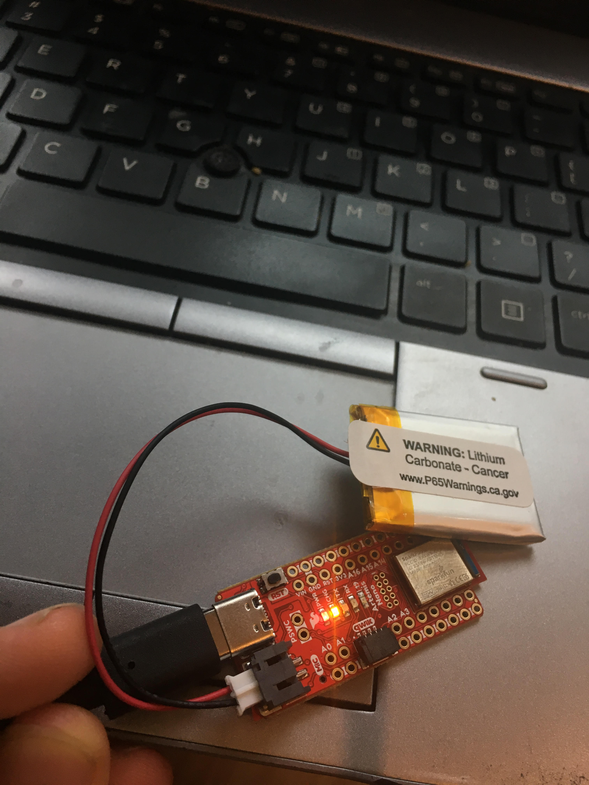

<style>
    ul li { margin-bottom: 10px; }
</style>
<Center> <br>
<h1>About Me</h1></Center>
Hi! My name is Jade and I'm super excited to take this class! Here are some (hopefully) fun facts about me:
<li> I'm currently a junior studying ECE and minoring in robotics </li>
 
<li> I think robots and autonomous systems are super cool - in high school I did a lot with FIRST robotics and I'm a member of CUAir and the Organic Robotics Lab here at Cornell</li>
 
<li> When I'm not being a stereotypical engineer in the lab, I enjoy playing the keyboard (not the typing kind!), running, hiking, and any sort of adventure I might stumble into</li>
 
<li> I'm trying to learn how to cook and don't consider myself so bad at it, but my smoke detector begs to differ </li>

<Center> <h1> Lab 1: The Artemis Board </h1> </Center>

<p style="color: green;font-size:18px"> <b> Setup </b> </p>
To be able to program the Artemis board, I first had to configure my Arduino IDE to install the required libraries. After installing everything, I checked that the programmer was functional by uploading the provided 'Blink It Up' program - as shown in the video below, the board exhibited the expected behavior (built in blue LED toggles every second).
<iframe width="560" height="315" src="https://www.youtube.com/embed/OfnUbPsn1BE" frameborder="0" allow="accelerometer; autoplay; encrypted-media; gyroscope; picture-in-picture" allowfullscreen></iframe><br>
<p style="color: green;font-size:18px"> <b> Example Programs </b> </p>
<b> Serial Output: </b> To test if serial communication worked between my laptop and the Artemis board, I uploaded the provided 'Example2_Serial' program. As seen in the video below, the board was able to receive keyboard input from the laptop, process it, and print statements on my screen via the serial interface. The provided example program actually didn't work perfectly because it neglected to take into account the default newline character when sending serial commands, so I had to alter the code slightly to make it run more smoothly.<br>
<iframe width="560" height="315" src="https://www.youtube.com/embed/wWjGUYQRyek" frameborder="0" allow="accelerometer; autoplay; encrypted-media; gyroscope; picture-in-picture" allowfullscreen></iframe><br>
<b> Analog Tests: </b> To determine if the board is able to measure analog values, I ran the 'Example4_analogRead' program that reads an onboard temperature sensor and prints the output on the Arduino IDE via serial. In the video below, we can see the temperature of the board increase as I hold it close to my overheating laptop. <br>
<iframe width="560" height="315" src="https://www.youtube.com/embed/1t-gQvpS2A4" frameborder="0" allow="accelerometer; autoplay; encrypted-media; gyroscope; picture-in-picture" allowfullscreen></iframe><br>
<b> Microphone Test: </b> To see if the onboard microphone is functional, I uploaded the 'Example1_MicrophoneOuput' program that identifies the loudest frequency heard by the microphone. As seen in the video below, the loudest frequency changes with the pitch of the whistled tone.<br>
<iframe width="560" height="315" src="https://www.youtube.com/embed/7lypdgFtBKc" frameborder="0" allow="accelerometer; autoplay; encrypted-media; gyroscope; picture-in-picture" allowfullscreen></iframe><br>

<p style="color: green;font-size:18px"> <b> Battery Tests </b> </p>
Another cool feature of the Artemis board is its onboard battery charger. When the LiPo battery is connected to the board while plugged into a laptop via USB-C, the board is able to charge the battery (indicated by the yellow light in the image below). When the board is disconnected from the computer, it is able to source power from the battery; this can be seen in the video below, in which the board turns on the blue built in LED when it detects a tone being whistled. The board determines that a tone is being whistled by identifying the loudest frequency using the microphone, just as was done above; if the pitch was above a certain threshold frequency value, then the light would turn on (this frequency value was determined via trial and error - speaking is at much lower tones than whistling)<br>
<b>Code:</b><br>
```C
if(ui32LoudestFrequency >= 500){digitalWrite(LED_BUILTIN,HIGH);}
  else{digitalWrite(LED_BUILTIN,LOW);}
```
<i>The battery being charged while the board is connected to my laptop</i>
<br>
<iframe width="560" height="315" src="https://www.youtube.com/embed/MvvlOql-GQY" frameborder="0" allow="accelerometer; autoplay; encrypted-media; gyroscope; picture-in-picture" allowfullscreen></iframe>

<br> <br>

<Center> <h1> Lab 2: Bluetooth Communication </h1>

<p style="color: green;font-size:18px"> <b> Setup </b> </p>
I had a little trouble setting up the bluetooth on the provided ECE4960 Ubuntu VM, so I just opted to use my windows machine for the entirety of this lab. To enable bluetooth communication with the Artemis board, I installed the necessary python library (bleak) using pip. I also downloaded the provided distribution code (python scripts and Arduino IDE code) as a starting point for this lab.<br>
Once the necessary libraries were installed, I ran the example code to see if my laptop was able to connect to the Artemis board via bluetooth. Luckily, I was able to connect the two after a few tries and added the board's MAC address to the settings cache.

<p style="color: green;font-size:18px"> <b> Pinging the Robot </b> </p>
Each ping packet is 99 bytes - one length, one command, 96 data bytes, and one extra.To measure the round trip response times and flucutuations in latency, I modified the PONG case as below:
```Python
timeDiff = time.time() - theRobot.now
instantDat.append(round(timeDiff,5))
if(Settings["pingLoop"]):
    loop.create_task(theRobot.ping())
```
The program records the time difference between pongs and records it in a python list. When the python script is killed by the user, these python lists are converted to NumPy arrays before the program quits out (this was done because appending to lists is computationally faster than appending to NumPy arrays and I wanted to skew the measurement as little as possible). While a slightly more accurate average may be acquired by only measuring the time every few pings, capturing the round trip time of every ping only adds a few extra commands; since python per-line execution times are on the order of microseconds, this shouldn't skew the data a whole lot - collecting more data points may also give a better idea of the variation in latency. The data I collected was then used to make the following histogram of round trip times: <br>
<br>
The average round-trip ping time was 0.1185 seconds with a standard deviation of 0.0095 seconds with a total of 500 datapoints collected. Interestingly, the data seems to be bimodal in a sense - the majority of times are centered around ~.1125 seconds, but there's a second significant cluster at around 0.13 seconds. 
This test was performed with the artemis board right next to my laptop. To see how the round-trip time varies with distance, I left the board on my porch and pinged it with my laptop from across the street - results can be seen below: <br>
<br> 
The average RT ping time in this case was 0.145 seconds with a standard deviation of 0.034 seconds, also with 500 datapoints collected. As with the last trial, the data also seems to be bimodal in a sense (although it's shifted right and a bit less apparent), but the distribution is a fair bit smoother than in the previous. I was suprised to see that the difference in average RT time did not differ by such a large margin (only about ~0.03 sec slower on average from a distance). <br>
While these rates are not particularly slow, they are significantly slower than a wired serial connection. The standard baud rate (roughly the number of bits/sec) that we've been using for the Artemis board is 115200 - this translates to about 11520 Bytes/sec when accounting for start/stop bits in transmission. Since each byte would have to travel back and forth, this implies that 11520/2=5760 bytes could be transmitted back and forth per second. Since our average RT time over bluetooth was just over 0.1 seconds for 99 bytes, this means that the (somewhat idealized) wired connection is approximately 5-6 times faster than Bluetooth.

<p style="color: green;font-size:18px"> <b> Requesting a float </b></p>
While pinging the robot is pretty cool and serves as a quick check to see if the bluetooth link is functional, sending and receiving meaningful data to/from the Artemis board is much more useful. As a first attempt to transmit values between the two nodes, I tried requesting a float from the board via a command sent by my laptop. Upon reception of this REQ_FLOAT command, the board sends back a packet that contains a 4-byte float value; this return command struct also contains a length field and a command value that the computer uses upon reception of this retun packet. <br>
In order to write a float value into the data bytearray, I ended up casting the data pointer into a float pointer, then storing the desired value in there: <br>
```C
res_cmd->length = sizeof(float);
res_cmd->command_type = GIVE_FLOAT;
*((float*)res_cmd->data) = putVal;
amdtpsSendData((uint8_t *)res_cmd, 6);
```
When testing the program, I first tried transmitting pi over Bluetooth by casting the math library's M_PI constant to a float and sending that, but the received value wasn't exactly pi. To determine if that error was due to an imprecise M_PI constant or floating point isses, I just decided to send the number 3.14 as a float instead; rather than receiving exactly 3.14, the Python code unpacked that value as 3.140000104904175, indicating that there are some issues with floating point comparison/conversion. These issues in C are fairly well known, but one must still be really careful when comparing two float values (especially with subtraction).

<p style="color: green;font-size:18px"> <b> Testing the Data Rate </b> </p>
The procedure for sending two numbers was very similar to sending a float - the only difference was the number of bytes and that they had to be inserted into different points int the array. 
```C
//ct declared as a global uint32_t, lastTime declared as global uint64_t 
lastTime = (uint64_t)micros();
memcpy((uint32_t*)&res_cmd->data[0],&ct,4);
memcpy((uint64_t*)&res_cmd->data[4],&lastTime,8);
amdtpsSendData((uint8_t *)res_cmd, 14);
```
With 5000 received packets, a total of 881 were lost (1 packet dropped for every 5.7 sent, on average). The datastream rate was also much faster, with an average time of 0.0128 seconds between packets received. Below is a histogram of the packet RT times: <br>
<br>

I also tried the same thing but with sending 4x the amount of data in a packet (4-32 bit ints, 4-int_64's). With 5000 received packets, a total of 890 were lost and the average time between packets was also 0.0128 secs - it seems like the amount of data transferred in a single packet has no significant effect on the bytestream performance; this makes sense since all 99 bytes are transmitted each time anyway. The histograms look shockingly similar to each other: <br>
<br>

<p style="color: green;font-size:18px"> <b> Command Framework Modifications </b> </p>
To expand on the command framework, I added a command that transmits 9 floats as provided by the IMU (should be convenient later). I also added some commands to transfer larger PNG files (described below). To do this I had to modify both constants.py and commands.h


<p style="color: green;font-size:18px"> <b> 2+ KB File Transfer </b> </p>
Unfortunately, I did not have enough time to fully complete this optional part of the lab (somehow prelims are starting already!). However, my original idea was to bounce a PNG image bytearray between the two devices and see how the final image looked. To do this, I expanded the framework to include PNG_START_TRANSMIT and PNG_IMG commands that indicated when a file transfer starts and was in progress. Because the full file would have to be distributed across multiple packets, the cmd->length would be the packet number, and the file size would be indicated by the START_TRANSMIT command.
```C
case PNG_IMG_START:{
  pngSize = cmd->length;
  Serial.print("PNG Size is ");
  Serial.println(pngSize);
}
case PNG_IMG:{
  int countt = cmd->length;
  *((uint8_t*)&img[countt*96]) = *cmd->data;
}
```
<br> <br>

<h1> <Center> Lab 3: Characterizing the Robot </Center> </h1> <br>

<p style = "color: green; font-size: 18px;"> <b> 3a: Characterizing the Physical Robot </b> </p> </Center><br>
<i> For this portion of the lab, I worked together with Katie Bradford and Emily Wang </i> <br>

To characterize the physical robot, we first started by measuring the mass and physical dimensions of the robot. Using a scale, we measured the robot to be 45.9g without the battery and 54.0g with the battery. Using a tape measure, we approximated the dimensions to be {x,y,z}. None of us were able to sit in front of the charger for several hours to time how long it takes for the battery to recharge (we prefer watching paint dry tbh, it's much more exciting), but according to the robot manual, it takes approximately 5 hours for a full charge once the battery has been used a few times. This was done so we could eventually accurately describe the robot in simulation and get an estimate of all the relevant forces. We also estimated the battery lifetime to be about 10-15 minutes of continuous driving. <br>

To characterize the motion of robot, we attempted to measure its speed by racing it along a 10m drag strip of tile in Phillips Hall. From 5 trials with our separate robots, we found that the average speed was 2.47 m/s with a maximum trial average speed of 2.61 m/s and a minimum of 2.25 m/s (all in fast mode). By running the robot until its battery was drained, we saw that there was a significant decrease in speed as the battery charge dropped; this was not really a linear phenomenon - while the speed decreased throughout our testing of the robot, once the battery approached its minimum charge, the speed dropped off very sharply until the robot could not drive any further. This data was very useful as an estimate of the average velocity that we could use in simulation and provided somwhat of an upper bound on the speed of the robot. The nonlinearity of the maximum speed as a function of battery life is also something that will probably not be taken into account in simulation but is a very important consideration in real life. <br>

In addition to speed, we attempted to estimate the acceleration of the robot - unfortunately, this proved to be quite difficult using the our eyes and the camera alone; we thought of attaching the IMU to the robot but we would have a hard time securing it to the robot without taking off the top. To estimate the acceleration, we noticed that the robot reached its full speed after about 2m of acceleration. Since our velocity tests were over a full 10m, we can approximate the time needed to accelerate to full velocity as 1/5 of the total time needed to travel the 10m (in reality its's probably a bit longer) - this is about 0.75 sec. From zero to an average velocity of 2.25 m/s in 0.75s, we can estimate the acceleration of the robot to be around 3.0 m/s^2. This also provides somewhat of an upper bound on the acceleration that we can use in the simulation. Also useful for computing forces and checking the accuracy of our IMU when we mount it on the robot. Check out a video of the robot accelerating below! <br>
<iframe width="560" height="315" src="https://www.youtube.com/embed/ypQzi79MOVw" frameborder="0" allow="accelerometer; autoplay; clipboard-write; encrypted-media; gyroscope; picture-in-picture" allowfullscreen></iframe> <br>

We also tried to measure braking distance by driving the robot at full speed and then throwing the motors into reverse when it crossed a line on the floor. In the robot's slow mode, we found the robot's average braking distance to be 13.2cm with a minimum of 10cm and a maximum of 15cm. When we tried to measure the braking distance in the robot's fast mode, we found that the robot simply flips over when we tried to actively brake, so were unable to estimate a reasonable distance at these speeds. This information will hopefully be useful in simulation and may limit how fast we can allow our robot to travel in a given room. In addition, the braking distance could also be used to characterize the robot wheels and how much slippage they experience. Our setup can be seen in the video below. <br>
<iframe width="560" height="315" src="https://www.youtube.com/embed/iga5Dm6c1dE" frameborder="0" allow="accelerometer; autoplay; clipboard-write; encrypted-media; gyroscope; picture-in-picture" allowfullscreen></iframe> <br>

To determine how well the robot could rotate, we drove one set of motors while keeping the other side off. We also tried spinning the robot about its own axis by driving the two sets of motors in opposite directions. When only one set of motors were turning, the robot's motion was very stable about its front wheel (seen in the video below) <br>
<iframe width="640" height="360" src="https://www.youtube.com/embed/ZS2JQHhOlLI?t=9" frameborder="0" allow="accelerometer; autoplay; clipboard-write; encrypted-media; gyroscope; picture-in-picture" allowfullscreen></iframe> <br>

For fun, we also drove the robot across several different surfaces to see how it performed. On all the surfaces we tested (tile, concrete, grass, carpet), the robot was able to drive quite well (useful for future field tests). We also played around with stunts and were able to make the robot flip over (by driving fast and throwing the motors into reverse), spin around / drift (by going fast and turning), and even balance on two wheels (but not the ones you'd expect). Reliably reproducing some of the tricks was a little difficult, but we were able to perform some of the stunts (namely flipping and spinning) fairly reliably - control details described above. We also tried braking before crashing into a wall, but that also proved to be a little difficult since the robot would simply flip over if we went too fast and tried to stop. To achive this in some manner, we had to let the robot coast a bit before braking completely and were able to stop the robot by decelerating about 30cm from the wall. In addition, we also tried to drive the robot as quickly as possible within a 1m square, but it was much more difficult than we expected! This was done to see if we could eventually make an algorithm that performs better than a human driver (although admittedly we're not exactly the gold standard for drivers). Check out the videos of surface tests and stunts below! <br> <br>

<i> Surface Tests </i>
<iframe width="360" height="270" src="https://www.youtube.com/embed/qeUlRmqmca8" frameborder="0" allow="accelerometer; autoplay; clipboard-write; encrypted-media; gyroscope; picture-in-picture" allowfullscreen></iframe> <br>
<i> Stunts </i>
<iframe width="360" height="270" src="https://www.youtube.com/embed/m3y1oS1I_Io" frameborder="0" allow="accelerometer; autoplay; clipboard-write; encrypted-media; gyroscope; picture-in-picture" allowfullscreen></iframe> <br>
<i> Driving on a Square </i>
<iframe width="640" height="360" src="https://www.youtube.com/embed/vc01po-Nxws" frameborder="0" allow="accelerometer; autoplay; clipboard-write; encrypted-media; gyroscope; picture-in-picture" allowfullscreen></iframe> <br>


<p style = "color: green; font-size: 18px;"> <b> 3b: Characterizing the Virtual Robot </b> </p> <br>
After installing all of the necessary dependencies and lab framework (and of course after having to reinstall the VM), I started playing around with the parameters in the robot simulator to try and get a sense of how the virtual robot operates as well as the limitations of the simulation environment. To start, I attempted to move the robot around using the specified keys and adjusted both the linear and angular speeds. While the speeds can grow very large (>10^20), the actual speed is capped at some point by the simulation and the robot does not travel any faster; the same goes for the minimum speed - while, according to the simulation parameters, it will not really ever reach zero (unless due to underflow error), the effective minimum speed is zero. <br>
Interesting things also happen when the robot is steered (purposefully or not) into one of the walls; rather than just stopping or bouncing off, it is replaced by a yellow triangle with an exclamation point in it. To start driving again, the robot must back out or turn out of that position; personally, I would rather have it reset to a starting position or still show the robot instead of replacing it with an uninformative box. <br>
By clicking on the robot, the simulation shows the robot's cooridinates (x,y,z,theta). The user can also drag the robot around the field using the left mouse button and can manually adjust the robot's angle/orientation by clicking and dragging using the right mouse button. The former is especially useful if the robot collides with a wall! <br>
When playing around with the simulator, I found out that clicking on the simulation window and pressing some keys did some interesting things. For example, pressing 'o' showed previous places that the robot visited; these markers would disappear over time. Right clicking and dragging would turn the map into a 3d world and showed that the 'robot' was simply an extruded hexagon. Pressing 'd' put a line of sight cone in front of the robot. 'f' centers the image on the robot and 'g' gets rid of the checkered squares in the background. My favorite change happened while pressing 'r', which put the camera in the frame of the robot, letting the user explore the maze from the robot's perspective. 'p' also pauses the simulation, and 'c' clears away the details in the bottom of the screen. Below is a video of the virtual robot navigating the obstacle course! <br>

<iframe width="766" height="394" src="https://www.youtube.com/embed/X6ZZOyAG-jA" frameborder="0" allow="accelerometer; autoplay; clipboard-write; encrypted-media; gyroscope; picture-in-picture" allowfullscreen></iframe>


